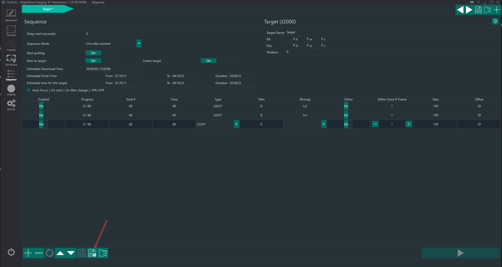
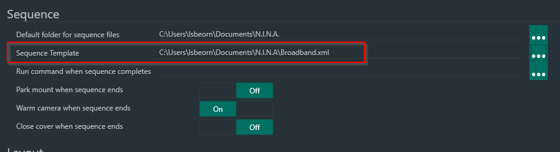

## Sequence Templates

When creating a new sequence item via Framing or when just adding a new target from anywhere in the application the default values of a Sequence will most likely not be satisfactory for a user.
Therefore N.I.N.A. offers the possibility to create a sequence template and set this template inside the settings.

### Exporting a sequence Template

To create a sequence template you just need to setup a standard sequence to your liking. In the example below I have set up a sequence for broadband. Once all sequence settings are done, just click on the save button to store the sequence xml on your hard drive. Once a template is set, each new Sequence you create will be pre-populated with this template. As you currently can only have one template for one profile, you can have two copies of your profile with different templates and take one profile for narrowband and one for broadband as an example.

This exported sequence can then be set as a template inside **Options->Imaging->Sequence**

