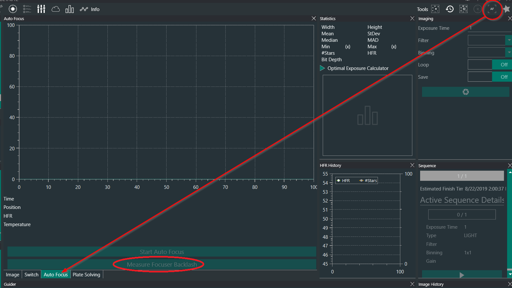

## Overview

Focusers can suffer from backlash when they reverse directions, which is basically the number of focuser steps that "slip by" before the focuser physically moves again during a change in directions.

It is possible to set that up in the Focuser Options under the Options -> Equipment tab. However, a tool is available to determine the current focuser backlash. It is available in the AutoFocus tool, in the imaging tab.

## Pre-requisites

For the focuser backlash measurement tool to be available and to work correctly, the following conditions need to be met:

* Both a camera and focuser are connected
* The autofocusing options have been set correctly, so that a decent autofocus run can already be accomplished (minus backlash). This is described in the [Auto-Focus Documentation](../autofocus#determining-ideal-parameters)
* Your overall auto focus curve profile should be a hyperbola - this should generally be the case
* The system is currently well focused (using a Bahtinov mask for example)

## Algorithm

The following method will be used to measure the IN backlash, based on the assumption that far enough from focus, focus points should be on a line (e.g. the focus curve profile is a hyperbola).

* Start at best focus (after an AF routine)
* Move the focuser out by twice the amount moved by the autofocus routine (e.g. *Auto Focus Initial Offset Steps* multiplied by *Auto Focus Step Size* times 2) and measure HFR (HFR2 at position2)
* Move in by the *Auto Focus Step Size* and measure HFR (HFR1 at position1). If HFR1 and HFR2 are very close, backlash is not cleared yet, and repeat (move in by *Auto Focus Step Size*, measure and replace HFR1 and position1 with the new position and measure). Remember the number of times the measurement is done, to a maximum of 3 times
* Move in by *Auto Focus Step Size* again, get to position0, and measure HFR0
* Compute the slope between position2 and position1 as measuredSlope = (HFR2 - HFR1) / (position2 - position1)
* Compute the slope between position0 and position1 as idealSlope = (HFR1 - HFR0) / *Auto Focus Step Size*
* If abs(measuredSlope) > abs(idealSlope), there is no significant backlash
* Else, Backlash In is (1- measuredSlope / idealSlope) * (position2 - position1)

The same routine, inverted, will be used for the Backlash OUT.

As can be seen above, the routine relies a lot on the *Auto Focus Step Size* setting, which can be changed as necessary if issues are noted with the process

## Running the tool

Running the focuser backlash tool is very simple: simply click on the *Measure Backlash* button. This will run the routine automatically - note that for greater precision, the routine takes three exposures per focus points, so it may take longer than expected. Once it's over, the routine will output a result that can be automatically saved in the focuser options.
