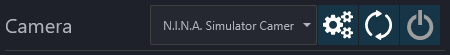
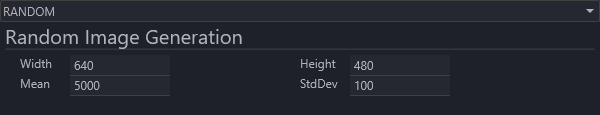
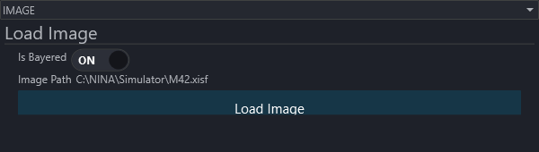
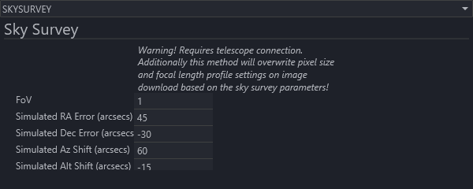
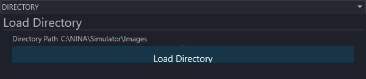

N.I.N.A. includes a camera simulator for testing an imaging workflow without a physical camera. It behaves like a camera connection and can return generated noise, a selected image, a sky survey image or images from a directory.

On the **Equipment > Camera** page, select **N.I.N.A. Simulator Camera**. Use the gear button to configure its image source, then connect it with the power button.

## Simulator Setup

The source selector at the top of the setup window controls what the simulator returns for an exposure. The settings are stored in the current N.I.N.A. profile.

### Source: Random

**Random** generates a 16-bit noise image. **Width** and **Height** set its pixel dimensions. **Mean** and **StdDev** control the distribution of its pixel values.

### Source: Image

**Image** returns one existing image for every exposure. Select **Load Image** and choose an image format that N.I.N.A. can open. Enable **Is Bayered** when the source data should be treated as a Bayer mosaic. The image path is retained in the current profile and the file is loaded again when needed.

### Source: Sky Survey

**Sky Survey** downloads an image centered on the connected telescope's current coordinates. It therefore requires both a telescope connection and network access. **FoV** sets the requested field of view in degrees. The RA, declination, azimuth and altitude offsets simulate pointing errors in arcseconds.

!!! warning
    Downloading a Sky Survey exposure updates the camera pixel size and telescope focal length in the current profile to match the simulated survey image. Use a dedicated test profile if those values must not replace your equipment settings.

### Source: Directory

**Directory** returns supported image files from a selected directory in sequence. Select **Load Directory** and choose the source folder. After the last image, the simulator starts again with the first image. This is useful for replaying a set of exposures through an imaging workflow.

## Simulator Usage

Connecting the simulator does not place an image in the Imaging workspace. Take a snapshot or run a sequence exposure just as you would with a physical camera. The configured source is returned when N.I.N.A. downloads that exposure.
