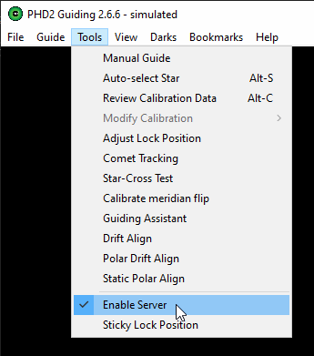
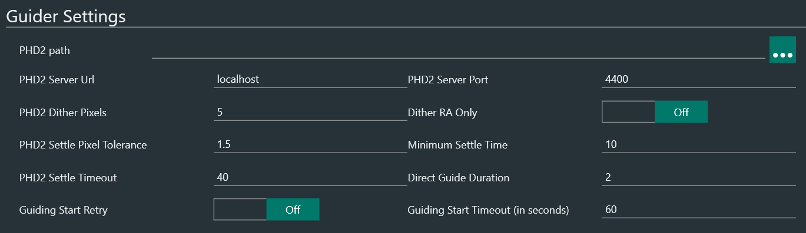
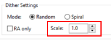
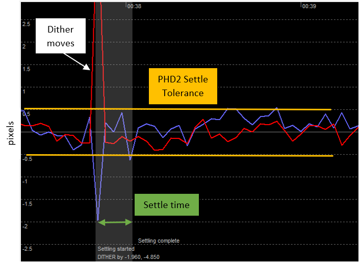
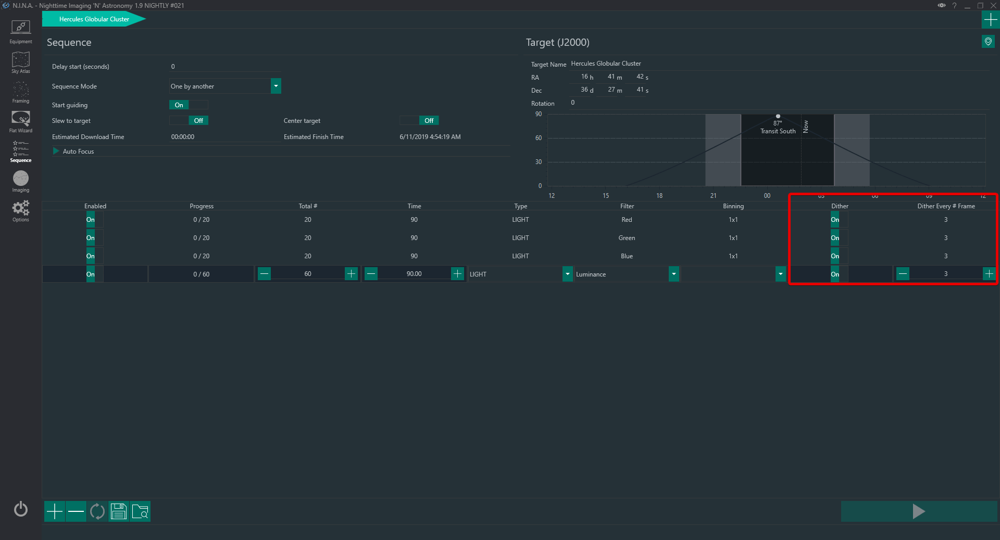

## Overview

Dithering is an important part of the modern image acquisition process. CMOS and CCD sensors suffer from various types of electronic noise, such as fixed-pattern noise, and defects such hot and cold pixels. Photons of light from stellar objects fall onto the sensor and will effectively be lost if the photon falls on a dead or hot pixel. The act of dithering is a commanded move of the mount between successive exposures that very slightly alters, on the pixel scale, where photons fall on the sensor. This means that one exposure can capture light (ie, data) from an object where that same light fell on a dead or hot pixel in the previous exposure. Image alignment issues are easily handled by most astronomy stacking and image post-processing applications.  
The different positions of single light frames will make it more effective for image integration algorithm that implement an outlier rejection method (like sigma-clipping) to reject fixed-pattern noise ans well as hot and cold pixels. This is because hot and cold pixels are always in the same position in the camera sensor and dither will make them appear in different places for each frame after a dither move.

Because dithering is an operation that must be coordinated with guiding (remember, the mount is being purposefully moved by a few pixels, which guiding would reflexively attempt to counteract), the dithering operation is managed by PHD2 itself. The process is simple. N.I.N.A. suspends imaging and commands PDH2 to execute a dither operation. PHD2 performs the dither, and then informs N.I.N.A. when the operation is complete. Any required adjustments to guiding are automatically handled by PHD2. N.I.N.A. then resumes commanding normal exposures. Normally, a dither operation takes a few tens of seconds (at most) to complete.

## Dithering in N.I.N.A.

N.I.N.A. offers three different ways to effect dither operations:

1. Standard dithering through PHD2 or MGEN2
2. Synchronized dithering across multiple main cameras on the same mount, also through PHD2
3. Built-in dithering using N.I.N.A.'s Direct Guider function

The desired way of dithering is based on the connected device in the **Equipment > Guider** tab.

### Standard Dithering

This is the typical scenario for most users. The user has a single main camera, a guide camera, and is using PHD2/MGEN2 for guiding. At the intervals configured in the sequence, N.I.N.A. will pause operations with the main camera and signal PHD2/MGEN2 to begin a dither operation. Photography resumes when the dither operation is completed.

### Synchronized Dithering with PHD2

Multiple imaging telescopes and cameras in addition to a single guide camera has become a common configuration. N.I.N.A. can be used to control these kinds of setups through multiple instances of the application. One instance controls the mount, guiding, and one of the main cameras. Additional instances of N.I.N.A. control each additional main imaging camera present and communicate their actions to the master instance of N.I.N.A. This coordination is automatically set up in the background when multiple instances of N.I.N.A are started. This configuration poses an issue for dithering because, without coordination between the multiple instances of N.I.N.A., a dither operation may be initiated while one of the other main cameras still is busy exposing.

To manage this, a dither operation will be coordinated with PHD2 so that it happens when none of the imaging cameras are exposing. N.I.N.A. developer Stanley Dimant [describes Synchronized Dithering](//youtu.be/edYcKUPEEAU?t=546) in his N.I.N.A. 1.8 feature overview video.

### Built-in Dithering

There are cases where there is no guiding equipment in use, and thus no PHD2, but where dithering is still desirable. Examples of configurations like this usually include small, portable setups that have a main camera and telescope or lens, but no guiding. In cases like this, N.I.N.A. can still effect dithering operations, but on its own through its **Direct Guider** facility. Once activated, dithering operations become available in the Sequence and are effected by N.I.N.A. directly.

## Requirements

N.I.N.A. supports dithering using its direct communication with PHD2 and makes it easy to set up as a part of a sequence. There are a few prerequisites to dither during a sequence:

 * A mount needs to be connected
 * PHD2 needs to be be running, actively guiding, and also communicating with N.I.N.A.
 * The PHD2-related settings in the Equipment Settings need to be correctly set up
 * Dithering needs to be enabled in the sequence

## PHD2 Settings

In order for N.I.N.A. to communicate with PHD2 and command operations such as dithering and for receiving guiding telemetry, PHD2's internal server must be enabled. To enable PHD2's internal server, go to PHD2's **Tools** menu and ensure that **Enable Server** is selected.

## N.I.N.A Settings

### Settings for PHD2

Settings related to guiding and dithering can be found in the **Options > Equipment** tab. The defaults are suitable for most cases. You will need to specify the full path to `phd2.exe` if PHD2 was installed in a non-standard location. This is so N.I.N.A. can automatically start PHD2 as a part of the equipment connection process.

An explanation of the two most important dithering-related settings follows:

 * **PHD2 Dither Pixels**: The amount of pixels (on the guiding camera) that the dithering action will shift. This value should take into account the guiding imaging scale and main camera imaging scale, in arcsec/pixels. To select the appropriate value you need to consider how many imaging camera pixels will shift between two exposures as a consequence of a dither move. Obviously, 2 pixels at one focal length and pixel size will cover a different amount of sky than another setup with a different focal length and pixel size.
 It is usually recommended to dither a number of guide camera pixels that will shift the main imaging camera of about 10 pixels.  
   
!!! tip
    Let's assume to have a guide camera with a pixel size of 3.8µm and a 260mm focal length guidescope, resulting in a guide scale of about 3 arcsec/pixel. The imaging optical train is composed by a camera with a pixel size of 3.8µm and a 520mm focal length scope, resulting in an imaging scale of about 1.5 arcsec/pixel. A guide camera shift of 5 pixels corresponds to a motion of 15 arcsec or 10 pixels of shift for the main imaging camera. In this case a PHD2 Dither Pixels of 6 pixel is therefore appropriate.

!!! note
    The PHD2 Dither Pixel value will be multiplied by PHD2 by the "Scale" value found under Advance Setup>Dither Settings of PHD2. This value will be multiplied by the Dither Pixel set in N.I.N.A. to determine the final pixel shift amount. It is recommended to leave it at 1 and only change the amount of dither pixels in N.I.N.A.  
        
 
 * **Dither RA Only**: This will cause dithering to happen on the RA axis only and allow the declination axis to continue guiding.
   
!!! note
    This option should only be checked in the following cases:  
    - your mount does not support DEC guiding (i.e. skytracker)  
    - a mount that suffers from a high declination backlash   
    - you are guiding in one direction only in DEC  

!!! tip
    The pixel scale of your guide camera can be calculated using online tools. By inputting the focal length of your guiding optical train and the pixel size of your guide camera's sensor, you will know how many arcseconds of sky is covered by each pixel (arcseconds per pixel). Such a tool is the [Astronomy Tools FOV Calculator](//astronomy.tools/calculators/field_of_view/).

* **Dither Settle Pixel Tolerance and Settle Time**: these are important parameters that define the successful end of a dither move. When a dither is initiated by PHD2 a random move of the mount in RA/DEC is issued,  the maximum amount of the random move is defined by **PHD2 Dither Pixels**. The mount then resumes its tracking operations, but depending on the mechanical stability of the gears it might take a couple of seconds to return to its normal guiding conditions. This time represents the settle time and N.I.N.A. lets you define a **Minimum Settle Time** during which the mount has to be inside the pixel tolerance. If the mount is moving outside this tolerance during this timeframe, the minimum settle time timer will restart again. 
The successful completion of a dither settling is achieved when guiding after a dither move remains within the tolerance defined by the **PHD2 Settle Pixel Tolerance**  expressed in guide camera pixels. Once settling is complete N.I.N.A. can continue and start a new capture.
Should settling not be achieved after the period defined in **PHD2 Settle Timeout**, the settling will be declared failed and N.I.N.A. will start a new capture.  
**PHD2 Dither Pixels** depend on your mount guiding capabilities and guiding scale and should be determined by looking at PHD2 logs. A great tool to analyze PHD2 logs is PHD2 Log Viewer that can be downloaded from [here](http://adgsoftware.com/phd2utils/)

### Settings in Sequences

Regardless of the dither method in use, initiating dithering during the course of a running sequence is simple. Dithering operations can be activated for each step in a sequence, and be initiated every *Nth* frame in each step. That is, if a step in a sequence specifies that 20 exposures be taken with a dither operation every second exposure, two normal exposures will be taken, a dither operation performed, and then the next two exposures will be taken, etc. N.I.N.A. manages these operations itself in conjunction with PHD2 and the process is entirely hands-off.

Dithering operations happen while the previous image is downloading from the camera. If you have a camera with slow download speeds, it might be that the dithering operation is completed in time for the camera to be ready for the next exposure.
  
!!! tip
    If you use an LRGB rotational sequence (See Also: [Advanced Sequencing](advancedsequence.md)) you might only want to dither on every L frame. If an OSC or DSLR camera is used, it is suggested to dither after every frame, although if you are shooting very short exposures (30s, 60s) you may want to reduce the number of dithers to avoid excessive perturbation of guiding.