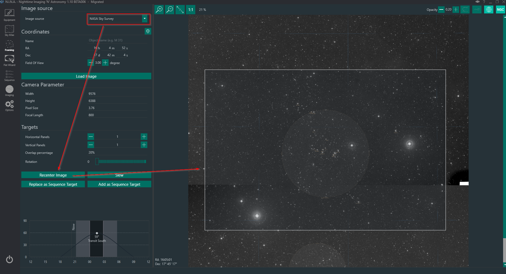
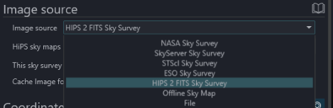
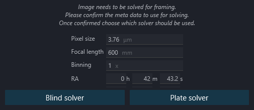
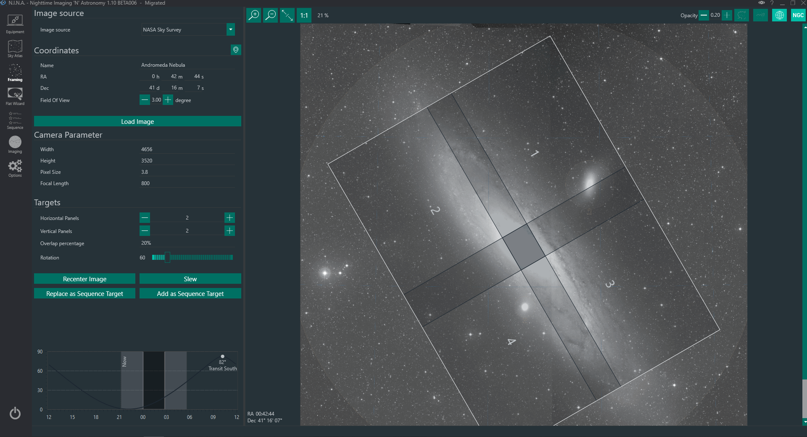
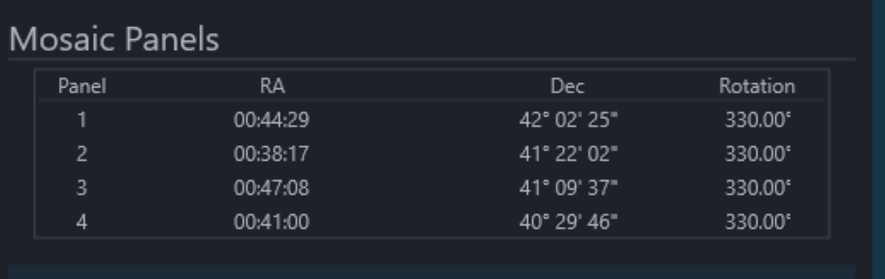
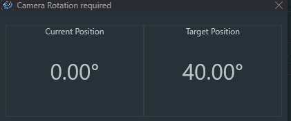

## Overview

The Framing Assistant turns a target position and an image source into one or more camera frames. It can use an online survey, N.I.N.A.'s offline sky map, a local image or the survey cache. The resulting center coordinates and position angle can be sent to the telescope or added to the Simple or Advanced Sequencer.

## Before you start

Enter accurate camera width, camera height, pixel size and focal length. N.I.N.A. fills the camera values when a compatible camera is connected, but the Framing Assistant focal length is intentionally editable so that you can compare optical configurations. These values control the size of the frame overlay. Plate-solving equipment values are configured separately under **Options > Equipment**.

Enter a target name or coordinates, or use the planetarium and telescope buttons to import coordinates. Set **Field of view** wide enough to show the surrounding area and select an image source.

## Image sources

- **NASA Sky Survey**, **SkyServer Sky Survey**, **STScI Sky Survey** and **ESO Sky Survey** download an image from their respective services.
- **HIPS 2 FITS Sky Survey** downloads from the selected HiPS map. The available map list is loaded from N.I.N.A.'s database.
- **Offline Sky Map** renders N.I.N.A.'s interactive sky map. It can display constellation, coordinate, horizon and catalog overlays and can use cached survey tiles on 64-bit builds.
- **File** loads a local image. FITS and XISF World Coordinate System metadata is used when present. Otherwise N.I.N.A. opens the current plate-solve prompt.
- **Cache** loads a previously cached survey or local-image result.

Online sources require network access. Use **Cache Image for Offline Use** when you want a downloaded result available later. 

## Load and adjust a frame

1. Choose the source and target coordinates.
2. Set the field of view and select **Load Image**.
3. Drag the frame to adjust its center. Use the zoom controls or mouse wheel as supported by the selected source.
4. Set **Rotation**. **Rotate sky** changes whether the background or frame is rotated visually.
5. Check the frame-center RA and Dec displayed at the lower left of the image.

The opacity control makes the frame fill more or less transparent. The remaining toolbar controls toggle sky-map annotations such as constellation boundaries, constellation names, the equatorial grid, horizon and deep-sky objects when those layers are available.

## Loading a local image

If a FITS or XISF image contains usable World Coordinate System metadata, N.I.N.A. uses its center, scale and orientation directly.

If scale or coordinates are missing, N.I.N.A. shows the current solve prompt. Confirm pixel size, focal length and binning. Supply approximate coordinates for a normal plate solve, or select **Blind solver** when no reliable reference is available.

The configured plate solver and blind solver under **Options > Plate Solving** are used. A successful solve updates the displayed image, frame scale and center coordinates.

## Mosaic planning

Increase **Horizontal panels** or **Vertical panels** to create a mosaic. Set overlap as a percentage or in pixels. Each panel receives its own center coordinates, position angle and numbered overlay.

**Preserve alignment** compensates panel orientations for sky projection. It is useful for large mosaics away from the celestial equator, but it can require a different physical rotation for individual panels.

The **Mosaic Panels** table is the generated plan that will be transferred to the sequencer:

For the Advanced Sequencer, prepare a Deep Sky Object container template first. **Add target to sequence** can create targets from that template, add targets to the target list or update an existing sequencer target. A mosaic creates one target per panel with the panel number appended to its name.

## Slewing, centering and rotation

The main action slews and centers on the frame coordinates. Its menu also exposes the available slew-only or center-and-rotate variants. **Determine rotation from camera** captures and solves an image to copy the measured position angle into the frame.

When a motorized rotator is connected, center-and-rotate can command it directly. With N.I.N.A.'s Manual Rotator selected and connected, N.I.N.A. displays the actual and requested angles and asks you to rotate the camera manually:

Rotation tolerance is configured under [Options > Plate Solving](../tabs/options/platesolving.md#rotation-tolerance).

## Common problems

- **The frame size is wrong:** verify sensor width, sensor height, pixel size and the Framing Assistant focal length.
- **A local image opens the solve prompt:** the file does not contain a complete usable WCS solution. Confirm the solve parameters or use the blind solver.
- **An online survey does not load:** try another service, reduce the requested field of view and verify network access. Cached and offline-map sources do not require a survey download.
- **A mosaic is not offered to the Advanced Sequencer:** create or select a Deep Sky Object container template first.
- **The camera angle does not match the plan:** use a rotator or the Manual Rotator and a center-and-rotate action. A framing rectangle alone cannot physically rotate the camera.
