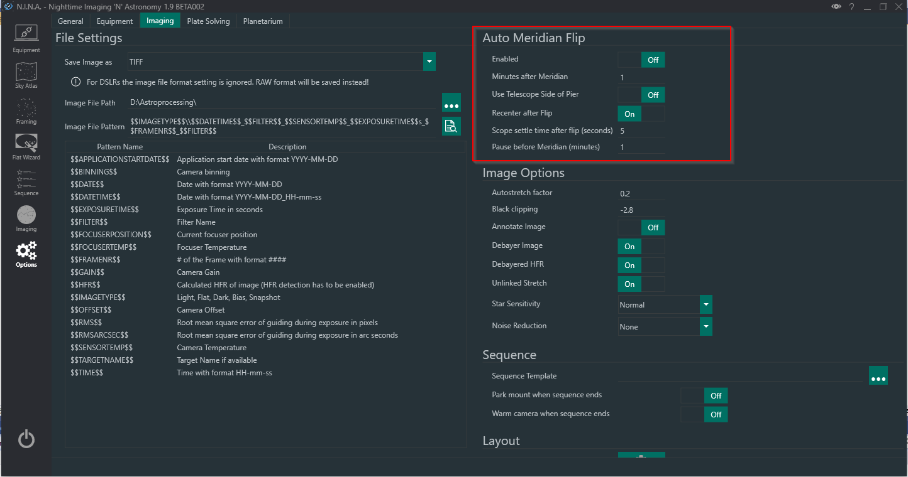

## Overview

Mount operations known as Meridian Flips are important when using a German Equatorial Mount (GEM).
The meridian is an imaginary line that divides the sky into east and west halves.
It starts at 180 degrees (south) and passes directly overhead to 0 degrees (north).
It is static and does not move with the sky.
Imaging an object typically begins when it is in the east half of the sky.
As the night progresses, the object will approach the meridian, cross it, and then be in the west half of the sky.

When a GEM's RA axis approaches the meridian, with the telescope on the west side of the mount and looking east, a "flip" must be performed to swap the side of the mount that the telescope is on.
This is to avoid the mount tracking past the meridian.
Otherwise the counterweights will be higher than the telescope (an undesirable situation on some mounts) and the telescope (or some part of it) contacting the pier or tripod legs.
Some mounts and equipment configurations are more tolerant than others to these conditions.
Some mounts can track for hours after passing the meridian in a counterweight-up condition.
Some telescopes are both short enough in length and height that they will not crash into the pier or tripod legs.
Every situation is different, so it is up to the user to know when a meridian flip should be commanded.

## Automating Meridian Flips

An Automatic Meridian Flip operation swaps the telescope to the west side of the mount.
Meridian flips prevent that your telescope and camera bump into the mount and do major damage to your equipment.
N.I.N.A. has built-in functionality for the automated flip, even if your mount does not support it in firmware.
After a flip N.I.N.A. verifies that it is still imaging the desired area of sky through [Plate Solving](platesolving.md) and the imaging session continues.

To enable the Automated Meridian Flip you need to enable it in the imaging settings.

- _Enabled_: Turns automated meridian flips on or off.
- _Minutes after Meridian_: This setting defines how many minutes after the meridian has been passed the flip should occur.
- _Use Telescope Side of Pier_: Some mount drivers are capable of reporting the side of pier. In case the scope is already flipped prior to passing the meridian, N.I.N.A. would normally do the flip anyways as it cannot detect the side of pier. With this setting enabled the flip could be skipped instead. Keep in mind that many mount drivers do not implement this feature!
- _Recenter after Flip_: When enabled, N.I.N.A. will verify that the current target is still centered after the flip using [Plate Solving](platesolving.md).
- _Scope settle time after flip (seconds)_: Determines how many seconds the mount should rest after the flip occurred.
- _Pause before Meridian (minutes)_: For some setups the equipment can touch the tripod or pier a while before passing the meridian. This setting enables the mount to disable tracking for the defined minutes prior to reaching meridian. Once this time and the defined minutes after meridian are passed, the flip will occur normally.

!!! note
Some mounts require to pass the meridian by a couple of minutes, as otherwise syncs via plate solving near the meridian after a flip could be rejected by the driver.
