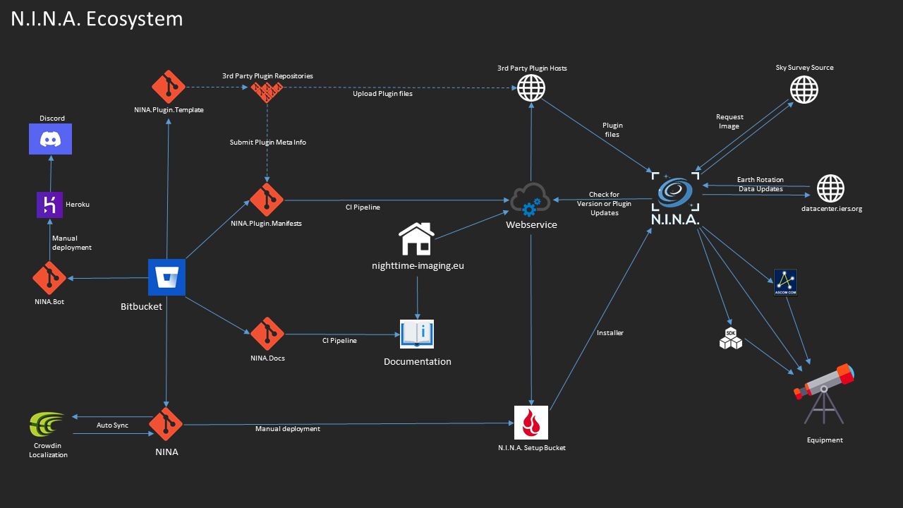

The ecosystem of N.I.N.A. consists of a whole lot more than just the main application. There is quite a bit of orchestration done in the background to be able to build the application as it is today.

## Bitbucket Repositories
[Main application](https://bitbucket.org/Isbeorn/nina/src/master/) - The main application source code  
[Plugin Manifests](https://bitbucket.org/Isbeorn/nina.plugin.manifests/src/main/) - Meta Definition files for plugins can be pushed here   
[Plugin Template](https://bitbucket.org/Isbeorn/nina.plugin.template/src/master/) - Serves as a starting point for plugin developers  
[Documentation](https://bitbucket.org/Isbeorn/nina.docs/src/master/) - Using mkdocs to define the documentation  
[Discord Chat Bot](https://bitbucket.org/Isbeorn/nina.bot/src/master/) - A bot to make life easier inside the discord chat  

## Crowdin
[Crowdin Localization Management](https://nina.crowdin.com/)  
See the dedicated page for [Localization](./localization.md) for more details

## The Homepage
The [Homepage](https://nighttime-imaging.eu/) serves as the central hub to gather the resources. It also hosts the webservice that will tell you and the application where to get updates, as well as hosting the documentation.