## Forking the repository

1. Login to your bitbucket account
2. Navigate to [N.I.N.A.'s main repository](https://bitbucket.org/Isbeorn/nina/) and click on the big plus
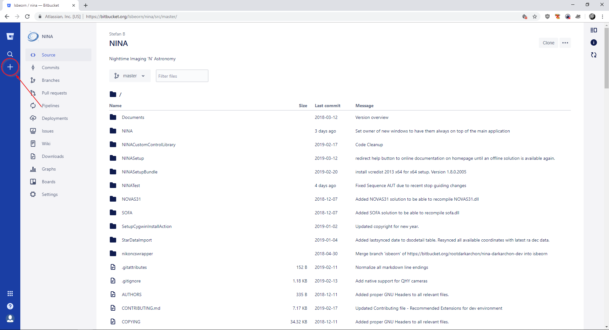
3. Click "Fork this repository"
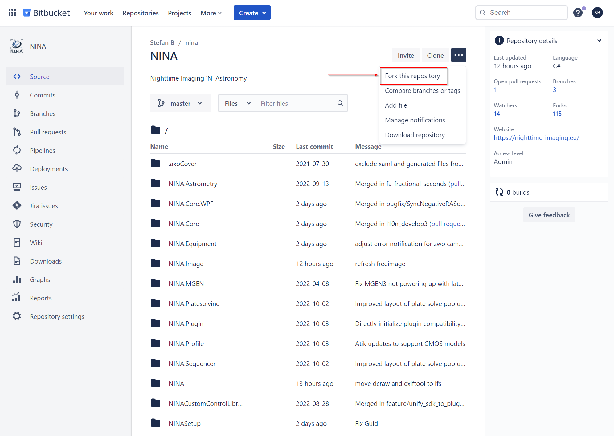
4. You will see a configuration wizard for your fork.
5. Enter a name for your forked repository. (This guide will use "ninaexamplefork" for reference)
6. Give a short description what your intention is with this fork (optional)
7. Uncheck Issue tracking and Wiki as you don't need this in your fork.
8. Click on "Fork repository"
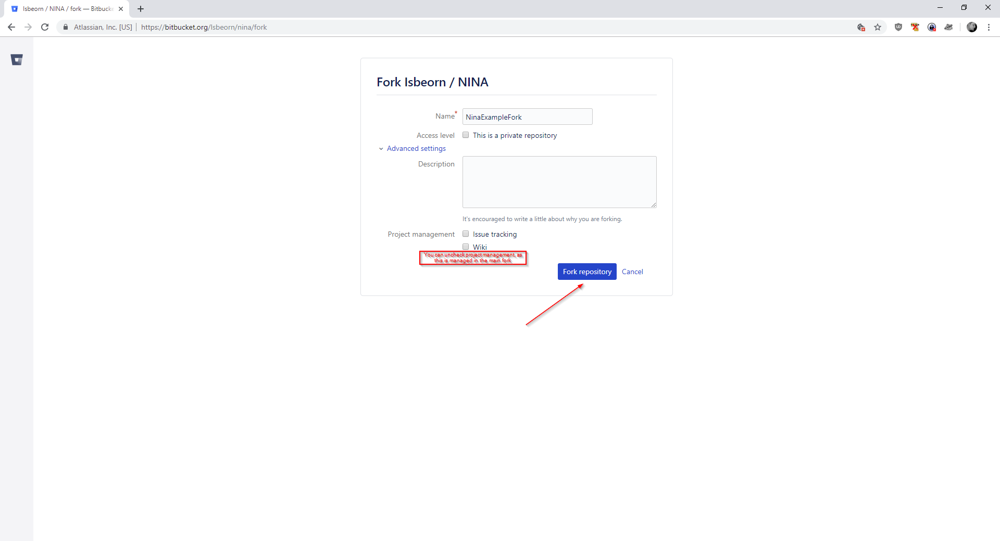
9. You will be navigated to your new repository at https://bitbucket.org/\<your\_username\>/\<your\_fork's\_name\>/

## Cloning Repository

1. On the top right of your forked repository click on the "Clone" button
2. A pop up will show the command how to clone this repository to your local machine
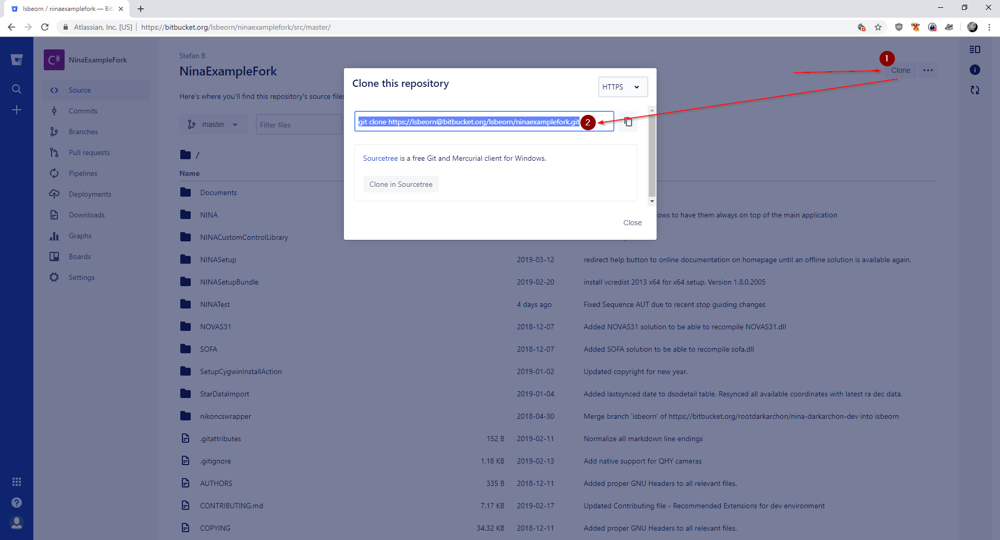
3. Open a command window
4. Navigate to the folder where you want your repository folder should be created in
5. Enter the command that was shown in step 2.
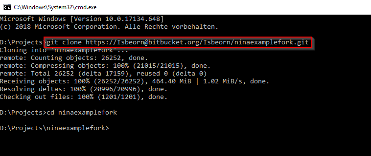
```
git clone https://<YourUserName>@bitbucket.org/<YourUserName>/<YourForkName>.git
cd <YourForkName>
```
6. Navigate to the created sub folder
7. Next you need to add a the "upstream" to the root repository (where your fork is based on). This is later required for merging from the main dev branch etc.
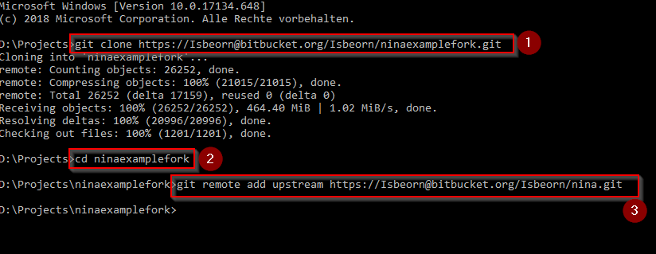
```
git remote add upstream https://<YourUserName>@bitbucket.org/Isbeorn/nina.git
```

## Fetching the Large File Storage files

1. Bitbucket will not automatically copy over the LFS into the fork repository. This has to be done manually
2. Run the following commands to sync the lfs
```
git lfs fetch --all upstream
git lfs push --all origin
git lfs pull
```

## Navigation in Visual Studio

1. Navigate to your local clone and open "NINA.sln"
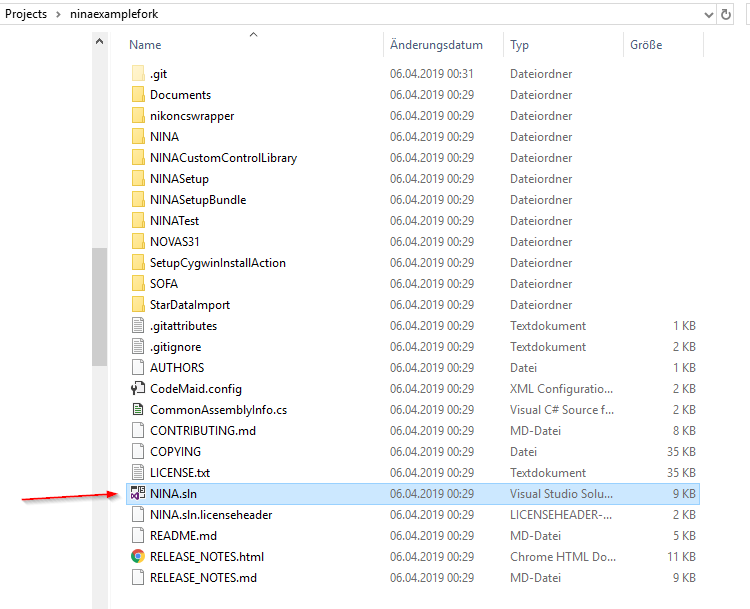
2. Visual studio has a built in git UI, which you can find on the lower right called "Team Explorer"
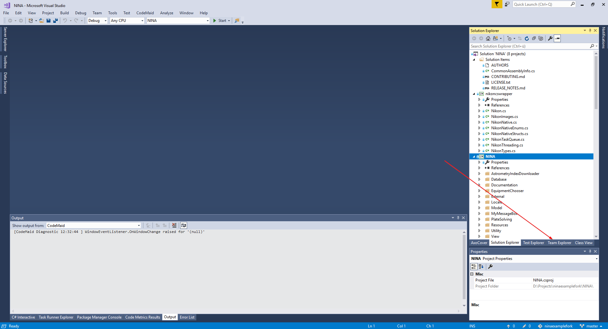
3. Inside the Team Explorer you can get a visual list of all available branches
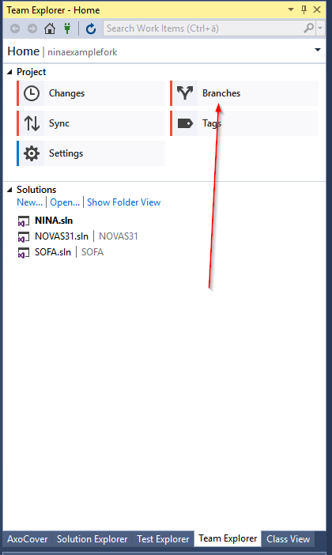
4. Here you can see all branches of your forked repository. Note that the upstream we added earlier is not yet displayed.4. Expand "remotes\origin" and double click on "develop" to switch to this branch
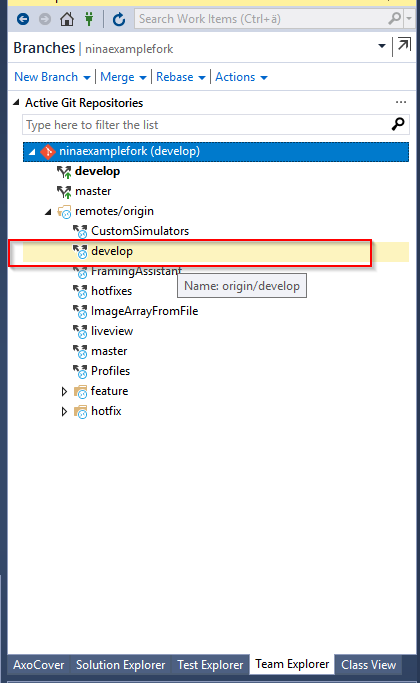
5. Click the back button (top left) and click on "Sync"
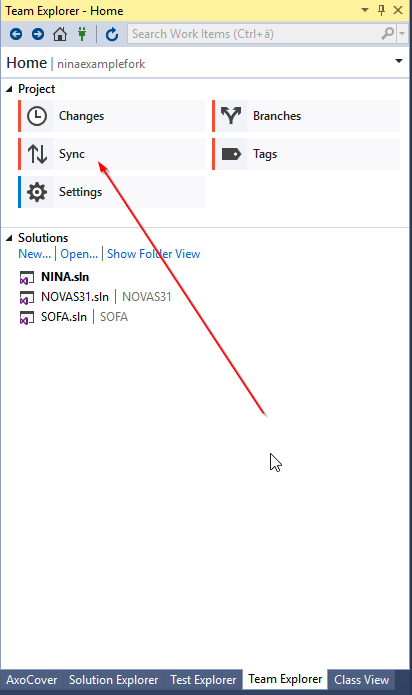
6. Click on "Fetch" and select "upstream" to fetch all branches that are inside "upstream", which is the root repository
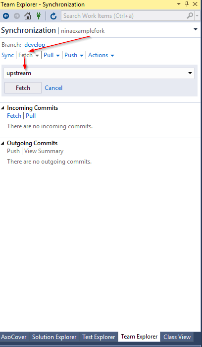
7. Now navigate back and select the "Branches" again. Now the "upstream" branches are also available.
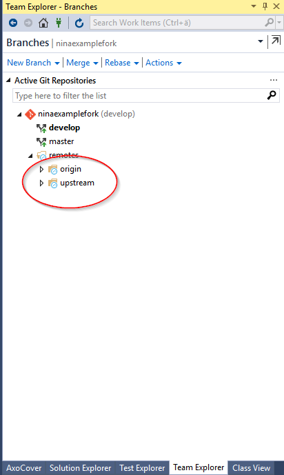
8. To fetch and merge the latest code of the root repository you can right click on "develop", click on "fetch" and "Merge from..." afterwards.
9. Now your branch is up to date and you can start coding.
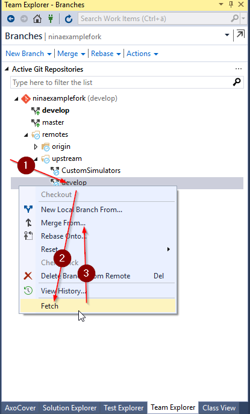
