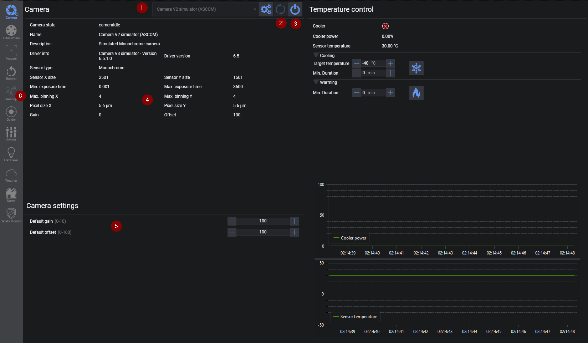
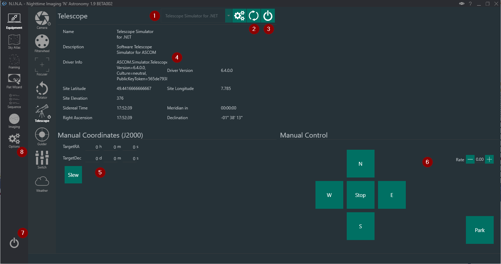

# Connect and verify equipment

Physically connect and power the rig, then open **Equipment**. Select the saved driver for each device, open its setup dialog if required and connect it.

Start with the camera and telescope. Then connect the filter wheel, focuser, rotator, guider, flat device, dome, safety monitor, weather source and switches that the profile uses. The **Connect All Equipment** button is convenient after each device has been selected and tested once.

For the camera, take a short manual exposure and verify download, gain or ISO, offset, binning and cooling controls. For the telescope, verify that the reported site, time, tracking state and pier side are credible before issuing a small slew.

Check the remaining device paths independently:

* move the focuser in both directions without approaching a hard stop
* change filters and confirm the reported position
* connect the guider and start a short guiding test
* run a plate solve on a downloaded exposure
* confirm that a safety monitor changes state as its driver reports

!!! warning
    N.I.N.A. sends commands through the selected driver. Establish safe slew, park, home and meridian limits in the mount or driver before relying on an automated sequence.
