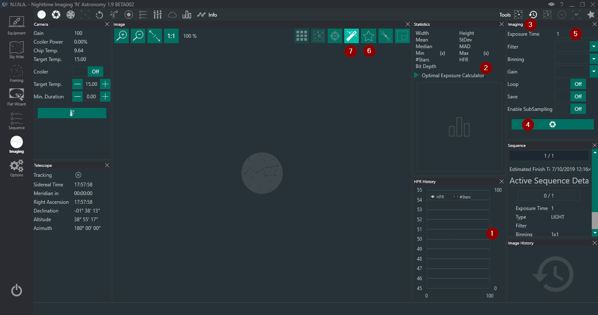

# Focus and solve

Open **Imaging**, take a short looping exposure and enable star detection. Adjust focus until stars are small and the reported HFR is near its local minimum. HFR values depend on image scale and seeing, so compare the trend from the same optical setup instead of using a universal target value.

With a motor focuser, configure [autofocus](../advanced/autofocus.md) and run it manually before adding autofocus instructions or triggers. A useful run has samples on both sides of focus, no saturated field and enough focuser travel to show a clear curve. If the two approach directions produce different positions, measure and configure backlash compensation before increasing the number of autofocus points.

Next, take an exposure and run **Plate Solve**. Verify that the solver returns plausible coordinates and image scale. Automated centering, rotation and meridian-flip recovery all depend on this test succeeding.

For a manual focuser, a Bahtinov mask or repeated HFR measurements can be used instead. Remove the mask before starting the sequence.
