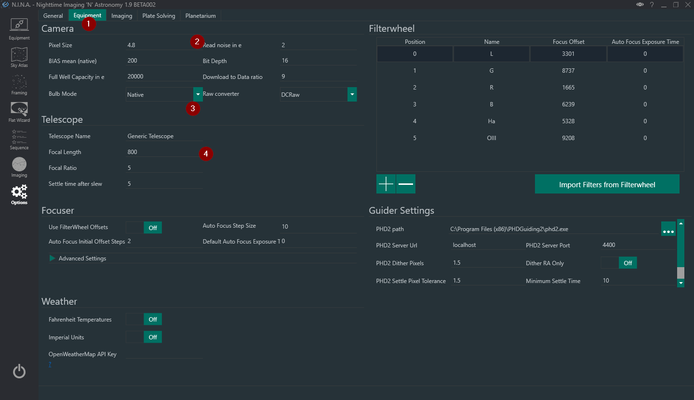
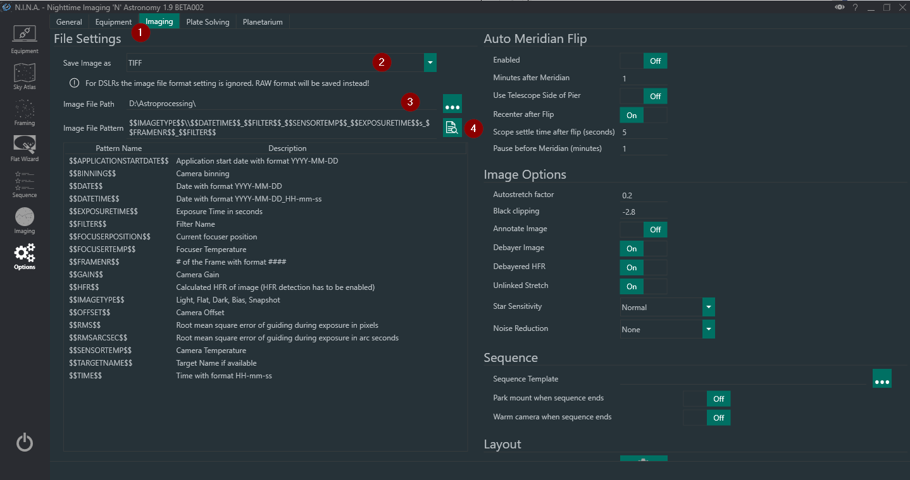

# Configure the profile

Open **Options** and establish the values that other tools use before connecting equipment.

1. In **General**, enter the observing latitude, longitude, elevation and time zone. These values drive altitude charts, twilight times, target visibility and FITS/XISF site metadata.
2. In **Equipment**, verify camera pixel size and telescope focal length. These values determine image scale and the framing rectangle. Most drivers provide camera bit depth automatically; native DSLR drivers may need the sensor value entered manually.
3. In **Imaging**, choose the image directory, file format and file-name pattern. Use the preview below the pattern to make sure a night's files will be unique and sortable.

Before an automated session, also configure:

* a primary and blind [plate solver](../tabs/options/platesolving.md)
* a [guider](../tabs/equipment/guider.md), if the rig guides
* [autofocus](../tabs/options/autofocus.md), if the rig has a motor focuser
* [meridian flip](../tabs/options/imaging.md#auto-meridian-flip) timing for a German equatorial mount

Keep all of these settings in the same profile. Switching profiles changes the complete equipment and automation configuration, not just the device list.
