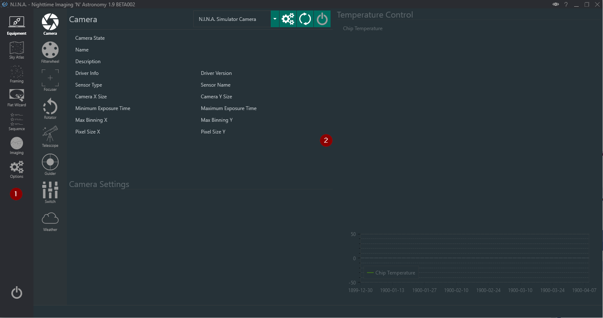

# Start with a profile

N.I.N.A. stores equipment choices, site coordinates, imaging preferences and automation settings in a profile. Create a profile for the imaging rig you are about to use, then confirm that it is selected before changing settings or connecting devices.

The navigation bar opens the main workspaces. The most important ones for a first session are:

* **Options** for the observing site, camera properties, file paths, plate solving, guiding and autofocus settings
* **Equipment** for selecting, configuring and connecting each device
* **Sky Atlas** and **Framing Assistant** for choosing and framing a target
* **Sequencer** for building and running the session
* **Imaging** for manual exposures and live monitoring

This guide follows the current Framing Assistant and Advanced Sequencer workflow. The Simple Sequencer remains available for a compact target list and can convert its contents to an Advanced Sequence when more control is needed.

!!! note
    Install the current Windows and device drivers before starting. N.I.N.A. can list only devices exposed by a supported native, ASCOM or Alpaca driver.
