The advanced sequencer makes it possible to completely plan and customize an imaging run based on specific needs for each user by giving the capability to plan on a very granular level. Equipment can be controlled step by step with various available instructions, and each instruction can be further customized with specific parameters.

## Navigating
The main area will contain the actual instructions. There it is possible to add the instructions, customize the parameters and see the progress of the sequencer.  
Additionally, the area is split into three sections to manage sequence start instructions, target instructions, and end-of-sequence instructions.
  
On the bottom left, it is possible to lock the sequencer from any manual input, disable drag & drop, and save and load a complete sequence run. On the bottom right, it is possible to start and stop a sequence.
The right sidebar will show all available instructions as well as templates and targets. These are described in more detail below.
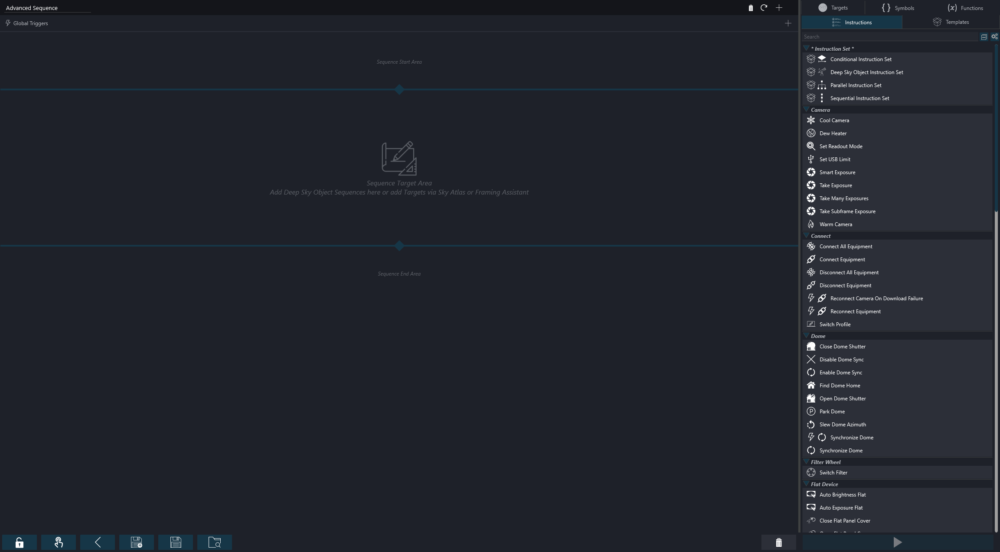

Everything inside the advanced sequencer is enabled to use drag and drop. For example an instruction can be grabbed by holding the left mouse button and then dragged into the sequencer area to add an instruction at the mouse location.  
However, it is also possible to plan everything without using drag and drop at all by using the available '+' buttons.
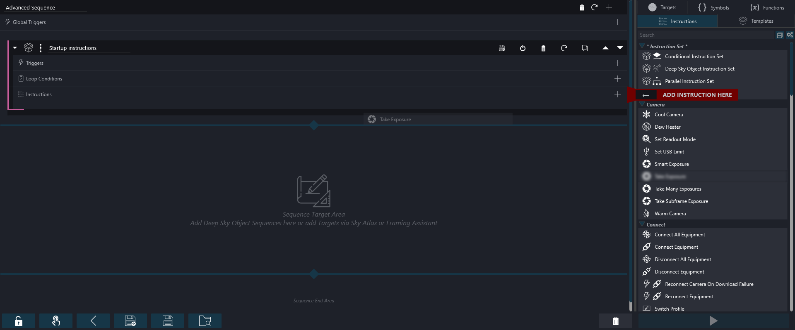

## The flow of the sequencer

On a high level, the concept of the advanced sequencer is quite simple. A sequence will consist of small building blocks that will execute some logic and the sequencer will execute these blocks one by one from top to bottom.  
In addition to single building blocks, so-called *Instruction Sets* can be added too. Think of these as a logical group of instructions. These groups will function in the same way as the whole sequencer, as they will execute the blocks that are part of the group from top to bottom.
The *Instruction Sets* can contain so-called *Loop Conditions* which will change the flow of operation slightly, as the Instruction Set will repeat its set of instructions for as long as all conditions that these loop conditions define are met. Some instruction sets can also change when or how their contents run, such as running in parallel or only when an Expression is true.
In the example below, the first three waits run once, the two waits in "Repeat captures" run five times and the final two waits then run once.
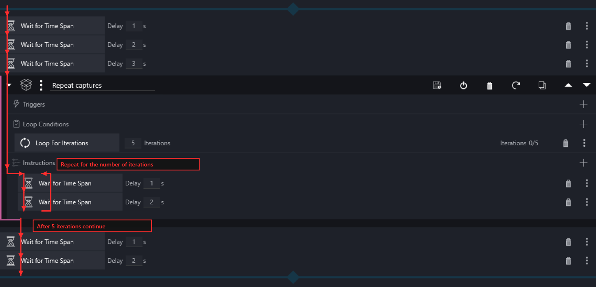
    
## Instructions
An instruction is a single command that the sequencer will execute. Each instruction has a different purpose and can control various types of equipment, set parameters or are utility functions to automate the imaging process.  
A complete list of available instructions can be found on the right side of the advanced sequencer and each instruction will have a small description as well as a tooltip of its purpose. The [Instructions page](./instructions.md) will also describe each available instruction in detail.
Instructions can be added to the sequencer and the specific parameters can be set there. The sequencer will then go through each instruction and process them.
From the available list, instructions can be dragged over from the right side to the left side and dropped into the sequencer.  
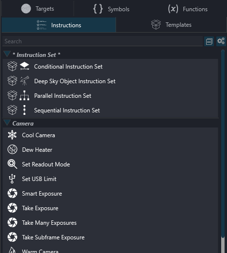

Furthermore, instructions can also be directly added into the sequence by clicking on the + button on the top.
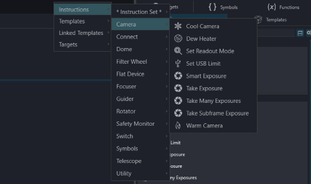

Once an instruction is part of the sequencer, it will show the specific options for each instruction to customize the behavior. For example an item can be set to cool down the camera to a specific temperature, another item set to switch to a specific filter etc.

### Expressions (NINA 3.3)
NINA 3.3 adds the ability to use Expressions, in addition to numeric values, to customize instruction options.  Expressions are strings of text that represent something to be *calculated* or *evaluated*; the result of this evaluation must be a valid option for the instruction.   Expressions can include numeric values, Symbols (defined below), mathematical, bitwise, and logical operators (e.g. +, -, |, &, ||, &&), and functions (e.g. if, floor, between); in specific places, a string (text surrounded by single quotes) can also be part of an Expression.  Please see [Expressions](../advanced/expressions.md) for further details.

### Customizing the list of instructions
With the gear icon in the sidebar, a customization mode can be enabled. In this mode, you can flag each instruction to be hidden. When it is flagged, the instruction will no longer be visible in the sidebar or in the context menus. This is useful if, for example, you don't have a specific type of equipment and don't want to see instructions for it cluttering your user interface. Instructions that are part of the sequence, but are hidden from the sidebar, will still be visible and active in the sequence.
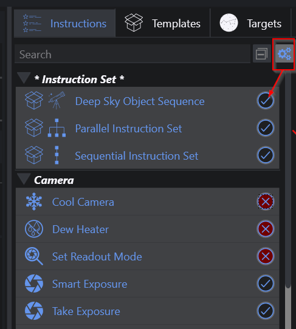

### Validations
Each instruction is capable of doing some degree of validation and will check if the preconditions are met. A red exclamation mark will appear next to an instruction when an issue is detected. Hover over the red indicator to get more details.
For example, the screenshot below shows exposure instructions with gain and offset values outside the connected camera's supported ranges. Each affected instruction displays an indicator, and the production tooltip describes both validation failures.
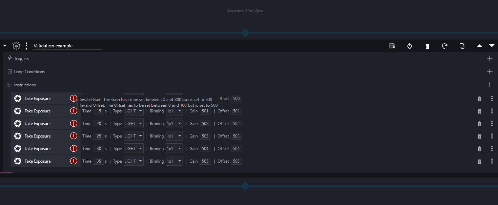

!!! tip
    Instructions that report issues will always be skipped, indicate that there was an error and will not run at all!

## Instruction Sets
Instruction sets are groups of instructions. Each set will process its content based on the parameters inside the set. Their behavior can be further controlled by loop conditions and triggers, which are described further below.
Instruction sets can be added to the sequencer in the same way as instructions. Furthermore it is possible to nest instruction sets inside of each other.
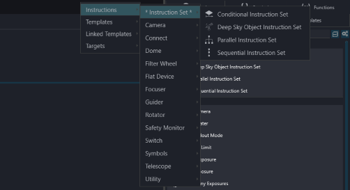
### Sequential Instruction Set
This instruction set will process the instructions one after the other, from top to bottom.
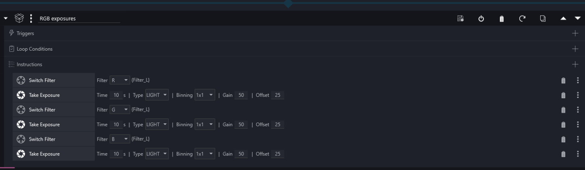
### Conditional Instruction Set
This instruction set checks its Expression when the set is reached. If the Expression evaluates to true, the instructions inside run once from top to bottom. If it evaluates to false, the instructions inside are skipped and the sequence continues after the set.

The Expression and its current evaluated result are shown in the set header, so the condition remains visible even when the set is collapsed.

### Parallel Instruction Set
All instructions inside this special instruction set will be processed in parallel. As everything will run in parallel, there are no conditions or triggers available for this set.
Order of instructions within the Parallel Instruction Set is not defined or implied.

- Note:  
   Multiple instructions for the same equipment should generally not be used in the same parallel instruction set.  
   example: Park Scope and Find Home will be executed in parallel and which one is executed first is not constant.  
   Wait instructions are executed in parallel with all other instructions so will not force an order to instruction execution.  
   Shutdown PC and Shutdown N.I.N.A instructions generally are not wise to use inside a Parallel Instruction Set.  
        
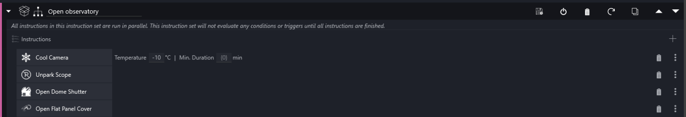
### Deep Sky Object Set
This special set of instructions behaves similarly to a sequential instruction set. The main difference here is that a specific target can be specified with coordinates and rotation, and then all instructions that are dependent on coordinates or rotation will pick up these coordinates automatically, so a user does not need to enter these coordinates multiple times.
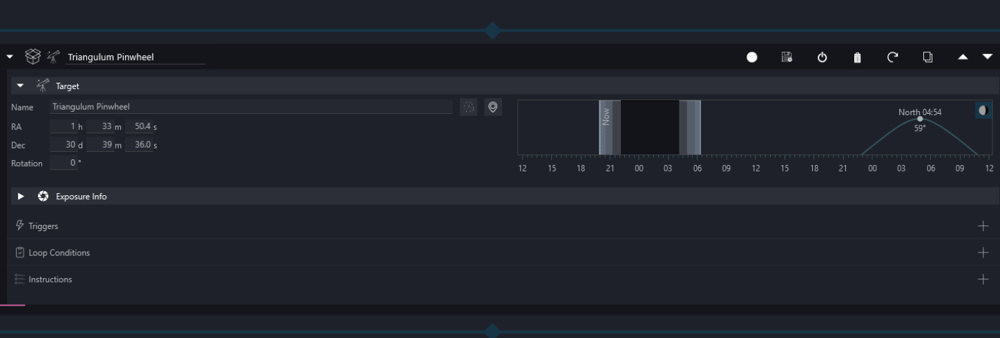

## Loop Conditions
Loop conditions will drive the behavior of an instruction set. Without a condition, an instruction set will just process each sequence item inside once and is finished. This behavior will be changed, when loop conditions are attached. When an instruction set has a loop condition attached, it will process its items and loop itself again as long as the attached loop conditions are fulfilled. Once at least one of these loop conditions is not fulfilled anymore (e.g. a condition to loop until a specific time and the time has passed) the current instruction will be finished and afterwards the rest of the instructions inside this set will be skipped as well as the instruction set marked as finished. Conditions will be evaluated after each instruction.
These conditions can be dragged and dropped into the loop condition section inside an instruction set.
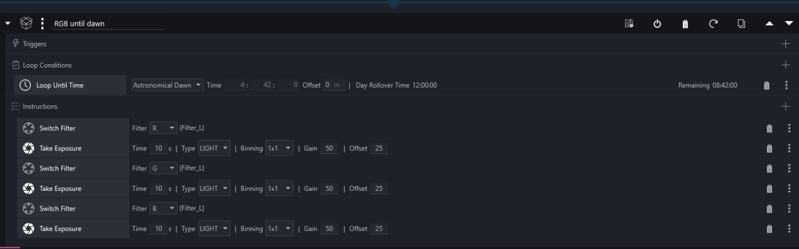
Loop conditions can also be directly attached to an instruction set by clicking the + icon next to the loop conditions section inside an instruction set.  
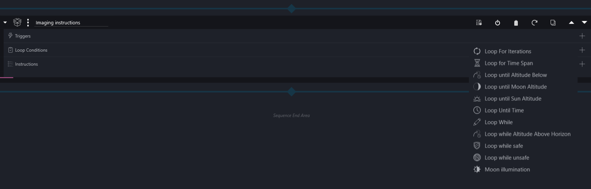

As instruction sets can be nested, the loop conditions are also evaluated for the current instruction set and all loop conditions that are in a parent instruction set.  
Let's take a look at the below example to give an example. The top level instruction set has a condition attached to loop until 12:24:09h. Then there are two further instruction sets inside that should loop 2 times and 3 times respectively.
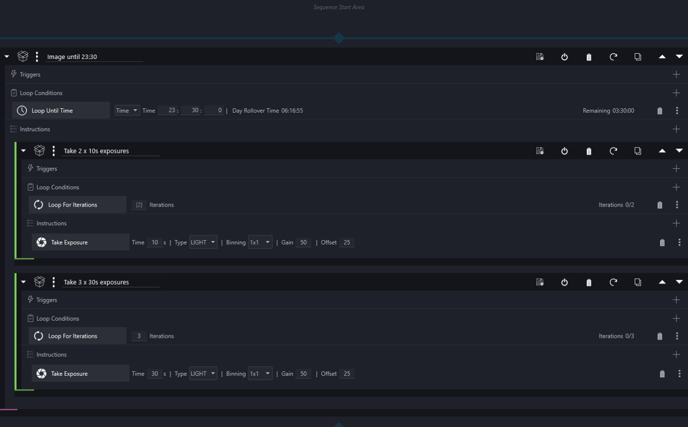
The following will happen in this case:  
- The first instruction set will loop 2 times. After each instruction the parent condition will be checked too, that the remaining time is still sufficient to continue.  
- Afterwards the second instruction set will loop 3 times. After each instruction the parent condition will be checked too, that the remaining time is still sufficient to continue.  
- Once both instruction sets are finished, the whole set will be reset again, as the "Loop Until Time" condition is still valid  
- This behavior will repeat until the Time is up. Once this happens all items inside this whole set will be skipped  

## Triggers
Triggers are instructions that should only happen when certain events occur. These triggers can be attached to an instruction set. When attached, they will get evaluated after each instruction inside the set, similar to how loop conditions are evaluated. When the defined event occurs, the trigger will execute its instruction. An example is to trigger something after a certain amount of exposures.
The lightning icon next to an instruction on the right side will indicate that the instruction is in fact a trigger. These can only be dragged into the trigger section of an instruction set. Additionally a trigger can directly be added to an instruction set by clicking on the + button.
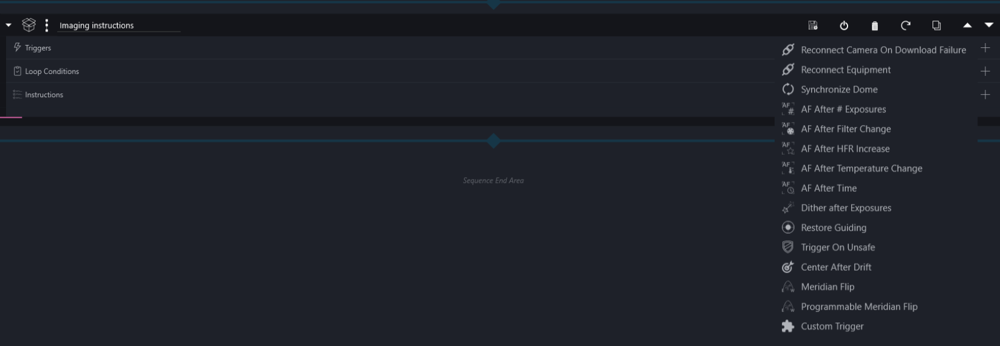
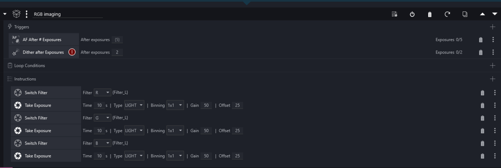

As triggers are evaluated in the same fashion as loop conditions, you can set triggers on a higher level and they still get evaluated when the current instruction that is executed is part of a nested instruction set. In the example below, the trigger will fire after every 5 exposures, even though the trigger is defined on a higher level than the actual exposure item.

## Templates
A template is a set of various customized instructions set up with predefined values to be re-used constantly. To be able to quickly set up a sequence for an imaging run, the templates will take a key part and enable the possibility to easily create specific types of sequences in a matter of no time.  
Each instruction set is capable of being templated. When a set is templated, all its content and the values set inside are saved and put into the template. When the template is then added to the sequence again, it will create a copy of it and create an instruction set that is exactly set up like the templated set.  

### Linked Templates
By default, adding a template to a sequence creates an independent copy. If you want a sequence to follow future changes to the source template, hold Ctrl while dropping the template into the sequencer, or add it from the Linked Templates menu. This creates a Linked Template container instead of copying the template.

A linked template shows the current template contents directly in the sequence, but the materialized content is dimmed and read-only so it can be inspected without accidentally changing it. When the source template changes, the linked template refreshes automatically.

To intentionally change the source template from the sequence, use Edit Template on the linked template. While editing, the materialized content becomes editable. Save Template writes the changes back to the user template; Cancel discards the edit and refreshes from the current source. Default templates cannot be edited directly.

When a linked template is based on a Deep Sky Object Set, target information is stored on the linked template instance and not in the reusable template itself. Enter a target on the linked template or drop a target onto it. This target override is saved with that linked use and is reapplied whenever the template refreshes, so the same template can be reused for multiple targets.

The templates are located on the right sidebar when switching to the templates tab. A couple of basic templates are provided with the application.  
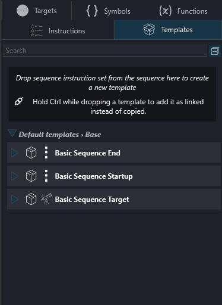

User specific templates are listed below the basic templates.
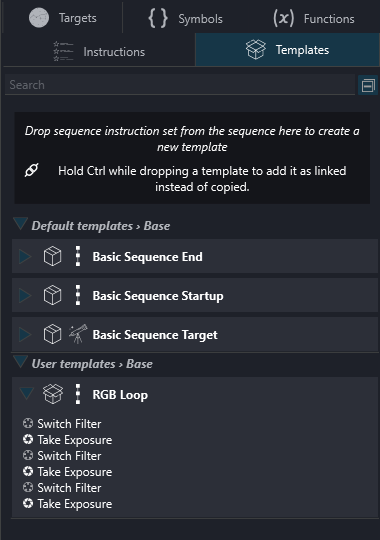

To create a user template an instruction needs to be added to the sequencer. Then the desired instructions, triggers and loop conditions should be added to the instruction set. Once the instruction set is set up with all desired parameters a click on the save button next to the instruction set will save it as a template. Then the name of the instruction set will be taken for the template name and a new template will be shown in the sidebar. When a name is already taken, the application will ask if the existing template should be overwritten.
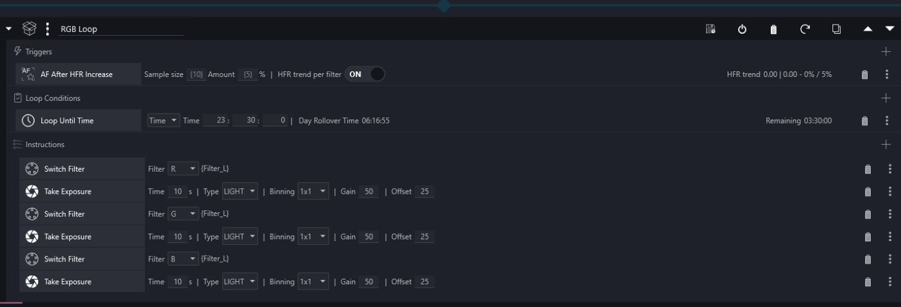

Furthermore it is possible to just drag and drop the instruction set into the template area to create a new one.
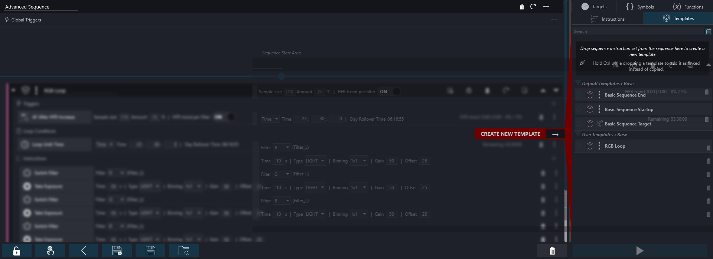

!!! tip
    Templates using a Deep Sky Object Set will be available for selection in the sky atlas and framing assistant to be used to add targets to a sequence

## Targets
The targets tab offers the ability to store targets for later use. They contain a deep sky object sequence and can be dragged and dropped into the sequencer just like templates. In contrast to templates, these deep sky object sequences will auto populate the target coordinates and rotation info as they were saved.  
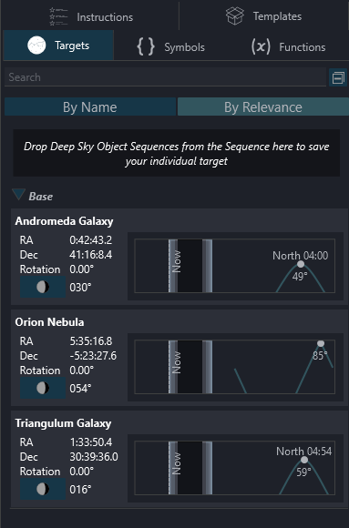

To use a target, simply drag it into the sequencer. Its underlying instructions will then be loaded into the sequencer.
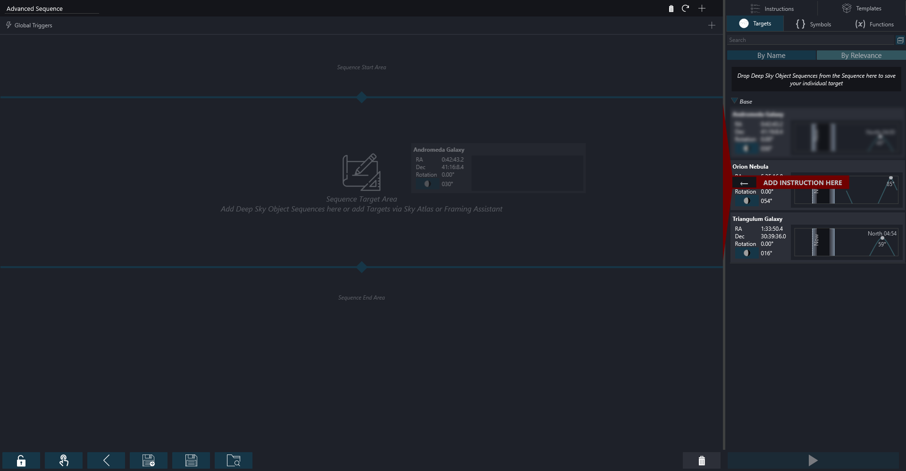

An alternative to just dragging them into the sequence, it is also possible to update an existing deep sky object sequence with a specific target by dragging the target from the target tab into the target area of the deep sky object sequence. Then only the target information of that set is updated.    
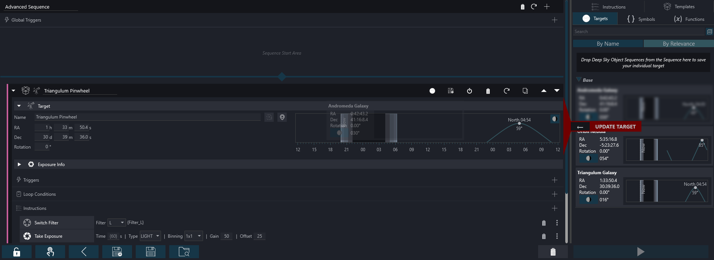

To save a target in the target area, simply click the save target button in the header of the deep sky object sequence.  
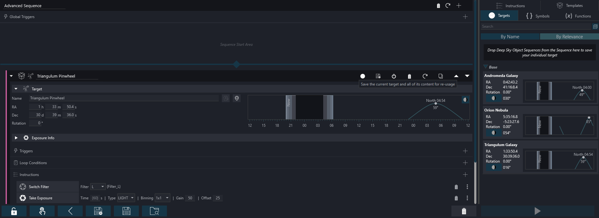

Or drag it into the target tab drop area.  
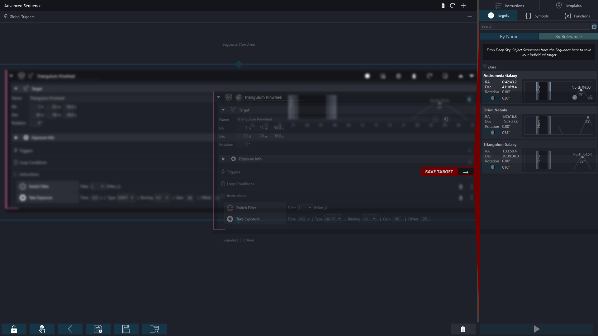

## Shortcuts
| Key          | Command                                              | Note                                                                                |
|--------------|------------------------------------------------------|-------------------------------------------------------------------------------------|
| Ctrl+S       | Saves the current sequence                           |                                                                                     |
| Ctrl+Shift+S | Saves the current sequence to a new file             |                                                                                     |
| Ctrl+O       | Opens an existing sequence                           |                                                                                     |
| Alt          | Duplicate the current instruction or instruction set | When in the process of dragging an instruction or instruction set to a new location |
