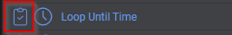
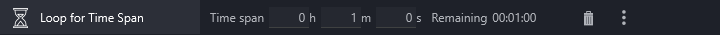
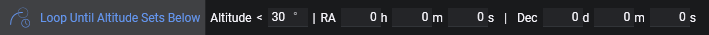
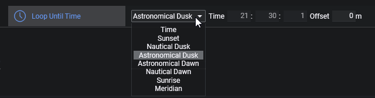
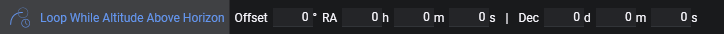
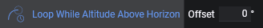
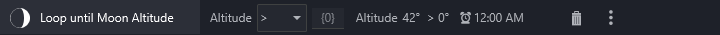
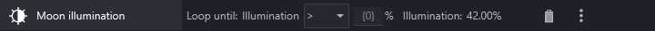
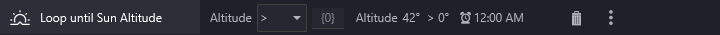

Loop conditions will drive the behavior of an instruction set. Without a condition, an instruction set will just process each sequence item inside once and is finished. This behavior will be changed, when loop conditions are attached. When an instruction set has a loop condition attached, it will process its items and loop itself again as long as the attached loop conditions are fulfilled. Once at least one of these loop conditions is not fulfilled anymore (e.g. a condition to loop until a specific time and the time has passed) the current instruction will be finished and afterwards the rest of the instructions inside this set will be skipped as well as the instruction set marked as finished. Conditions will be evaluated after each instruction.    

Conditions can be identified by the highlighted icon next to them in the sequencer sidebar.  
  

### Loop For Iterations
  
Loop the instruction set for the specified amount of iterations.

### Loop For Time Span
  
Loop the instruction set for the specified amount of seconds.

### Loop Until Altitude Sets Below
  
For a given target coordinates the condition will loop until the altitude sets below the specified amount.
When this condition is part of a "Deep Sky Object Sequence" the coordinates will be inherited by this set and no coordinates need to be entered  
  

### Loop Until Time
  
Loop an instruction set until a specific point in time. The time can either be set manually or automatically determined based on criteria and an offset specified in minutes.  
**Time**: Manually entered time  
**Sunset**:  The time when the sun gets below 6° of the horizon  
**Nautical Dusk**: The time when the sun gets below 12° of the horizon  
**Astronomical Dusk**: The time when the sun gets below 18° of the horizon  
**Astronomical Dawn**: The time when the sun gets above 18° of the horizon  
**Nautical Dawn**: The time when the sun gets above 12° of the horizon  
**Sunrise**: The time when the sun gets above 6° of the horizon  
**Meridian**: When a target is set this will be the time the target will cross the meridian  

!!!note
    **When using a manual time:**  
    As there is no day attached to the condition, the roll over for a new day happens at noon (similar to the altitude charts). This brings a few advantages to not loop unexpectedly when you are already past the specified time.  
    Examples:  
    Current time: 18:00h | Loop until time: 19:00h -> Loop for one hour  
    Current time: 20:00h | Loop until time: 19:00h -> Condition will be skipped  
    Current time: 18:00h | Loop until time: 02:00h -> Loop for eight hours  
    Current time: 02:00h | Loop until time: 03:00h -> Loop for one hour  
    Current time: 04:00h | Loop until time: 03:00h -> Condition will be skipped  
    Current time: 08:00h | Loop until time: 18:00h -> **Condition will be skipped** because the roll over at noon has not happened yet  

    **When using calculated times for dawn and dusk:**  
    Instead of using noon to roll over to the next day the rollover will instead happen at the "opposite" side of the condition. For example when you loop until dawn, the roll over will be at sunset

### Loop While Altitude Above Horizon
  
This will loop the instruction set for as long as the specified target is above the horizon. When a [custom horizon](../../tabs/options/general.md) is set, the custom horizon will be considered as the altitude to be above of. When no custom horizon is set, 0° of altitude will be considered. Furthermore an altitude offset can be specified.  
When this condition is part of a "Deep Sky Object Sequence" the coordinates will be inherited by this set and no coordinates need to be entered  
  

### Loop While Safe
  
Loop for as long as the safety monitor is reporting safe conditions. When the state of the safety monitor switches to unsafe, the currently running instruction will be cancelled and the rest of the instruction set will be skipped.  
It is recommended to use this condition in conjunction with another condition, to not run in an endless loop when the safety monitor is reporting safe conditions for the whole time.  
*Requires a safety monitor device to be connected*

### Loop While Unsafe
  
Loop for as long as the safety monitor is reporting unsafe conditions. When the state of the safety monitor switches to safe, the currently running instruction will be cancelled and the rest of the instruction set will be skipped.  
It is recommended to use this condition in conjunction with another condition, to not run in an endless loop when the safety monitor is reporting unsafe conditions for the whole time.  
*Requires a safety monitor device to be connected*
### Moon Altitude
  
Loop for as long as the moon matches the specified parameters.

### Moon Illumination
  
Loop for as long as the sun matches the specified parameters.

### Sun Altitude
  
Loop while the sun altitude is above or below the specified amount of degrees