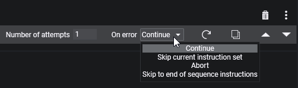
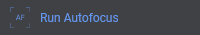
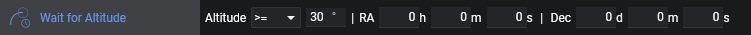
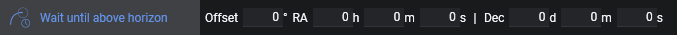

## General
  
An instruction is a single command that the application will execute. Each instruction has a different purpose and can control various types of equipment, set parameters or are utility functions to automate the imaging process.

  
Each instruction can be identified by its name and its icon.

### Validations
  
Instructions are capable of validating prerequisites and warn the user about potential issues. When a red exclamation mark is visible next to the instructions, not all prerequisites to run this instruction are met and when hovering over the red circle, the details which prerequisites are missing is shown.  
**Important**: An instruction that does not meet its prerequisites will be skipped and the instruction is considered as failed.  

### Options
  
Most instructions also come with a variety of options to adjust their behavior at runtime. For example you can adjust the exposure times, gain and offset for an instruction that should take an exposure with your camera. Each instruction has a different set of options which are explained in more detail below.

### Buttons
  
On the right side of the instructions are a bunch of buttons available to delete, copy, move or adjust advanced settings that exist for all instructions.
### Advanced settings

  

When clicking on the three dots on the right side of an instruction, an advanced section will appear where advanced settings for an instruction are revealed.

**Number of attempts**  
This drives how many reattempts an instruction should make in case of failure

**On error**  
When all attempts have been unsuccessful this setting will drive how to continue with the sequence.  
- *Continue*: The sequencer will just continue with the next instruction  
- *Skip current instruction set*: The currently running instruction set will be skipped  
- *Abort*: The sequence will be completely stopped  
- *Skip to end of sequence instructions*: Skip any remaining instructions from the start and target area and continue with the instructions in the sequence end area  

**Reset**  
This button will reset the state of the instruction, like progress exposures etc.

**Copy**  
Create an exact copy of the current instruction set and add it below the current instruction

**Move up**  
Moves the instruction one row above. If it is already the first instruction of an instruction set, it will move to the parent instruction set above the current instruction set instead.
If the previous instruction is an instruction set that is not collapsed, the instruction will move to the bottom of that instruction set

**Move down**  
Moves the instruction one row below. If it is already the last instruction of an instruction set, it will move to the parent instruction set below the current instruction set instead.
If the next instruction is an instruction set that is not collapsed, the instruction will move to the top of that instruction set

## Camera
Control basic functions of a [Camera](../../tabs/equipment/camera.md). Each instruction in this category requires at least a Camera to be connected.

### Cool Camera  
  
Cool your camera to the specified temperature and the specified minimum duration. For most cameras the duration can be left at 0 as the driver will handle the cooling duration.
Once the camera has reached the specified temperature the instruction is completed.  
*Requires a camera that is capable of set point cooling*

### Warm Camera  
  
Warm your camera to ambient temperature using the specified minimum duration. For most cameras the duration can be left at 0 as the driver will handle the cooling duration.
Once the camera has reached the ambient temperature the cooler is turned off and the instruction is completed.  
*Requires a camera that is capable of set point cooling*

### Dew Heater
  
This instruction will turn on or turn off the camera dew heater  
*Requires a camera that has a controllable dew heater*

### Set Readout Mode
  
Set your camera to a specific readout mode. The number indicates the index of the readout mode from the camera dropdown - starting with 0.  
*Requires a camera with settable readout modes*

### Take Exposure
  
This instruction will take an exposure using the specified exposure time, binning, gain and offset.

### Take Many Exposures
  
Similar to the "Take Exposure" instruction, but with the added ability to specify a number of exposures to complete before proceeding.

### Smart Exposure
  
Similar to the "Take Many Exposure" instruction, but with the added ability to also specify a specific filter and to dither after a specific amount of exposures.  
Keep dither after exposures to 0, to skip the dither completely.  
*Requires a connected filter wheel to switch filters and a connected guider to dither*

!!!note
    A fun fact - the "Take Many Exposures" and "Smart Exposures" are actually instruction sets with static content that is just displayed like a normal instruction and is bundling together most common imaging operations for convenience

## Dome

### Close Dome Shutter

### Enable Dome Sync

### Open Dome Shutter

### Park Dome

## Filter Wheel

### Switch Filter

## Flat Device

### Close Flat Panel Cover

### Open Flat Panel Cover

### Set Brightness

### Toggle Light

### Trained Flat Exposure

### Trained Dark Flat Exposure

## Focuser
Control basic functions of a [Focuser](../../tabs/equipment/focuser.md). Each instruction in this category requires at least a Focuser to be connected.

### Move Focuser
  
Moves the focuser to the specified absolute position

### Move Focuser By Temp.
  
Moves the focuser to a position that is calculated out of the current temperature, the slope (and intercept when absolute mode is enabled).  

* *Absolute mode*: Calculated Position = Slope * Temperature + Intercept  
* *Relative mode*: Calculated Position = Current Position + Slope * Temperature  

*Requires a focuser with a temperature probe*

### Move Focuser Relative
  
Moves the focuser to a target position based on the current position and a specified amount from that position

### Run Autofocus
  
Starts an [autofocus run](../../advanced/autofocus.md) based on the [autofocus settings](../../tabs/options/autofocus.md)

## Guider
Control basic functions of a [Guider](../../tabs/equipment/guider.md). Each instruction in this category requires at least a Guider to be connected.

### Dither
  
Issues the guider to [dither](../../advanced/dithering.md)

### Start Guiding
  
Starts guiding if not already started. In addition a toggle to force the calibration can be enabled. Then the guider will be forced to run a calibartion, even if a valid calibration is already available. When this toggle is off, the guider will determine by itself if calibration is necessary.

### Stop Guiding
  
Stops active guiding when guiding is active.

## Rotator
Control basic functions of a [Rotator](../../tabs/equipment/rotator.md). Each instruction in this category requires at least a Rotator to be connected.

### Rotate By Mechanical Angle
  
Rotates the rotator to the specified mechanical absolute angle

## Safety Monitor
Control basic functions of a [safety monitor](../../tabs/equipment/safetymonitor.md). Each instruction in this category requires at least a safety monitor to be connected.

### Wait Until Safe
 
Waits until the safety monitor is reporting safe conditions again

## Switch
Control basic functions of a [Switch](../../tabs/equipment/switch.md). Each instruction in this category requires at least a Switch to be connected.

### Set Switch Value
  
Sets a switch to a specified value. When no switch is connected, a list of generic switches by number are available. The list will update itself to the actual switches on device connection. When a specified switch value is out of range, the instruction will show a validation error.

## Telescope
Control basic functions of a [Telescope](../../tabs/equipment/telescope.md). Each instruction in this category requires at least a Telescope to be connected.

### Find Home
  
Move the mount to the home position.  
*Requires a mount driver that is capable of finding the home position*

### Park Scope
  
Moves the mount to the park position. A mount that is parked, will not accept slew commands.
*Requires a mount driver that is capable of parking*

### Set Tracking
  
Enables mount tracking to the specified tracking rate.

### Slew And Center
  
Stops Guiding (if it was active), slews to the specified coordinates, calls the platesolver to center to the specified coordinates and resumes guiding (if it was stopped at the start).  
When this instruction is part of a "Deep Sky Object Sequence" the coordinates will be inherited and no coordinates need to be entered here  
*Requires a [plate solver](../../advanced/platesolving.md) to be set up*

### Slew To Alt/Az
  
Slews to the specified coordinates.

### Slew To Ra/Dec
  
Stops Guiding (if it was active), slews to the specified coordinates and resumes guiding (if it was stopped at the start).  
When this instruction is part of a "Deep Sky Object Sequence" the coordinates will be inherited and no coordinates need to be entered here  

### Slew, Center And Rotate
  
Stops Guiding (if it was active), slews to the specified coordinates, calls the platesolver to center to the specified coordinates as well as considering the rotation together with a [rotator](../../tabs/equipment/rotator.md) and resumes guiding (if it was stopped at the start).  
When this instruction is part of a "Deep Sky Object Sequence" the coordinates will be inherited and no coordinates need to be entered here  
*Requires a [plate solver](../../advanced/platesolving.md) to be set up and a rotator to be connected*

### Solve And Sync
Uses the current mount position to solve the position and sync it based on the plate solver result.
**This instruction will not center the mount, it will just sync the mount to where it is currently pointing at!**  
*Requires a [plate solver](../../advanced/platesolving.md) to be set up*

### Unpark Scope
  
Unparks the mount so it is able to receive slew commands.  
*Requires a mount driver that is capable of parking*

## Utility
The instructions in this category are utility commands that don't necessarily depend on any equipment and have useful tools and helpers to improve the sequence

### Annotation
  
This instruction will not execute anything. It is purely there to have custom text annotations inside the sequence to remind you of things, or taking notes to clarify certain sequence arrangements etc.

### External Script
  
An instruction to start a custom executable file from your file system. Click on the three dots to browse through the file explorer and set a file path.

### Message Box
  
When this instruction is starting it will spawn a message box and pauses the sequence until the user action to confirm the box is taken. The box can be used for example to stop the sequence and notify you to put a cover on to take flats etc.

### Wait For Altitude
  
For the given target coordinates, this instruction will simply wait until the altitude has been reached.
When this instruction is part of a "Deep Sky Object Sequence" the coordinates will be inherited and no coordinates need to be entered here  

### Wait For Time
  
Wait until a specific point in time. The time can either be set manually or automatically determined based on criteria as well as an offset specified in minutes.  
**Time**: Manually entered time  
**Sunset**:  The time when the sun gets below 6° of the horizon  
**Nautical Dusk**: The time when the sun gets below 12° of the horizon  
**Astronomical Dusk**: The time when the sun gets below 18° of the horizon  
**Astronomical Dawn**: The time when the sun gets above 18° of the horizon  
**Nautical Dawn**: The time when the sun gets above 12° of the horizon  
**Sunrise**: The time when the sun gets above 6° of the horizon  
**Meridian**: When a target is set this will be the time the target will cross the meridian  

### Wait For Time Span
  
Wait for a specific period of time.

### Wait If Moon Altitude
  
This will check the altitude of the moon and wait until the moon is above or below the specified altitude.

### Wait If Sun Altitude
  
This will check the altitude of the sun and wait until the sun is above or below the specified altitude.

### Wait Until Above Horizon
  
This will wait for as long as the specified target is below the horizon. When a [custom horizon](../../tabs/options/general.md) is set, the custom horizon will be considered as the altitude to be above of. When no custom horizon is set, 0° of altitude will be considered. Furthermore an altitude offset can be specified.  
When this instruction is part of a "Deep Sky Object Sequence" the coordinates will be inherited and no coordinates need to be entered here  