Triggers are instructions that should only happen when certain events occur. These triggers can be attached to an instruction set. When attached, they will get evaluated after each instruction inside the set, similar like loop conditions are evaluated. When the defined event occurred for the trigger to fire, the trigger will execute its instruction. After the trigger has finished its execution, the sequence will continue where it left off.   
Triggers can be identified by the highlighted lightning icon next to them in the sequencer sidebar.  
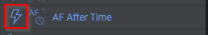  

## Dome
Trigger actions for a dome. Each trigger in this category requires at least a dome to be connected.

### Synchronize Dome
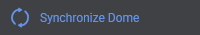  
N.I.N.A. has the capability to automatically synchronize the dome with the telescope pointing direction. However in some scenarios, for example with a heavy dome, the vibrations of movement can affect imaging quality. Therefore this trigger exists to only synchronize the dome in between instructions, instead of having it constantly adjusted. This will also prevent dome movement during exposures.  
*Requires dome following to be disabled*

## Focuser
Trigger actions for a focuser. Each trigger in this category requires at least a focuser to be connected.

### AF After # Exposures
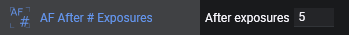  
A trigger to simply run an autofocus after a set amount of exposures. As the amount of exposures is an arbitrary metric, this trigger is not recommended.

### AF After Filter Change
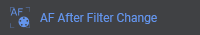  
When the filter wheel changes its filters and no filter offsets have been calcualted to automatically adjust the focuser position for the change of focus due to the filter shift, this trigger can help to mitigate the problem by running an auto focus run when a filter changes during imaging.

### AF After HFR Increase
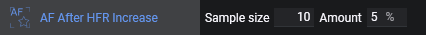  
This trigger will monitor the history of images done during the sequence. It will take all exposures up until the last autofocus (or all if no autofocus has happened yet) and filter them for the currently active filter. The first point after the autofocus will be taken as reference point as well as the last n points, where n is the specified sample size. Out of the last n points the trend will be determined and compared to the reference point. If the trend is above the specified amount of percentage an autofocus will be triggerd.  
This is a decent generic trigger if you don't know about the temperature sensitivity of your equipment, but it requires that your autofocus results are consistent and that the seeing is not bad.

### AF After Temperature Change
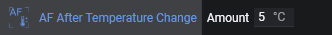  
When the temperature rises or falls most equipment will slightly shift its focus. When you roughly know at which temperature your equipment shifts focus enough to be out of the critical focus zone, this trigger can help you to automatically run the autofocus run when a specifed amount of temperature drift has happened.
*Requires a focuser with a temperature probe*

### AF After Time
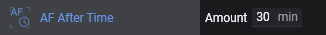  
A trigger to simply run an autofocus after a set amount of time. As the amount of time is an arbitrary metric, this trigger is not recommended.

## Guider
Trigger actions for a guider. Each trigger in this category requires at least a guider to be connected.

### Dither After Exposures
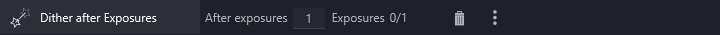  
Using this trigger will initiate a dither operation after the set amount of exposures. For more information about dithering, visit the [dedicated page](../../advanced/dithering.md) about it.

### Restore Guiding
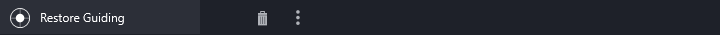  
This trigger will start guiding each time after an instruction inside its context. When guiding is already started, no action will be taken. Using this trigger makes sure that the guiding software reacquires a guide star after some failures, like clouds.  
This trigger is best used in combination with the "Center After Drift" trigger to guard against interruption from clouds and thus drifting off target.

## Telescope
Trigger actions for a telescope. Each trigger in this category requires at least a telescope to be connected.

### Center After Drift
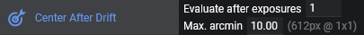  
After the set amount of exposures, this trigger will plate solve the saved image in the background. When the distance of the solved coordinates are above the specified amount of arcminutes compared to the current target coordinates, this trigger will initiate a recenter operation.  
*Requires a plate solver to be set up and the trigger needs to be inside a deep sky object sequence to have a target reference*

### Meridian Flip
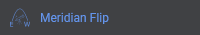  
When the telescope passes the meridian according to the meridian flip settings in the [options](../../tabs/options/imaging.md), this trigger will initiate the meridian flip.  
More information on the settings and how the flip works is available on the [meridian flip page](../../advanced/meridianflip.md)
