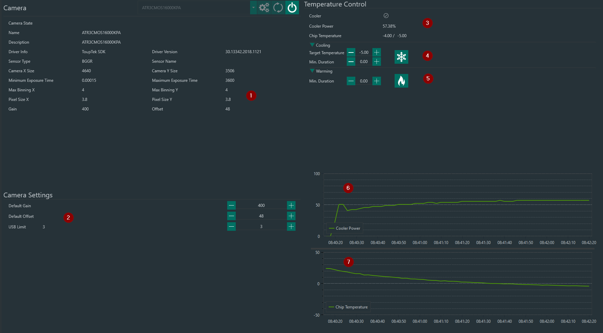

The Filterwheel  Tab lets you connect an ASCOM-compatible filterwheel

1. **Camera  Info Panel**
      * This section provides info about the camera in general, like sensor dimensions, sensor type, pixel size etc.

2. **Camera Settings**
      Default camera settings. These settings are used by default if not overriden by different inputs in other parts of the application

    ## Temperature control
When a cooled camera is connected, this section allows the user to control cooling and warming

3. **Info Panel**
      * Provides info about the current camera cooler status, power usage and chip temperature (actual / target)
   
4. **Cooling**
      * Define a target temparature and activate camera cooling with the ice icon. Min Duration is optional and lets you define a minimum duration for cooling, most cameras drivers already regulate the cooler power automatically and will gradually decrease the temperature.
  
5. **Warming**
      * Gradually warms the camera to ambient temperature with the fire icon. Min Duration is optional and lets you define a minimum duration for warming, most cameras drivers already regulate the cooler power automatically and will gradually increase the temperature.
  
6. Camera Cooler Power chart
   
7. Chip Temperature chart
   

   

