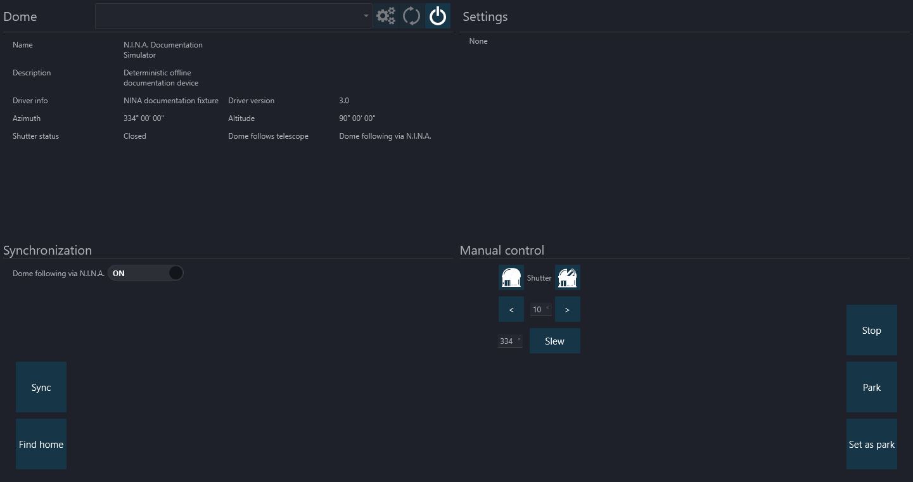

The Dome Tab lets you connect an ASCOM-compatible Dome.

N.I.N.A. provides some useful capabilities when connected to a Dome. They include:

1. **Telescope Following**
 When a Telescope is connected, enabling *Dome follows telescope* ensures that the Dome azimuth (where the opening of a Dome is) is centered wherever the Telescope is pointed. This covers several different cases:
      * *Tracking* - As the telescope follows the rotation of the Earth, the Dome stays in sync with it.
      * *External Slew* - If a program other than N.I.N.A. slews the telescope, then the Dome will rotate until the telescope stops and they are lined back up. This movement can be jerky however - some Domes (such as NexDome) don't allow changing the destination azimuth while it is rotating, so N.I.N.A. repeatedly sends slew commands based on wherever the telescope is pointing at the time. <i>You can disable this behavior in the Options tab.</i>
      * *N.I.N.A. Slew* - If N.I.N.A. issues a slew command to the telescope (such as from the Framing Wizard), then the Dome will go directly to the target azimuth that would be in sync with the telescope at its destination.

2. **Find Home Before Park**
 This setting can be found in the [Dome Options](../options/dome.md). Domes with a Home position (such as NexDome) use a sensor to synchronize the physical azimuth with what is in the software. This is conceptually similar to star alignment with a mount. Finding the home position before parking increases the reliability of finding the precise park location, which can be important if that is where batteries recharge.

3. **Wait for Dome Synchronization**
 When the telescope moves, the Dome typically needs extra time to follow it and re-synchronize their azimuths. N.I.N.A. waits until the telescope stops slewing *and* the Dome is synchronized with it before starting operations that take images (such as Plate Solving and Auto Focus).

4. **Manual Shutter Control**
 The Dome shutter can be directly opened and closed, and the dome can be rotated either directly to an azimuth or in configurable increments.

    !!! note
        There is no rotation control where you hold a button until you're where you want to be. Unfortunately, the ASCOM standard doesn't provide operations that would make this possible.

5. **Sync Azimuth**
  Sometimes the dome rotation can get off a few degrees - for example if a gear slips or there aren't exactly the right number of gear teeth. If your dome supports "Sync Azimuth", then a "Sync" button will be available in the lower left corner that sets the dome azimuth to wherever the telescope is currently pointing. You'd use this by manually lining up the dome with the telescope before syncing. You should not have Dome Synchronization enabled while you do this, but you can turn it back on right afterwards.
