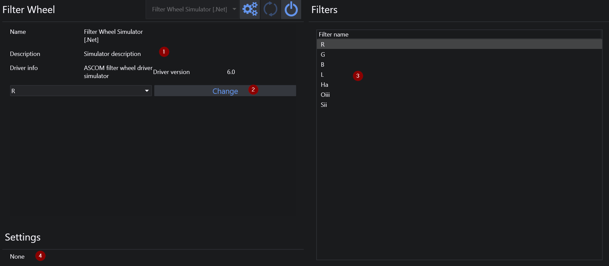

The Filter Weel Tab lets you connect an ASCOM-compatible filterwheel

1. Filter Wheel information
2. Select a filter from the combobox you want to switch to and select the change filter button afterwards
3. List of current filters as imported from ASCOM driver and specified in the [Filter Wheel Options](../options/equipment.md#filterwheel)

