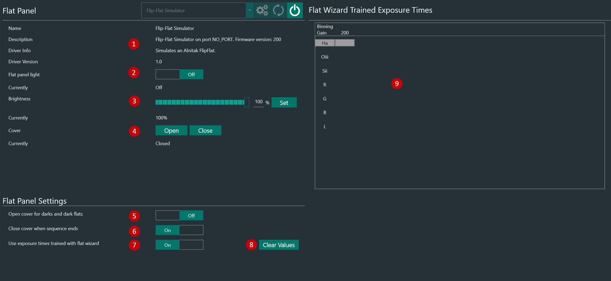

The Focuser Tab lets you connect and control one of the following flat panels:

* Alnitak Flip-Flat
* Allpro Spike-a-flat
* Artesky flat box
* Pegasus Astro Flat Master
* ASCOM compatible flat panel

1. On the left side you will find the flat device info provided by the driver
2. To toggle the light on or off you can press the Toggle button
3. Using the brightness slider you can specify a target brightness for your panel. Hit the Set button to set your panel to the chosen brightness
4. Using the open/close button lets you open or close the panel if it supports it.
5. On the bottom you can customize settings for your flat panel
### Trained Flat Exposure Times

Trained exposure table will automatically populate when running the [Flats Wizard](../flatwizard.md) and will report the gains/exposure times for each Filter, remembering the relative flat panel brightness.  
Furthermore you can manually add or remove columns to it by using the buttons on the bottom. Clicking into the values lets you customize the exposure time (left value) and flat panel brightness (right value) for the filter and gain.

!!! tip
    Follow these steps to fully automate the acquisition of flat frames during an imaging session:  
    1. Populate the _Trained Exposure Times_ Table  
    2. Create a new  sequence (or load a pre-defined sequence) in the [advanced sequencer](../../sequencer/advanced/advanced.md) and add a sequential instruction set to it (let's call it "Flats").    
    3. Populate the instruction set with the "Trained Flat exposure" and select it for the specific filter you want to take flats for as well as the amount of flats to be taken.

    When N.I.N.A. runs this instruction it will look up the trained exposure time and the panel brightness to automatically set those and automate the flat taking process

    

 