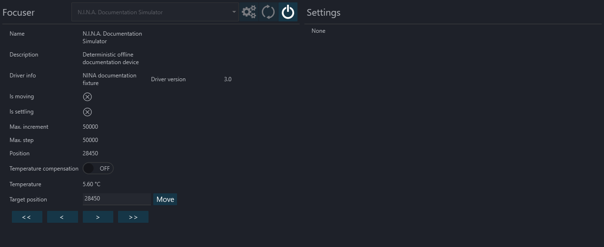

The Focuser Tab lets you connect an ASCOM-compatible focuser

1. Various focuser information can be found on this page
3. Temperature compensation can be turned on or off here. Note that this is the in-driver temperature compensation.
   > Temperature compensation must be configured in the focuser driver
4. If the focuser has a temperature probe this will report the current temperature
5. To move the focuser to a target position (steps) you need to enter a value into the target position and hit the move button
6. Focuser movements:
    * Single arrow <  > : half the Auto Focus Step Size
    * Double arrows <<  >> : five times the Auto Focus Step Size
