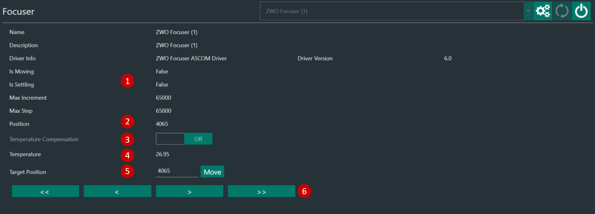

The Focuser Tab lets you connect an ASCOM-compatible focuser

1. Focuser information
2. Focuser current position (steps)
3. Toggles ON/OFF focuser temperature compensation. 
   > Temperature compensation must be configured in the focuser driver
4. If the focuser has a temperature probe this will report the current temperature
5. Move the focuser to a target position (steps)
6. Focuser movements:
    * Single arrow <  > : half the Auto Focus Step Size
    * Double arrows <<  >> : five times the Auto Focus Step Size