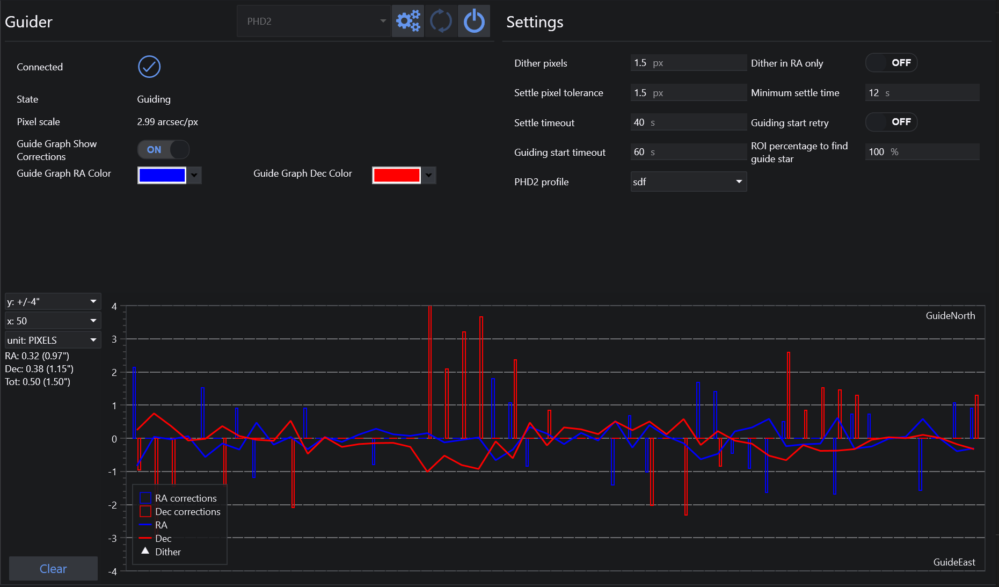
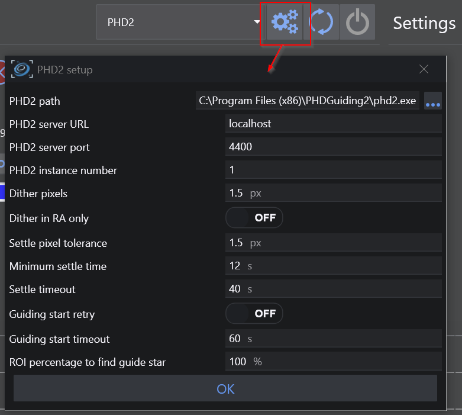
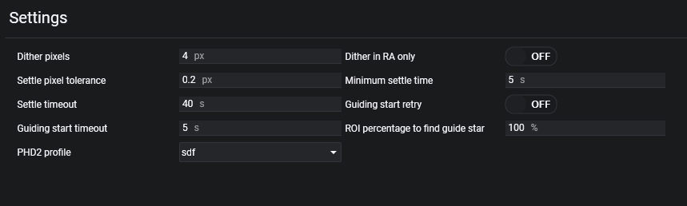

The Guider Tab lets you connect to autoguiders

1. Guider information can be found on the left side. Furthermore the guide chart colors can be customized here.
2. On the right side you can find guider specific settings. The available settings depend on the type of guider that is connected.
3. On the bottom you can find the guider graph showing the corrections and drift of the guider

## PHD2 Setup

### PHD2 Path
PHD2 installation path. This is used to start PHD2 when it is not already running.

### PHD2 Server URL
You can set the PHD2 server settings here
> Usually the defaults should work fine. You also need to enable PHD2 server in PHD2.

### PHD2 Server Port
PHD server port, usually the default 4400 works fine. If you are using multiple instances of PHD2, each instance will add 1 to the port number. So instance 2 will run on port 4401, instance 3 on 4402 etc.

## PHD2 Settings

### Dither Pixels and Dither RA Only
The amount of guide camera pixels to dither in PHD2. If "Dither RA only" is checked, the dither movements will only be performed in RA. 
    
!!!tip
    Refer to [Dithering](../../advanced/dithering.md) in Advanced documentation topics for more information about Dithering and how to set the above parameters
  

### Settle Pixel Tolerance
The threshold expressed in guide camera pixels that will determine a dither settling completion after a dither move.

!!!tip
    A dither  will be considered settled if, after for the duration of "Minimum Settle Time" and before the "PHD2 Settle Timeout", the guide movements in PHD2  will be below the "PHD2 Settle Pixel Tolerance".

### Minimum Settle Time
The minimum time the settling should wait after a dithering process until the process is complete

### Settle Timeout
The maximum time N.I.N.A. should wait during a settling process until it starts the next action. 
### Guiding Start Retry
If PHD2 fails to restart guiding - N.I.N.A. will send a new start guiding command again until a successful guiding is initiated.
  
### Guiding Start Timeout (seconds)
Seconds to wait before sending a new start guiding command to PHD2.

### ROI percentage to find guide star
A region of interest expressed in a percentage of the full frame with the center of the frame as reference. If you want to prevent guid star selection near the edges of the frame, decrease this percentage.

### PHD2 profile
Select from the list of available PHD2 profiles to switch to