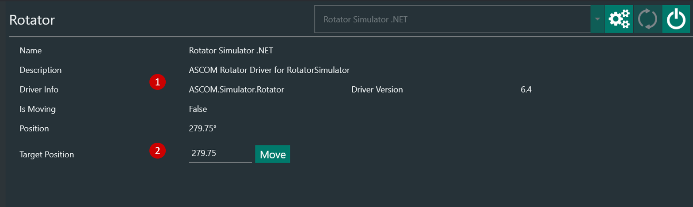
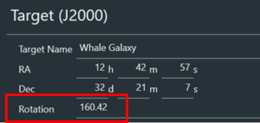
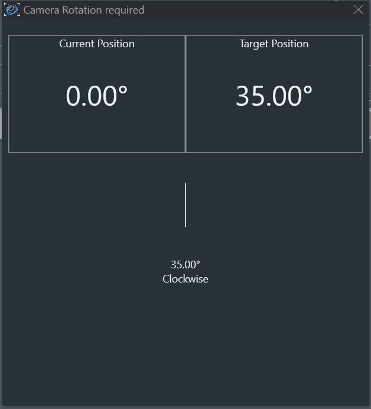

The Rotator Tab lets you connect an ASCOM-compatible rotator. 
A Manual Rotato option is also available

1. Rotator information 
2. Reverse the direction of the rotator (if available). Enable this option, when the rotator moves into the wrong direction during centering and rotation. This is for example required on setups like a Hyperstar where the horizontal image axis is flipped.  
3. Move the rotator to the selected angle

!!! note
     The rotator angle will be synced to the sky angle after a center+rotation happened and will display the sky angle instead of the mechanical angle instead.

## Manual Rotator

Manual Rotator is a very useful tool for those setup that do not have a motorized rotator but still want to be able to match the framing angle as defined in the [Framing Tab](../framing.md)

To enable manual rotator you must:

1. Define a _Rotator Tolerance_ in [Options->Platesolving](../options/platesolving.md)
2. Connect the manual rotator in the Rotator tab
3. Frame your object in [Framing](../framing.md) and Add as Sequence Target
4. Enable _Rotate Target_ in [legacy sequencer](../../sequencer/simple/simple.md) or use the _Slew, center & rotate_ instruction in the [advanced sequencer](../../sequencer/advanced/advanced.md)
5. Start the sequence

Once the sequence is started and the mount has finished slewing to the target, N.I.N.A. will perform a platesolving to determine the current framing coordinates and rotation angle. If the difference between the angle determined by the platesolving and the angle specified in _Sequence ->Rotation_  is above the _Rotator Tolerance_, a pop-up will appear indicating the degrees and direction you need to rotate the camera.
Rotate the camera and close the manual rotator window, a new platesolve will be performed. If the angle is still above the _Rotator Tolerance_ the process will be repeated.

!!! tip
     If you want to set camera rotation before starting the main imaging sequence you can use a dummy sequence with exposure 1s to kick the manual rotator in
