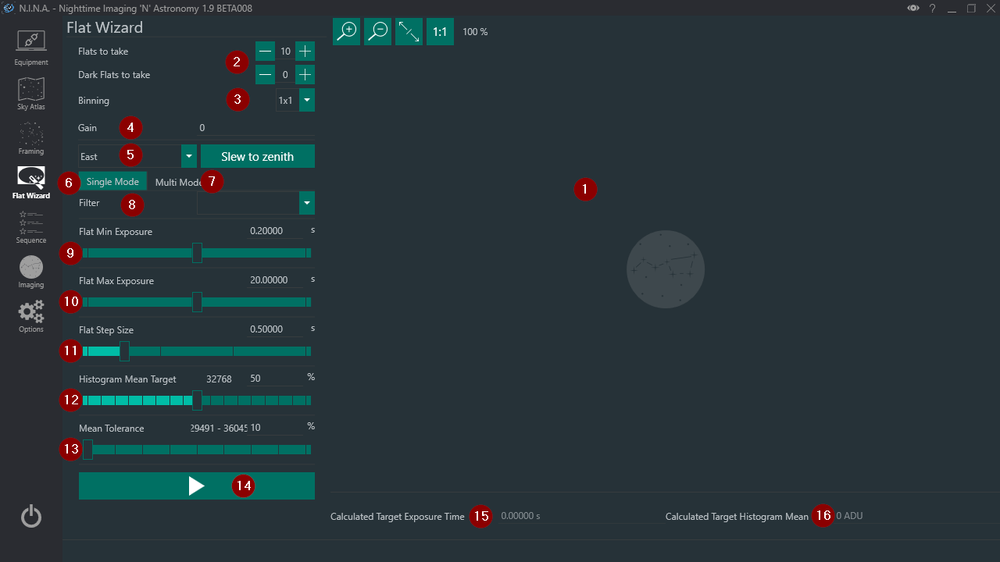
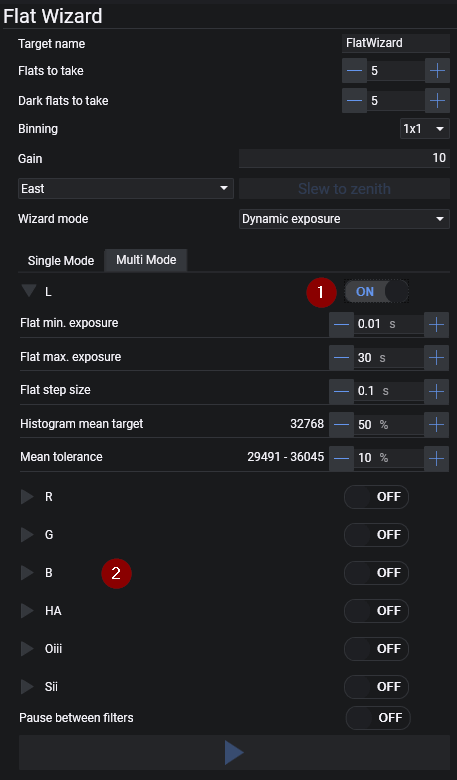
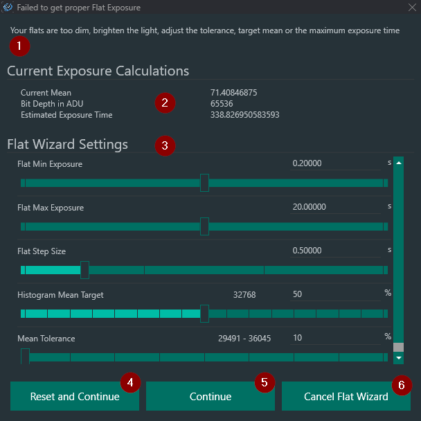

The Flat Wizard offers the possibility to automate flat image capture. It takes multiple exposures until it finds an optimal exposure time for the settings specified. There is also [Multi Mode](flatwizard.md#multi-mode). Multi Mode automates flat acquisition for each filter for users with electronic filter wheels.

Flat Wizard takes 3 test exposures and attempts to calculate the optimal exposure time for a flat image by using linear extrapolation. Should that not be sufficient to derive a suitable exposure time, it will continue to take test exposures until it can determine the optimal exposure time.

## Single Mode

1. **Image Preview**
    * The most recent flat image is displayed in this area while determining the optimal flat exposure time. Note that this area will not be updated once the optimal exposure time is determined. This is to speed up the flat acquisition process.

2. **Flats & Dark Flats to take**
    * The number of flats and dark flats the wizard should capture

3. **Binning**
    * Sets camera binning level for the exposures

4. **Gain**
    * Sets the gain of the camera to use for the exposures. The camera and driver needs to support gain control

5. **Zenith Slew**
    * Slews scope to point at zenith on either east or west side

6. **Single Mode**
    * The mode to take flats for a single filter or no filter at all

7. **Multi Mode**
    * The mode to take flats for multiple filters

8. **Filter**
    * If a filter wheel is connected, a filter can be chosen for single mode

9. **Flat Min Exposure**
    * The minimum exposure time Flat Wizard should use

10. **Flat Max Exposure**
    * The maximum exposure time Flat Wizard should use

11. **Flat Step Size**
    * Sets the step size (in seconds) that Flat Wizard should use when comparing test flats while determining the optimal exposure time

12. **Histogram Mean Target**
    * Sets the mean ADU that the flat image histogram should use.
    * A percentage can be specified on the right or with using the slider. The number left of the percentage displays the ADU value of the desired percentage

13. **Mean Tolerance**
    * Determines how large the tolerance of the flat mean from the mean target (12) should be
    * A percentage can be specified on the right or with using the slider. The number left of the percentage displays the ADU range of the desired tolerance percentage based on the mean target (12). A tolerance value of 20-30% should be typical

14. **Start Flat Wizard**
    * This button starts the flat acquisition process using the current settings
    * First, Flat Wizard will calculate the optimal exposure time using test exposures, and then take flat the full course of flats as set in (2). You will be prompted to extinguish any light source prior to taking Dark Flats.

15. **Calculated Target Exposure Time**
    * Once Flat Wizard determines the necessary exposure time, it will use that to take all flats

16. **Calculated Target Histogram Mean**
    * Once Flat Wizard determines the necessary exposure time and resulting ADU, the ADU mean will be displayed here

## Multi Mode

In essence, Multi Mode works just like Single Mode, but for multiple filters. The majority of controls are identical to [Single Mode](flatwizard.md#single-mode).

In Multi Mode, Flat Wizard settings are saved on a per-filter basis and do not transfer to Single Mode.

1. **Filter Toggle**
    * Enables a specific filter for flat capture

2. **Filter List**
    * Displays all available filters by name and can be expanded by clicking the > icon

## Error Handling

If Flat Wizard cannot determine the necessary exposure time or there is a conflict with the spcecified settings, it will display this dialog.

1. **Error message**
    * Flat Wizard will display what the issue with the current configuration is and what should be done to fix the issue

2. **Current Exposure Calculations**
    * Flat Wizard will display current calculated metrics, as the current mean, the maximum bit depth of the camera in ADU and the estimated exposure time
    * Use those to adjust the values in (3)

3. **Flat Wizard Settings**
    * Specify settings for the current flat capture to get successful flats
    * For further detail, see the description of the settings in the [Single Mode](flatwizard.md#single-mode) section

4. **Reset and Continue**
    * Pressing this button will lead to Flat Wizard re-starting from the Flat Min Exposure as set in the settings (3)

5. **Continue**
    * This button will continue the flat capture with any new settings (3)

6. **Cancel Flat Wizard**
    * This button will abort Flat Wizard's sequence
