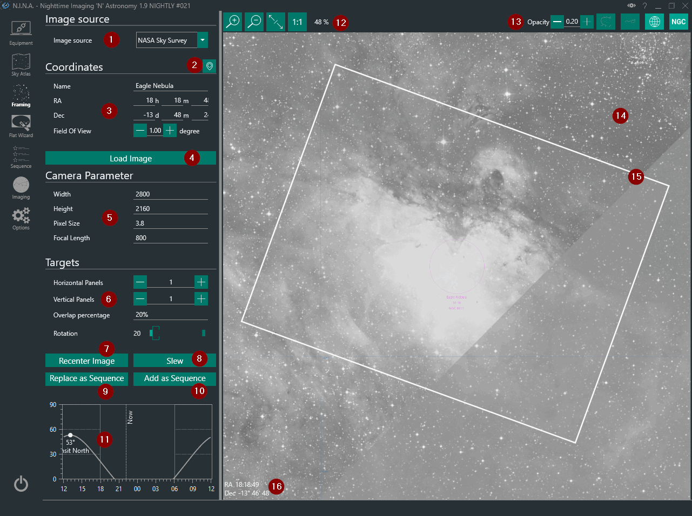

Framing Assistant allows you to frame the next shot perfectly via several online sky survey services, an inbuilt planetarium, or a user-supplied image. It can utilize plate solving to perfectly align your telescope and rotator (if equipped) to match the position of the framing rectangle.

For further information about using the Framing Assistant refer to the [Advanced Framing](../advanced/framingassistant.md) topic.

1. **Image Source** selection menu
    * Allows you to specify the source of an image to utilize in the Framing Assistant. Possible options are:
        * **Digital Sky Survey**: Fetch an image of the object from a sky survey server. This requires an internet connection
        * **Sky Atlas**: N.I.N.A.'s own database of objects. Circles representing approximate target sizes will be displayed
        * **From File**: Load an existing JPEG, GIF, PNG or TIFF image of an object.
        * **Cache**: Utilize images from a local cache of images there have already been downloded from one of the Digital Sky Survey servers
    * When an image is provided through **From File**, the configured [Blind Solver](../advanced/platesolving.md) is used to determine the coordinates and orientation of the image. Blind solving can be a slow process and may take a long time to complete
    * Successfully-solved or downloaded local and sky survey images are cached

2. **Planetarium Sync**
    * Pressing the Planetarium Sync button fetches the coordinates of a selected object from the configured external planetarium program

3. **Coordinates**
    * The RA, Dec, and Field of View of a location in the sky may be manually entered here 
    * RA, Dec and Field of View are initially unavailable when loading an image from file, however these fields will be populated once the image has been automatically solved

4. **Load Image**
    * Starts the image download when using a sky survey 
    * Starts the plate solving mechanism when using **From File**
    * Attempts to load an image from the cache using the provided coordinates

5. **Width, Height, Pixel Size and Focal Length**
    * Values will be set from the connected camera automatically, if available 
    * These settings are not available to DSLR users
    * The specified Focal Length is **not** synchronized to the your Telescope settings. This allows you to experiment with various focal lengths
    * These parameters determine the size of the framing rectangle (15)

6. **Mosaic Panels and rotation**
    * Rotation can be set freely and should match your camera's orientation as determined by plate solving 
    * You can specify the number of panels for an N x M size mosaic 
    * You can specify the % overlap between each panel 

7. **Recenter Image**
    * When using a survey source, redownloads an image of the region centered on the current coordinates set by the framing rectangle (15) 
    * When using cached images or file source, the framing rectangle is centered on the image center 

8. **Slew**
    * Slews the mount to the coordinates of the center of the framing rectangle (16) 

9. **Replace as Sequence**
    * Sets the coordinates of the RA and Dec of the framing window as the sequence and copies the name over to the sequence tab as well 
    * Replacing the target also resets sequence settings to default 

10. **Add as Sequence**
    * The same as (9), but the framed target is added as an addition sequence target. This does not affect other sequences

11. **Altitude browser**
    * Displays the altitude of the target over time, indicating current position and meridian 

12. **Image display controls**
    * From left to right: Zoom in, zoom out, fit image to screen, show image in original resolution 

13. **Annotation controls**
    * From left to right: Opacity of framing rectangle, constellation boundaries, constellation annotation, equatorial grid, annotate DSOs 

14. **Image**
    * The image as downloaded from the sky survey, cache, Sky Atlas or provided by **From File** 

15. **Framing rectangle**
    * Depends on the camera and focal length parameters (5) 
    * Can be dragged around with the mouse 
    * Can be rotated with (6) 
 
16. **RA/DEC Coordinates**
    * The coordinates of the center of the framing rectangle. These are used as a sequences target coordinates  
