The Imaging tab is your imaging cockpit.   
Here  N.I.N.A. will display  a variety of information regarding  the captured images and will let you control all the vital parameters of your imaging session.

The Imaging tab is organized in windows that can be arranged dynamically to create your own layout.
Available windows can be activated and deactivated from the top bar.
To arrange a window simply drag it from the window header and drop it according to the suggested placeholders.   

The top bar is divided in two main sections: **Info** and **Tools**  

  

## Info  
These windows provide important status information about captured images and connected equipment  

### A. Image    
The image panel is the central part of the Imaging tab and is used to display the latest captured images

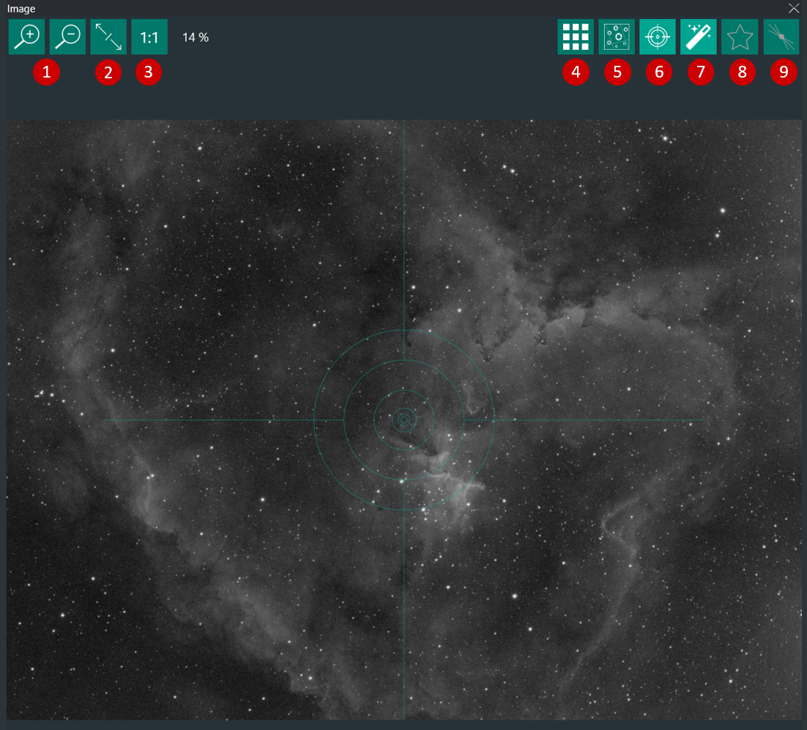

1.   Zoom In/out  
2.   Zoom to Fit  
3.   Zoom 100% (1:1 )    
4.   Opens a 3x3 crop mosaic of the current image to check for distortion and tilt
5.   Initiates a platesolving routine for the current image
6.   Toggles crosshair overlay on/off
7.   Toggles automatic display of the displayed image (for autostretch settings refer to [Options](options/imaging.md))
8.   Toggles automatic HFR (Half-FLux-Radius) star detection analysis. HFR is used for [Autofocus](options/equipment.md) routines. When HFR detection is ON, the average HFR value for each captured image are plotted in the HFR History window (M)
> If _Annotate Image_ is switched ON under [Options->Imaging](options/imaging.md), the calculated HFR values will be displayed on the image  
   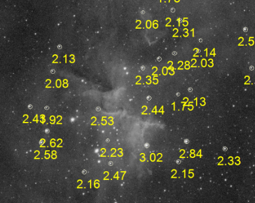
9.   Activates the Bahtinov Analyzer aid tool for manual focusing with a Bahtinov Mask.

### B. Camera   
This panel displays the main camera and sensor properties and cooling status
> Requires a connected camera

1. Camera status details
2. Camera cooling properties
3. Camera warming 
   
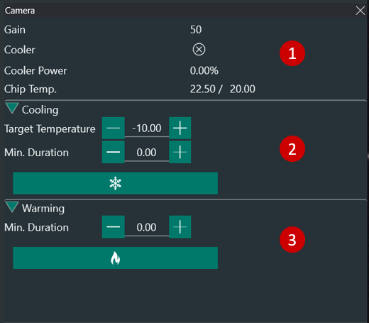

### C. Filter Wheel   
When a Filter Wheel is connected, this panel displays the current filter (1) and lets you manually switch filters by selecting them with the drop-down menu (2)

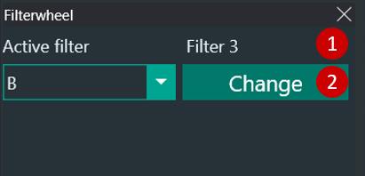

### D. Focuser  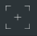  
This panel displays the focuser status and lets you manually move it to the desired position
> Requires a connected focuser

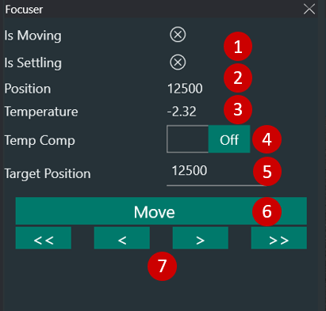

1. Focuser current status (Moving or Settling)
2. Focuser current position (for absolute stepper motor focusers)
3. Focuser temperature (if the focuser is equipped with an ambient temperature sensor)
4. Toggles focuser temperature compensation
5. Here you can set the target focuser position for the focuser to move by clicking on "Move" (7)
6. Moves the focuser to the Target Position defined in (6)
   > It is convenient to set the target position as the position of near-focus for your setup. This position can be determined by using a Bahtinov mask on a bright star (see **Manual Focus Targets**). Once the near-focus position is determined, input the number of steps indicated in "Position" (3) in Target Position field. You can then instruct the focuser to move to this position at the beginning of each imaging session before starting the Auto-Focusing routine 
7. The arrows will move the focusers back and forth of a pre-defined amount related to the Auto Focus Step Size defined under Options - [Equipment](options/equipment.md):
    * Single arrow <  > : half the Auto Focus Step Size
    * Double arrows <<  >> : five times the Auto Focus Step Size

### E. Rotator   
Here you can control the Rotator
> Requires a connected ASCOM Rotator

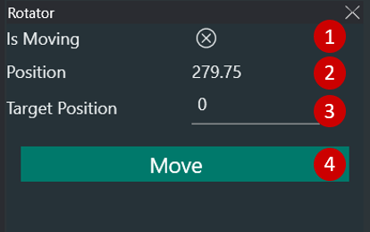

1. Rotator current status
2. Rotator current position
3. Input the Rotator target position
4. Moves the rotator to the Target Position

### F. Telescope 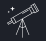  
The telescope panel provides all important information about your telescope like tracking status, sidereal time, time to meridian passing and current telescope coordinates.
> Requires a connected ASCOM telescope

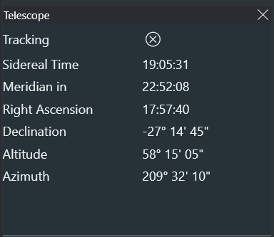

### G. Guiding    
The guider panel replicates the PHD guiding graph in real time. 
> PHD2 must be connected for the Guider to display the guiding trends and pulses (RA and DEC).

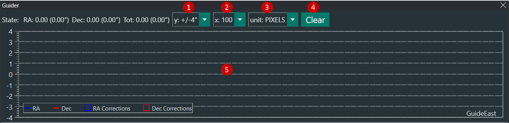

1. Select the scale range of y-axis
2. Select the scale range of x-axis
3. Select the units for y-axis:
    * Pixels: guide camera pixels
    * Arcseconds: units in arcseconds (this is calculated by PHD2 based on your guide camera pixel size and guide scope focal length)
4. Clears the chart
5. Chart area, this is where the PHD2 graph will be visualized

### H. Sequence   
Sequence panel lets you start/stop imaging sequences and provides information on the sequence run in a compressed format. To learn how to set up a sequence refer to the [Sequence](sequencer.md) section.

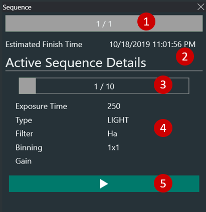

### I. Switches   
This panel will let you control the active switches
> Requires connected switches

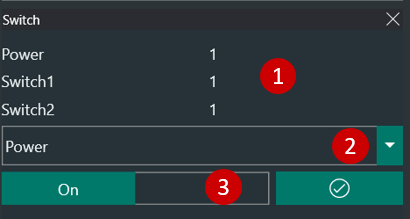

1. Available switches and status
2. Manually select switch
3. Toggle active switch ON/OFF

### J. Weather    
Weather and temperature information from OpenWeatherMap
> OpenWeatherMap API key must be set under Options [Equipment](options/equipment.md)

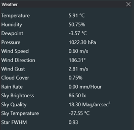

### K. Statistics    
In this panel  all the important information about the last captured image are reported

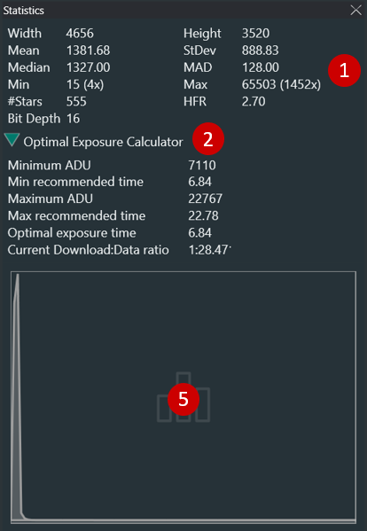

1. Basic statistics relative to the last captured image:
    * Width and Height, in pixels
    * Mean, Standard Deviation, Median and MAD values in ADU
    * Minimum and Maximum ADU values in the image
    * Number of detected stars and mean HFR
        > Stars and HFR will only be displayed if Automatic HFR is active
    * Bit Depth as reported by the image header  

2. Image histogram of the last captured image

### M. HFR History  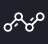  
When automatic HFR (Half-Flux-Radius) star detection is ON, this panel will display the history of HFR values and number of stars used to evaluate the HFR for each exposure.
The chart is limited to displaying a moving window of the last 100 exposures. 

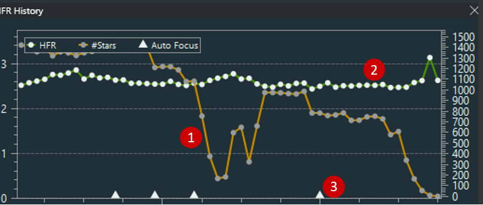

By default the HFR History shows the HFR values and the number of detected stars throughout the imaging session. The fields can be changed by hovering over the panel to different statistics.
1. Green line: Left y-axis
2. Yellow line: right-axis
3. Triangle marks: AF runs
   
## Tools 

### N. Imaging   
The imaging panel allows you to take a single exposure or live view when supported by the camera

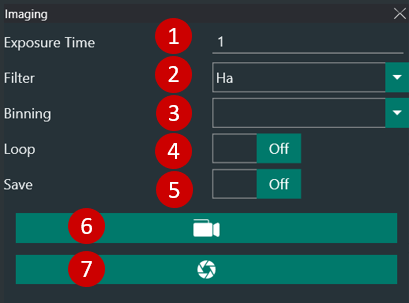

1. Capture exposure time in seconds
2. Filter to be used for the capture (if a Filter Wheel is connected)
3. Camera Binning
4. Toggles ON/OFF image looping. This is particularly useful for manual focus with a Bahtinov mask
5. Toggles ON/OFF the saving on HD of the current capture
6. When supported by the camera, this will activate the Live View mode
7. Takes the exposure

### O. Image History   
The Image History panel shows a list of thumbnails of the current sequence captured images with basic statistics: Mean value in ADU, average HFR, Filter used, duration and capture time.
> By double-clicking on any of the thumbnails the relative image will be opened in the Image panel (A)

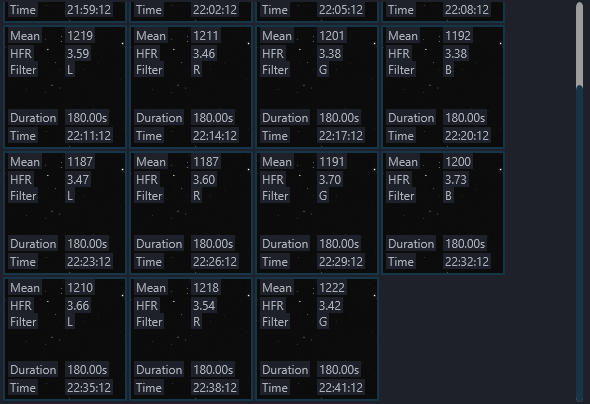

### P. Plate Solving 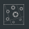  
Platesolving is a very important step in the imaging process, for further information on the Plate Solving process refer to [Platesolving](../advanced/platesolving.md) in the advanced topics. This panel lets you perform a manual platesolving and keeps the history of all platesolving sessions.
> Prerequisites for platesolving to work are:
> * An external Platesolver is  defined in Options [Platesolving](options/platesolving.md)
> * Telescope focal length is defined in Options [Equipment](options/equipment.md)
> * Camera pixel size is defined in Options [Equipment](options/equipment.md)
> * The image to be plate solved has been captured with the specified focal length and pixel size

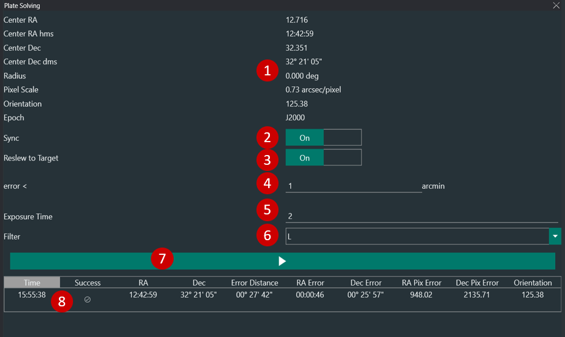

1. Plate solving results
2. Toggles ON/OFF syncing the telescope mount with the plate solved coordinates 
3. Toggles ON/OFF re-slewing and re-centering the mount to the plate solved coordinates if the plate solved position is not matching with the expected one
4. Error threshold for (4)
5. Exposure that will be used to capture the image for plate solving
6. Filter that will be used to capture the image for plate solving
7. Captures  an image for plate solving
8. History of plate solving sessions

### R. Auto Focus 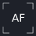  
This panel lets you manually trigger an Auto Focus routine based on the Auto Focus parameters set in Options [Equipment](options/equipment.md).

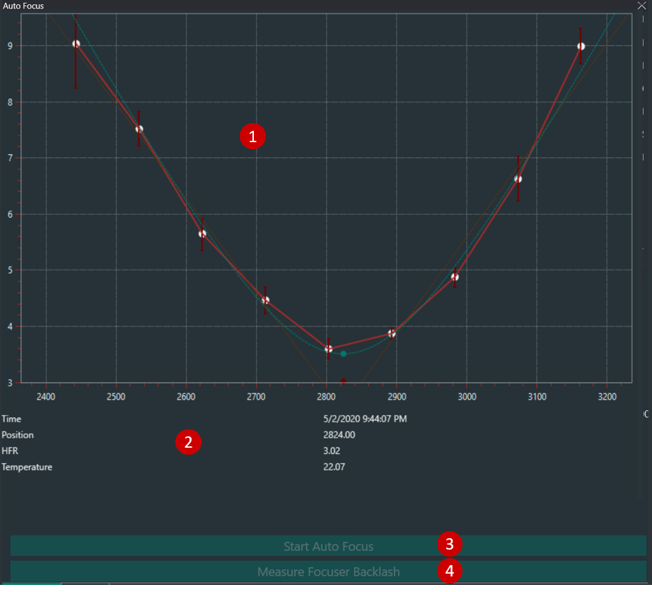

1. Autofocus curve 
2. Last Auto Focus run parameters
3. Starts Auto Focus routine

### S. Manual Focus Targets   
When you have to manual focus your scope this tab lets you conveniently choose among the current visible brighter stars according to your location and time.

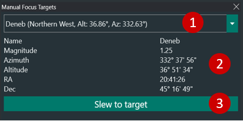

1. List of stars to choose from
2. Selected star properties
3. Slews telescope to the selected star

