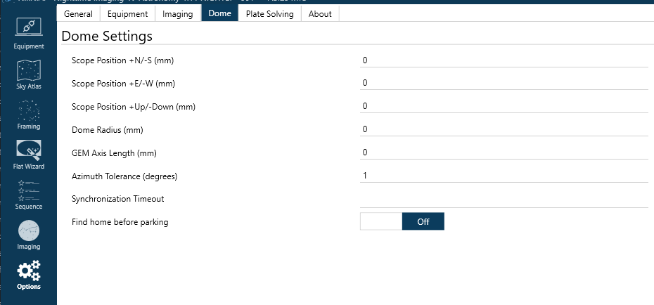

This is the tab where you set up all the parameters related to your dome.

1. **Scope Position +N/-S (mm)**
 Measure the North or South offset (in mm) of the center of the mount from the center of the dome. North is true north - the same direction a polar aligned telescope would point. Use a positive number for North, and a negative number for South.

2. **Scope Position +E/-W (mm)**
 Measure the East or West offset (in mm) of the center of the mount from the center of the dome. East/West is relative to true north - the same direction a polar aligned telescope would point. Use a positive number for East, and a negative number for West.

3. **Scope Position +Up/-Down (mm)**
 Measure the height difference (in mm) of the center of the mount axis relative to the base of the dome. For an Alt/Az mount, this is from the center of the Altitude axis, and for an EQ mount this is where the RA and DEC axes intersect. A positive number indicates the center of axis is higher than the base of the dome, and a negative number means it is lower.

4. **Dome Radius (mm)**
 Measure from the center to the rim of the dome, along the base.

5. **GEM Axis Length (mm)**
 If Alt/Az, this should be 0. For an EQ mount, slew RA to +/- 90 degrees, and measure the lateral distance (in mm) from the axis to center of the telescope aperture.

    !!! note
        The purpose of this setting is to determine what should point to the center of the Dome aperture. If you have a guide scope, you should add half the length from the OTA to the top of the guide scope. For example, if the guide scope mount is 40mm and the guide scope aperture is 60mm, you should add 70mm to **GEM Axis Length**.

6. **Azimuth Tolerance (degrees)**
 The Dome slews if the target azimuth is off by more than this amount. Some dome rotators have a maximum precision, so you should set this either at that precision or greater. For example, NexDome could only support 1 degree of resolution when slewing until mid-2020 when high precision slewing was added.

7. **Synchronization Timeout**
 Actions that require an image to be taken (such as Plate Solving and Auto Focusing) depend on the dome being synchronized with the mount. If <i>Dome follows telescope</i> is enabled, imaging operations will wait until the Telescope has stopped slewing **and** the Dome is pointed to the same azimuth (within the configured tolerance). This settings specifies the maximum amount of time, in seconds, to wait for this synchronization to complete.

    !!! important
        This value should be no smaller than twice the precision of the Dome rotator. For example, NexDome can only slew to integer granularity, which means its precision is 1 degree. If you own a NexDome, don't set this value smaller than 2 or **Wait for Dome Synchronization** will delay periodically.

8. **Find Home Before Parking**
 This is an innovative reliability feature. Some Domes, such as NexDome, require the Park location to be precise so that a battery powering the shutter motor can recharge. If this setting is enabled, the Dome will find the Home position (if the Dome provides one) before parking and closing the shutter. This resynchronizes the Dome azimuth to increase Park accuracy.

    !!! note
        Some Dome vendors also provide manuals to configure many of these same parameters. If you're stuck, try checking some of them out too.
