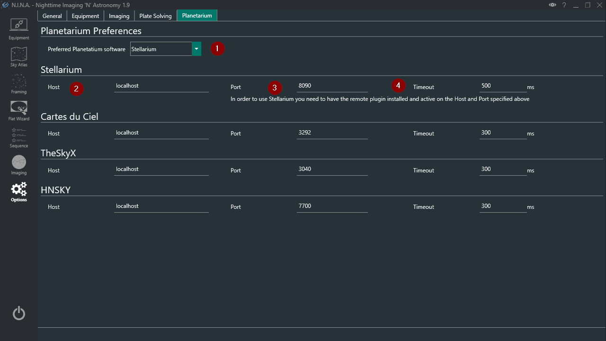

This is the tab where you set up all the parameters recmd-k vlated to your equipment.  

1. **Pixel Size**
    * The Pixel Size of your camera sensor in micrometers. This field will be automatically populated by the camera, if it provides the information.
    > This field together with the values in  “Telescope”  is used for Platesolving operations
     
2. **Bit Depth**
    * Specify the bit-depth of the images outputted by the camera in use.
    
    >  For DSLRs using DCRAW set this to 16 bit. If you're using FreeImage set to match the bitdepth of the camera
    
    > For ZWO, QHY and Atik cameras set this to 16bit since they are rescaled by the camera drivers.
    
    > Touptek and Altair do not scale, so set to match bit depth of the camera
    
    > For other CCD/CMOS cameras ask to your camera manufacturer.

3. **Enable bit scaling**
    * Indicates if data should be shifted to 16 bits. *Only relevant for Touptek, Altair and Omegon cameras*

4. **Bulb Mode**
    * Allows you to change the bulb mode of the camera. Native will work in most cases.
	> RS232 and Mount is available as well and might be necessary for older Nikon cameras
	> For usage of RS232 and Monunt shutter refer to Usage: [Using RS232 or Mount for bulb shutter](../../advanced/bulbshutter.md)

5. **Raw Converter**
    * Only for DSLR: select the RAW converter, options are DCRaw and FreeImage
    > DCRaw will utilize DCRaw and stretch your images to 16bit, applying the cameras specific color bias profile.  
    FreeImage will deliver the frame exactly as your camera provided it and can be slightly faster for image download on slower machines.

    !!! note
        Both raw converters will deliver you the raw frame of your DSLR, but they might vary in color. Saving the raw frame without adding the camera specific profile with FreeImage can deliver more faint and less colorful raw images than you are used to.

6. **Telescope**
    * This section lets you enter the parameters of your telescope that will be used for [Platesolving](../../advanced/platesolving.md).  
    > If you change telescope, remember to update these settings or to switch profile under [Options/General](../../tabs/options/general.md).

7. **Use FilterWheel offset**
    * Determines whether the focuser should move per the defined offset when the filter wheel changes filter

8. **Auto Focus Step Size**
    *  the number of focuser steps that the autofocus routine will move by between autofocus points
  
9. **Auto Focus Initial Offset Steps**
    * The number of focus points that will be used on each side of perfect focus by the autofocus routine

10. **Default Auto Focus Exposure Time**
    * The exposure time in seconds that will be used by autofocus, if filter times are not set

11. **AF Method**
    * Method used to detect datapoints for auto focus

12. **AF Curve Fitting**
    * Fitting that should be used to determine ideal focus position out of the measured data points

13. **AF Number of Attempts**
    * The number of attempts the autofocus routine should be retried in case of unsuccessful focusing

14. **Use brightest n stars**
    * The number of top brightest stars that the autofocus routine will use - 0 means there is no limit

15. **AF Crop Ratio**
    * Ratio  that will determine a centered region of interest for autofocus

16. **Binning**
    * The binning to be used for Autofocus exposures. 

17. **AF Disable Guiding**
    * Indicates if guiding should be paused during auto focus

18. **Focuser Settle Time**
    * The amount of time, in seconds, that should be awaited after a focuser move before starting a new exposure

19. **AF Number of Frames per Point**
    * The number of frames whose HFR or contrast will be averaged per focus points

20. **AF Crop Ratio**
    * Ratio  that will determine a centered region of interest for autofocus

21. **Backlash IN/OUT**
    * The focuser backlash in the IN (decreasing position) and OUT (increasing position) directions, expressed in focuser steps. A tool described in the Focuser Backlash Measurement Section is available to measure it [Imaging](../imaging.md) tab Focuser window.
  

### Auto Focus Exposure Time

The ideal auto-focus time can change per filter, particularly between broadband and narrowband filters (in the above example, the narrowband filter requires an exposure time 5 times longer than the broadband filters). This can easily be set up here.

Finding a good exposure time for autofocus is further explained in the [Auto-Focus section](../../advanced/autofocus.md)

### Auto Focus Filter

From this screen, it is possible to set (or unset) an autofocus filter, which will be used by the autofocus routine (if the *Use FilterWheel Offsets* setting under *Focuser Settings* is set to On). This can be done by simply selecting a filter in the list, and clicking on the *Set as Default AF Filter* button. The same button can be used to unset the Auto-Focus Filter.

## Weather
  This section is used to enter the OpenWeatherMap API Key to retrieve real time weather data in [Imaging](../imaging.md) tab Weather window.

  22. **Fahrenheit Temperatures**
    * Switch ON to use Fahrenheit temperature scale

23. **Imperial Units**
    * Switch ON to use Imperial Units

24. **OpenWeatherMap API Key**
    * Input your personal OpenWeather API key.
    > You can get your OpenWeather free API key [here](https://openweathermap.org/api)

25. **Filterwheel**
    * If a Filter Wheel is connected in [Equipment](../equipment.md) this window lists the available filters and names.
    
26. **Filter + - Buttons**
    * These buttons add and remove filters from the filterwheel list (24)

27. **Import Button**
    * When clicked filters will be imported from the ascom filter wheel driver 
  
## Filter Wheel Configuration

The Filters defined in the Filter Wheel list are used in various places in N.I.N.A., especially in:

* The Sequence Tab: each sequence item can use its own filter for capture
* The Plate Solving routine: it can be set to use a particular filter, to have lower exposure times for plate solving (e.g. using L rather than HA for example)
* The Auto-Focus routine: like plate-solving, autofocus can be set to use a particular filter

For the above to work well, it is necessary to define the proper filters available, if necessary their filter offsets, and any filter to be used for Auto-Focus from this view.

The screen looks like the below:

### Adding filters

Typically the first step for a user when first setting up the filter wheel is to click on the *Import Filters from Filterwheel* button. This will take the information about the filters from the filter wheel itself (if any is available), and automatically populate the list in N.I.N.A. based on that information.

If this doesn't work, it is possible for the user to use the *+* and *-* buttons to manually add or remove filters. Note that the Position order of the filters in this tab should match the order of the physical filters in the filter wheel.

For example, if a filter wheel has the following filters:

1. Luminance filter at position 1
2. Red filter at position 2
3. Green filter at position 3
4. Blue filter at position 4
5. H-Alpha filter at position 5

then the screen should be configured as per the screenshot above, starting with the L filter, and going in order until the HA filter.

### Changing filter information

It is possible to double click within the table to change the name of the filter (used throughout N.I.N.A.), its focuser offset and its Auto Focus Exposure Time directly.

### Filter offsets

Most filters are not exactly par focal, meaning that when changing filters, the ideal focus distance changes slightly. This will cause an imaging system that was in perfect focus with one filter to be slightly out of focus with another filter. This can be a big problem for precise imaging, requiring an additional autofocus run each time the filter is changed.

To avoid this, it is possible to set filter offsets, which are the amount of focuser steps that the focuser should move by when switching from one filter to another.

For example, I could run the autofocus routine on each of my filters one after the other (with hopefully very little temperature change in between), with the following results:

* L filter achieves perfect focus at focuser position 5000
* R filter achieves perfect focus at focuser position 4990 (10 steps fewer than L filter)
* G filter achieves perfect focus at focuser position 5030 (30 steps more than L filter)
* B filter achieves perfect focus at focuser position 5045 (45 steps more than L filter)
* HA filter achieves perfect focus at focuser position 4988 (12 steps fewer than L filter)

If we take the L filter as the reference filter, we can set up all the filter offsets relative to the L filter, as below:

* L filter offset 0 (reference filter)
* R filter offset -10 (10 steps fewer than L)
* G filter offset 30 (30 steps more than L)
* B filter offset 45 (45 more steps than L)
* HA filter offset -12 (12 steps fewer than L)

This is what has been done in the above screenshot.

Note that for this to work, the *Use FilterWheel Offsets* parameter under the Focuser Options needs to be set to On.

## Guider Settings
This section is used to connect N.I.N.A. with PHD2 and define Dithering parameters

28. **PHD2 Path**
    * PHD2 installation path

29. **PHD2 Server URL and Port**
    * You can set the PHD2 server settings here
    > Usually the defaults should work fine. You need to enable PHD2 server in PHD2.

30. **PHD2 Dither Pixels and Dither RA Only**
    * The amount of guide camera pixels to dither in PHD2. If "Dither RA only" is checked, the dither movements will only be performed in RA. 
    
    !!!tip
    Refer to [Dithering](../../advanced/dithering.md) in Advanced documentation topics for more information about Dithering and how to set the above parameters

31. **PHD2 Settle Pixel Tolerance**
    * The threshold expressed in guide camera pixels that will determine a dither settling completion after a dither move.
    > A dither  will be considered settled if, after the "Minimum Settle Time" and before the "PHD2 Settle Timeout", the guide movements in PHD2  will be below the "PHD2 Settle Pixel Tolerance".

32. **Minimum Settle Time**
    * The minimum time N.I.N.A. should wait after a dithering process until it starts the next capture

33. **PHD2 Settle Timeout**
    * The maximum time N.I.N.A. should wait after a dithering process until it starts the next capture. After this time N.I.N.A. will start a new capture regardless of dithering settling completion.

34. **Direct Guide Duration**
    * Duration of guide when Direct Guide is selected
  

## Planetarium Settings
The Planetarium section contains settings for each of the 4 supported planetarium programs.
Currently N.I.N.A. supports Stellarium, Cartes du Ciel, TheSkyX and HNSKY.
The connection allows a one way communication of coordaintes from the planetarium software to N.I.N.A. 

If a planetarium program is configured, coordinates can be imported anywhere in the program that has the Planetarium Sync Button.

35. **Preferred Planetarium Software**
    * This drop down menu selects the planetarium software to be used

36. **Host**
    * This is the address the planetarium server is hosted on
    > The default 'localhost' will work if you're running the planetarium software on the same machine

37. ** Port**
    * Each software's server operates on a different port
    > It is recommended to leave this as is