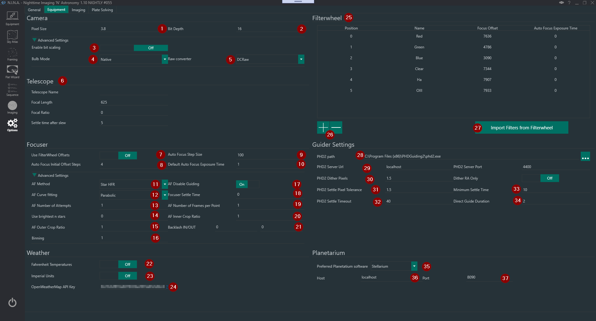
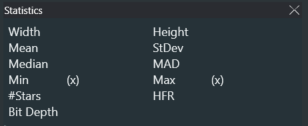

This is the tab where you set up all the parameters recmd-k vlated to your equipment.  

## Camera

1. **Pixel Size**
    * The Pixel Size of your camera sensor in micrometers. This field will be automatically populated by the camera, if it provides the information.
    > This field together with the values in  “Telescope”  is used for Platesolving operations

2. **Camera read noise in e**
    * The read noise in electrons of your camera device
    > Read noise charts for different Gain values are usually provided by camera manufacturers. Consult your camera manual/website or contact your vendor.   
    For DSLR refer to sensorgen.info or ccdparameters script in PixInsight

3. **BIAS mean (native)**
    * •	The mean value in ADU of your BIAS (shortest exposure) at your cameras native bit depth (4)
    > Select the appropriate RAW bit depth for DSLR.  
    For ZWO and QHY cameras select 16bit since they are rescaled by the by the camera drivers.  
    For Aitik and Touptek cameras select the native ADC bit depth.  
    For other CCD/CMOS cameras ask to your camera manufacturer.

4. **BIAS mean (native)**
    * The mean value in ADU of your BIAS (shortest exposure) at your cameras native bit depth (4)
    > This value changes for different Gain/Offset.   
     To evaluate the mean ADU you can follow these simple steps: 
     > - set the same Gain/Offset that will be used durign your imaging session  
     > - go to [Imaging](../../tabs/imaging.md) tab, under "Imaging" window  set an exposure of 0.001s
     > - take an exposure  
     > - the Mean value will be displayed in the "Statistics" window   
     

5. **Full Well Capacity in e**
    * The Full Well Capacity in electrons 
    > Full well charts for different Gain values are usually provided by camera manufacturers. Consult your camera manual/website or contact your vendor.  

6.	**Download to Data ratio**
      * The ratio the optimal exposure calculator will utilize to calculate the maximum adequately possible exposures. Default will work in most cases.

7. **Bulb Mode**
   * Allows you to change the bulb mode of the camera. Native will work in most cases.
	> RS232 and Mount is available as well and might be necessary for older Nikon cameras
	> For usage of RS232 and Monunt shutter refer to Usage: [Using RS232 or Mount for bulb shutter](https://nighttime-imaging.eu/docs/documentation/tabs/settings/#using-rs232-or-mount-for-bulb-shutter)

8. **Raw Converter**
    * Only for DSLR: select the RAW converter, optriona are DCRaw and FreeImage
    > DCRaw will utilize DCRaw and stretch your images to 16bit, applying the cameras specific color bias profile.  
    FreeImage will deliver the frame exactly as your camera provided it and can be slightly faster for image download on slower machines.

!!! note
    both raw converters will deliver you the raw frame of your DSLR. but they might vary in color. Saving the raw frame without adding the camera specific profile with FreeImage can deliver more faint and less colorful raw images than you are used to.

## Telescope
9. **Telescope**
* This section lets you enter the parameters relative to your telescope that will be used for [Platesolving](../../advanced/platesolving.md).  
> If you change telescope, remember to update these settings or to switch profile under [Options/General](../../tabs/options/general.md).

## Focuser

10. **Use FilterWheel offset**
    * Determines whether the focuser should move per the defined offset when the filter wheel changes filter

11. **Auto Focus Step Size**
    *  the number of focuser steps that the autofocus routine will move by between autofocus points
  
12. **Auto Focus Initial Offset Steps**
    * The number of focus points that will be used on each side of perfect focus by the autofocus routine

13. **Default Auto Focus Exposure Time**
    * The exposure time in seconds that will be used by autofocus, if filter times are not set

14. **Focuser Settle Time**
    * The amount of time, in seconds, that should be awaited after a focuser move before starting a new exposure

15. **AF Number of Attempts**
    * The number of attempts the autofocus routine should be retried in case of unsuccessful focusing

16. **AF Number of Frames per Point**
    * The number of frames whose HFR or contrast will be averaged per focus points

17. **AF Crop Ratio**
    * Ratio  that will determine a centered region of interest for autofocus
  
18. **Use Brightest n Stars**
    * The number of top brightest stars that the autofocus routine will use - 0 means there is no limit

19. **Backlash IN/OUT**
    * The focuser backlash in the IN (decreasing position) and OUT (increasing position) directions, expressed in focuser steps. A tool described in the Focuser Backlash Measurement Section is available to measure it [Imaging](../imaging.md) tab Focuser window.
  
20. **Binning**
    * The binning to be used for Autofocus exposures. 

## Weather
  This section is used to enter the OpenWeatherMap API Key to retrieve real time weather data in [Imaging](../imaging.md) tab Weather window.

  21. **Fahrenheit Temperatures**
    * Switch ON to use Fahrenheit temperature scale

22. **Imperial Units**
    * Switch ON to use Imperial Units

23. **OpenWeatherMap API Key**
    * Input your personal OpenWeather API key.
    > You can get your OpenWeather free API key [here](https://openweathermap.org/api)

## Filterwheel

24. **Filterwheel**
    * If a Filter Wheel is connected in [Equipment](../equipment.md) this window lists the available filters and names.
    > Filters can be added manually  (25) or imported from ASCOM filter wheel drivers (26)

## Guider Settings
This section is used to connect N.I.N.A. with PHD2 and define Dithering parameters

27. **PHD2 Path**
    * PHD2 installation path

28. **PHD2 Server URL and Port**
    * You can set the PHD2 server settings here
    > Usually the defaults should work fine. You need to enable PHD2 server in PHD2.

29. **PHD2 Dither Pixels and Dither RA Only**
    * The amount of guide camera pixels to dither in PHD2. If "Dither RA only" is checked, the dither movements will only be performed in RA. 

30. **PHD2 Settle Pixel Tolerance**
    * The threshold expressed in guide camera pixels that will determine a dither settling completion after a dither move.
    > A dither  will be considered settled if, after the "Minimum Settle Time" and before the "PHD2 Settle Timeout", the guide movements in PHD2  will be below the "PHD2 Settle Pixel Tolerance".

31. **Minimum Settle Time**
    * The minimum time N.I.N.A. should wait after a dithering process until it starts the next capture

32. **PHD2 Settle Timeout**
    * The maximum time N.I.N.A. should wait after a dithering process until it starts the next capture. After this time N.I.N.A. will start a new capture regardless of dithering settling completion.

33. **Direct Guide Duration**
    * Duration of guide when Direct Guide is selected
  
!!!tip
    Refer to [Dithering](../../advanced/dithering.md) in Advanced documentation topics for more information about Dithering and how to set the above parameters
## Focuser Options

This section contains options that are related to the focuser and the auto-focus methods. They are described in detail in the [Auto-Focus Documentation](../../Advanced/autofocus.md).

As a summary:

* Use FilterWheel Offsets: determines whether the focuser should move per the defined offset when the filter wheel changes filter
* Auto Focus Step Size: the number of focuser steps that the autofocus routine will move by between autofocus points
* Auto Focus Initial Offset Steps: the number of focus points that will be used on each side of perfect focus by the autofocus routine
* Default Auto Focus Exposure Time: the exposure time in seconds that will be used by autofocus, if filter times are not set
* AF Method: the autofocus method to be used
* AF Disable Guiding: determines whether autoguiding will be stopped during the autofocus routine
* AF Curve Fitting: the curve fitting method used for finding best focus based on autofocus points
* Focuser Settle Time: the amount of time, in seconds, that should be awaited after a focuser move before starting a new exposure
* AF Number of Attempts: the number of attempts the autofocus routine should be retried in case of unsuccessful focusing
* AF Number of Frames per Point: the number of frames whose HFR or contrast will be averaged per focus points
* Use Brightest n Stars: the number of top brightest stars that the autofocus routine will use - 0 means there is no limit
* AF Inner and Outer Crop Ratios: ratios (as numbers between 0.2 and 1) that will determine a centered region of interest for autofocus
* Backlash IN/OUT: the focuser backlash in the IN (decreasing position) and OUT (increasing position) directions, expressed in focuser steps. A tool described in the [Focuser Backlash Measurement Section](../../advanced/backlashmeasurement) is available to measure it
* Binning: the binning to be used for Autofocus exposures

## Filter Wheel Configuration

The Filters defined in the Filter Wheel list are used in various places in N.I.N.A., especially in:

* The Sequence Tab: each sequence item can use its own filter for capture
* The Plate Solving routine: it can be set to use a particular filter, to have lower exposure times for plate solving (e.g. using L rather than HA for example)
* The Auto-Focus routine: like plate-solving, autofocus can be set to use a particular filter

For the above to work well, it is necessary to define the proper filters available, if necessary their filter offsets, and any filter to be used for Auto-Focus from this view.

The screen looks like the below:

### Adding filters

Typically the first step for a user when first setting up the filter wheel is to click on the *Import Filters from Filterwheel* button. This will take the information about the filters from the filter wheel itself (if any is available), and automatically populate the list in N.I.N.A. based on that information.

If this doesn't work, it is possible for the user to use the *+* and *-* buttons to manually add or remove filters. Note that the Position order of the filters in this tab should match the order of the physical filters in the filter wheel.

For example, if a filter wheel has the following filters:

1. Luminance filter at position 1
2. Red filter at position 2
3. Green filter at position 3
4. Blue filter at position 4
5. H-Alpha filter at position 5

then the screen should be configured as per the screenshot above, starting with the L filter, and going in order until the HA filter.

### Changing filter information

It is possible to double click within the table to change the name of the filter (used throughout N.I.N.A.), its focuser offset and its Auto Focus Exposure Time directly.

### Filter offsets

Most filters are not exactly par focal, meaning that when changing filters, the ideal focus distance changes slightly. This will cause an imaging system that was in perfect focus with one filter to be slightly out of focus with another filter. This can be a big problem for precise imaging, requiring an additional autofocus run each time the filter is changed.

To avoid this, it is possible to set filter offsets, which are the amount of focuser steps that the focuser should move by when switching from one filter to another.

For example, I could run the autofocus routine on each of my filters one after the other (with hopefully very little temperature change in between), with the following results:

* L filter achieves perfect focus at focuser position 5000
* R filter achieves perfect focus at focuser position 4990 (10 steps fewer than L filter)
* G filter achieves perfect focus at focuser position 5030 (30 steps more than L filter)
* B filter achieves perfect focus at focuser position 5045 (45 steps more than L filter)
* HA filter achieves perfect focus at focuser position 4988 (12 steps fewer than L filter)

If we take the L filter as the reference filter, we can set up all the filter offsets relative to the L filter, as below:

* L filter offset 0 (reference filter)
* R filter offset -10 (10 steps fewer than L)
* G filter offset 30 (30 steps more than L)
* B filter offset 45 (45 more steps than L)
* HA filter offset -12 (12 steps fewer than L)

This is what has been done in the above screenshot.

Note that for this to work, the *Use FilterWheel Offsets* parameter under the Focuser Options needs to be set to On.

### Auto Focus Exposure Time

The ideal auto-focus time can change per filter, particularly between broadband and narrowband filters (in the above example, the narrowband filter requires an exposure time 5 times longer than the broadband filters). This can easily be set up here.

Finding a good exposure time for autofocus is further explained in the [Auto-Focus section](../../advanced/autofocus.md)

### Auto Focus Filter

From this screen, it is possible to set (or unset) an autofocus filter, which will be used by the autofocus routine (if the *Use FilterWheel Offsets* setting under *Focuser Settings* is set to On). This can be done by simply selecting a filter in the list, and clicking on the *Set as Default AF Filter* button. The same button can be used to unset the Auto-Focus Filter.