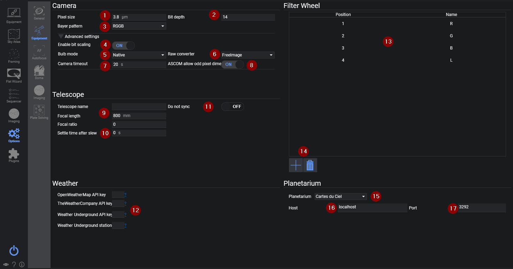
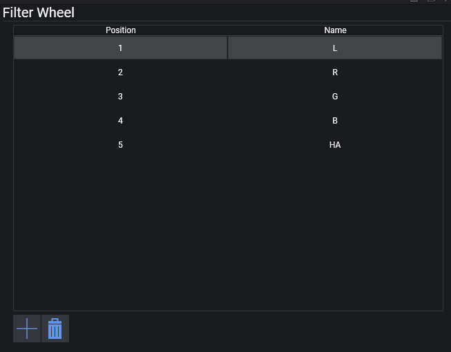

This is the tab where you set up all the parameters related to your equipment.  

## Camera

1. **Pixel Size**
    * The Pixel Size of your camera sensor in micrometers. This field will be automatically populated by the camera, if it provides the information.
    > This field together with the values in  “Telescope”  is used for Platesolving operations
     
2. **Bit Depth**
    * Specify the bit-depth of the images outputted by the camera in use.
    
    >  For DSLRs using DCRAW set this to 16 bit. If you're using FreeImage set to match the bitdepth of the camera
    
    > For ZWO, QHY and Atik cameras set this to 16bit since they are rescaled by the camera drivers.
    
    > Touptek and Altair do not scale, so set to match bit depth of the camera
    
    > For other CCD/CMOS cameras ask to your camera manufacturer.

3. **Bayer Pattern**
    * Specify the bayer pattern for DSLR/OSC cameras. Leave it to Auto for auto-selection from camera drivers.
  
4. **Enable bit scaling**
    * Indicates if data should be shifted to 16 bits. *Only relevant for Touptek, Altair and Omegon cameras*

5. **Bulb Mode**
    * Allows you to change the bulb mode of the camera. Native will work in most cases.
	> RS232 and Mount is available as well and might be necessary for older Nikon cameras
	> For usage of RS232 and Mount shutter refer to Usage: [Using RS232 or Mount for bulb shutter](../../advanced/bulbshutter.md)

6. **Raw Converter**
    * Only for DSLR: select the RAW converter, options are DCRaw and FreeImage
    > DCRaw will utilize DCRaw and stretch your images to 16bit, applying the cameras specific color bias profile.  
    FreeImage will deliver the frame exactly as your camera provided it and can be slightly faster for image download on slower machines.

    !!! note
        Both raw converters will deliver you the raw frame of your DSLR, but they might vary in color. Saving the raw frame without adding the camera specific profile with FreeImage can deliver more faint and less colorful raw images than you are used to.

7. **Camera Timeout**
    * Specifies how long N.I.N.A. should wait after the exposure time for the frame download before timing out and proceeding.

8. **ASCOM allow odd pixel dimensions**
    * In previous versions of N.I.N.A. the pixel dimensions were always truncated to have even width and height due to OSC cameras. This switch allows to utilize the full sensor size for mono cameras when using the ASCOM driver.

    ## Telescope

9. **Telescope**
    * This section lets you enter the parameters of your telescope that will be used for [Platesolving](../../advanced/platesolving.md).  
    > If you change telescope, remember to update these settings or to switch profile under [Options/General](../../tabs/options/general.md).

10. **Settle time after slew**
    * Time in seconds to wait after a scope slew before imaging again

11.  **No Sync**
    * When active it prevents sending syncs to the mount during centering. Instead an offset is calculated to center the mount.
    > Can be useful when you have a permanent setup and a good mount and created a solid pointing model in order not to interfere with it.

    ## Weather

12. **API Keys**
    * Input your personal API key for the various weather sources.
    > Click on the question mark to open the respective page for the API key

    ## Filterwheel

13. **Filterwheel**
    * If a Filter Wheel is connected in [Equipment](../equipment/equipment.md) this window lists the available filters and names.
      * Position: filter position
      * Name: name of the filter as imported from ASCOm driver
      * Focus Offset: offset values that are used at each filter change if "Use FilterWheel Offset" is enabled  
      * Auto Focus Exposure Time: it is possible to specify an AF exposure time for each filter 
14. **Filter + - Buttons**
     * These buttons add and remove filters from the filterwheel list (24)
  
    ## Filter Wheel Configuration

    The Filters defined in the Filter Wheel list are used in various places in N.I.N.A., especially in:

      * The [Sequencer](../../sequencer/overview.md): certain places can specify a filter for capture
      * The Plate Solving routine: it can be set to use a particular filter, to have lower exposure times for plate solving (e.g. using L rather than HA for example)
      * The Auto-Focus routine: like plate-solving, autofocus can be set to use a particular filter

        For the above to work well, it is necessary to define the proper filters available, if necessary their filter offsets, and any filter to be used for Auto-Focus from this view.

        The screen looks like the below:

        

        **Adding filters**

        Typically the first step for a user when first setting up the filter wheel is to connect to a filter wheel. This will take the information about the filters from the filter wheel itself, and automatically populate the list in N.I.N.A. based on that information.

        If this doesn't work, it is possible for the user to use the *+* and *-* buttons to manually add or remove filters. Note that the Position order of the filters in this tab should match the order of the physical filters in the filter wheel.

        For example, if a filter wheel has the following filters:

      1. Luminance filter at position 1
      2. Red filter at position 2
      3. Green filter at position 3
      4. Blue filter at position 4
      5. H-Alpha filter at position 5

        then the screen should be configured as per the screenshot above, starting with the L filter, and going in order until the HA filter.       

    ## Planetarium Settings
    The Planetarium section contains settings for each of the 4 supported planetarium programs.
    Currently N.I.N.A. supports Stellarium, Cartes du Ciel, TheSkyX and HNSKY.
    The connection allows a one way communication of coordaintes from the planetarium software to N.I.N.A. 

    If a planetarium program is configured, coordinates can be imported anywhere in the program that has the Planetarium Sync Button.

15. **Preferred Planetarium Software**
    * This drop down menu selects the planetarium software to be used

16. **Host**
    * This is the address the planetarium server is hosted on
    > The default 'localhost' will work if you're running the planetarium software on the same machine

17. **Port**
    * Each software's server operates on a different port
    > It is recommended to leave this at default