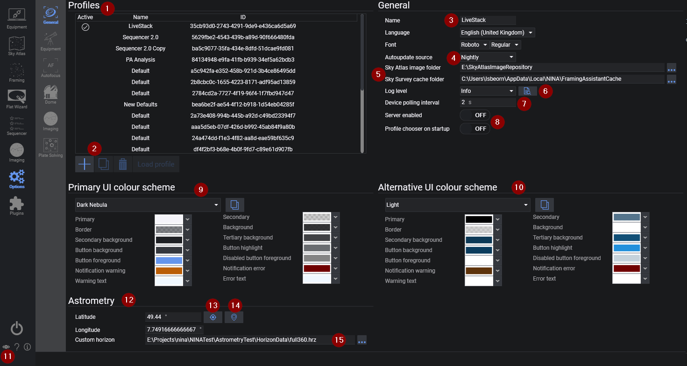

The General Settings tab allows you to manage N.I.N.A. in terms of all general settings. Settings here affect the whole application.

1. **Profiles**
    * Lists all user defined N.I.N.A. profiles
    * The name of the currently loaded profile can be changed using the form to the right (3)
    
2. **Profile Buttons**
    * The user may add, duplicate, delete or load a profile using these buttons
    > A profile cannot be loaded if the current one has a device connected 

3. **Name and Language settings**
    * Sets the name of the currently loaded and active user defined profile
    * The Language setting changes most labels, tooltips and buttons to the specified language
    > Currently English (UK/US), German (Germany) and Italian (Italy) are supported

4. **Auto Update Source**
    * Selects which version branch to check for updates
    * Currently there are 3 version branches, Nightly, Beta and Release
    
        > Nightly offers the latest developments including bugfixes and feature additions. These builds are not as well tested as the beta or released versions but should be stable for imaging runs
    
        > Beta versions are considered feature complete and are typically very stable. They will undergo a series of testing and bug fixing with incremental updates before becoming a release version
    
        > Release offers the most reliability and stability for your imaging runs 
    
5. **Update Availability Notification**
    * If an update is out for the currently selected release branch set in (4), then this notification will display
    * Clicking on it will download and run the update wizard

6. **Sky Atlas & Survey Directory Settings**
    * If the Sky Atlas images have been downloaded, N.I.N.A. must be pointed to them by setting the directory here
    * Survey images downloaded when using the framing tool are stored in this directory

7. **Logging**
    * Specifies the level of logging done by N.I.N.A for troubleshooting and debugging purposes
    * The level of logging can be set (in ascending order) to  'Error', 'Info', 'Warning', 'Debug' or 'Trace'
    * The button here opens the directory containing the logs, logs are typically located in %localappdata%\NINA\logs
    
8. **Device Polling Interval**
    * This sets the interval of device polling in seconds. Default works well in most situations.
    
9. **Current UI Color Schema**
    * Enables customisation of the color scheme of N.I.N.A. 
    * Offers many different themes via the drop down menu 
    * Alternatively, the user can define each colour for each specific element and save to the custom theme by clicking the button

10. **Alternative UI Color Schema**
    * Identical functionality to (9) however this schema is intended for use in the dark (i.e. a black/red theme to preserve night vision)
    
11. **Color Schema Toggle**
    * Clicking this eye icon will toggle between the current and alternative UI color schema
    > This can be done from anywhere in the application
    
12. **Astrometry Settings**
    * Hemisphere, Latitude and Longitude can be set here

13. **NMEA GPS Button**
    * Loads coordinates from a NMEA GPS device if connected
    
14. **Planetarium Button**
    * Loads coordinates from a user connected planetarium software
    > Planetarium can be connected in the [Planetarium menu](equipment.md)

15. **Current NINA version and active Profile**
    * The title displays the current NINA version and the active profile