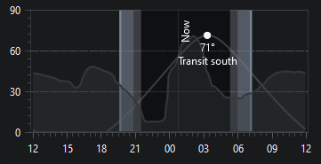

The General Settings tab allows you to manage N.I.N.A. in terms of all general settings. Settings here affect the whole application.


## Profiles
* Lists all user defined N.I.N.A. profiles
* The name of the currently loaded profile can be changed using the form to the right (3)

### Profile Buttons
* The user may add, duplicate, delete or load a profile using these buttons
> A profile cannot be loaded if the current one has a device connected 

## General
### Name, Language and Font settings
* Sets the name of the currently loaded and active user defined profile
* The Language setting changes most labels, tooltips and buttons to the specified language
> A wide range of languages are supported. If you want to contribute to localization, check out the [localization guide](../../contributing/localization.md)

### Auto Update Source
* Selects which version branch to check for updates
* Currently there are 3 version branches, Nightly, Beta and Release

    > Nightly offers the latest developments including bugfixes and feature additions. These builds are not as well tested as the beta or released versions but should be stable for imaging runs

    > Beta versions are considered feature complete and are typically very stable. They will undergo a series of testing and bug fixing with incremental updates before becoming a release version

    > Release offers the most reliability and stability for your imaging runs 

### Sky Atlas & Survey Directory Settings
* If the Sky Atlas images have been downloaded, N.I.N.A. must be pointed to them by setting the directory here
* Survey images downloaded when using the framing tool are stored in this directory

### Logging
* Specifies the level of logging done by N.I.N.A for troubleshooting and debugging purposes
* The level of logging can be set (in ascending order) to  'Error', 'Warning', 'Info', 'Debug' or 'Trace'
* The button here opens the directory containing the logs, logs are typically located in %localappdata%\NINA\logs

### Device Polling Interval
* This sets the interval of device polling in seconds. Default works well in most situations.

### Server enabled
* N.I.N.A. offers a basic REST server to receive commands from other applications. Currently very limited to specific use cases.

## Color Schemes
### Current UI Color Scheme
* Enables customisation of the color scheme of N.I.N.A. 
* Offers many different themes via the drop down menu 
* Alternatively, the user can define each colour for each specific element and save to the custom theme by clicking the button

### Alternative UI Color Scheme
* Identical functionality to (9) however this scheme is intended for use in the dark (i.e. a black/red theme to preserve night vision)

### Color Scheme Toggle
* Clicking this eye icon will toggle between the current and alternative UI color scheme
> This can be done from anywhere in the application

## Astrometry Settings
* Hemisphere, Latitude and Longitude can be set here

### NMEA GPS Button
* Loads coordinates from a NMEA GPS device if connected

### Planetarium Button
* Loads coordinates from a user connected planetarium software
> Planetarium can be connected in the [Planetarium menu](equipment.md)

### Custom Horizon
* To have a visual indicator about a local horizon and to also utilize a horizon for the advanced sequencer, a custom horizon file can be referenced here.
* The file format follows a simple style of azimuth altitude pairs to define the horizon. Gaps between azimuths are interpolated. A minimum of two azimuths altitude pairs are required for the file to work.  
* Here is an example of a horizon file:  
```
# Az Alt
0 14
5 69
55 77
90 70
105 35
115	10
120 24
135 25
145 30
205	20
230 23
235 14
240 14
265 33
285 33
350 20
360 14
```

* Once a horizon is specified it will be reflected in all altitude charts of the application
