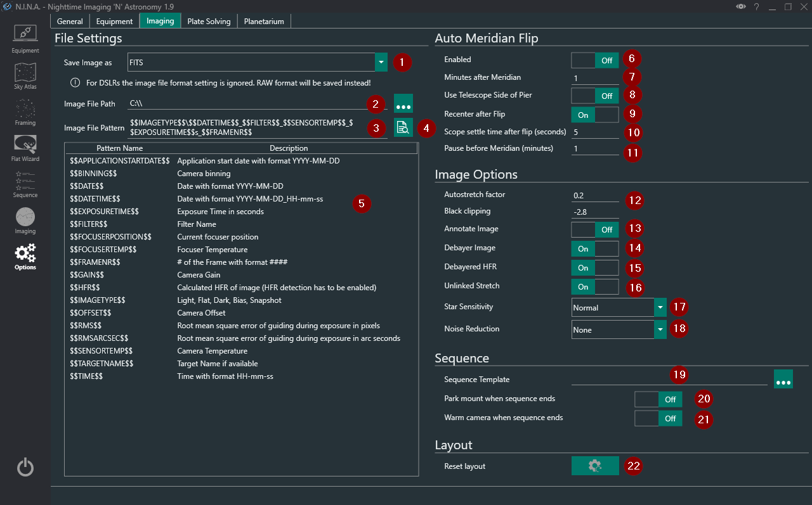

The Imaging options tab contains settings for file formats, save directories, Automatic Meridian flips, sequencing and image options.

1. **Image Save File Format**
    * The format for every image to be saved as
        * Available formats: TIFF, FITS, XISF, TIFF (zip-compressed) and TIFF (lzw-compressed)
    * For more information on these file formats see: 
        * [Advanced Topics: File Formats TIFF](../../advanced/file_formats/tiff.md)
        * [Advanced Topics: File Formats FITS](../../advanced/file_formats/fits.md) 
        * [Advanced Topics: File Formats XISF](../../advanced/file_formats/xisf.md)
    * All formats are saved as 16bit
    * If an OSC camera is used, the raw bayered data is saved
    
2. **Image File Path**
    * The file path where images will be saved
    
3. **Image File Pattern**
    * The structure of folders and the filename can be defined by the user using the keywords listed below in (5)
    > Fixed text is also possible
    
4. **Image File Pattern Preview**
    * This button displays a preview of the user defined file pattern in (3)

5. **Image File Pattern Keywords List**

6. **Meridian Flip Enabled**
    * This switch toggles the automatic meridian flip
    * The sequence will check between exposures when to start the flip sequence
    * For usage of the automated meridian flip refer to [Advanced Topics: Automated Meridian Flip](../../advanced/meridianflip.md)
    
7. **Minutes after Meridian**
    * This defines the amount of time in minutes for the flip sequence to wait once the target has passed the meridian
    
8. **Use Telescope Side of Pier**
    * Some telescope mounts can tell N.I.N.A which side of the pier/tripod the telescope is on which is either west or east
    * If this is enabled, this information is taken into account with the flip sequence logic
    > Recommended to have turned off for eqmod users
    
9. **Recenter after flip**
    * When enabled, N.I.N.A. will begin a plate solving sequence after flipping to recenter the target
    > Strongly recommended to have this enabled
    
    > Requires a plate solver to be set up
    
10. **Scope Settle time**
    * After flipping the scope, waits for the specified number of seconds to settle the scope
    > If you observe trailing in your first platesolve attempts after a flip, increase this value
    
11. **Pause before meridian**
    * The amount of time in minutes until meridian at which the imaging sequence will pause and wait for the meridian to pass as specified in (7)
    > I.E. with a value of 5, when a target is 5 minutes away from meridian, the sequence will pause and the flip sequence will wait until it has passed meridian

12. **Autostretch factor and Black Clipping**
    * These are the parameters for the display autostretch
    > N.I.N.A. uses the same MTF as PixInsight
    
    > Default settings should be very good
    
13. **Annotate Images**
    * When this setting and HFR analysis in imaging is enabled, displayed images will exhibit annotated HFR values on detected stars
    > Note that this is only for display in the imaging tab and has no effect on saved data

14. **Debayer Image**
    * When a OSC camera is used, enabling this will debayer the images for display purposes
    > Images are still saved bayered
    
15. **Debayered HFR**
    * If enabled, images will be debayered first before HFR analysis is done
    > This may help with auto focus

16. **Unlinked Stretch**
    * When a OSC camera is used, debayering the image generates 3 channels R,G and B
    * By default the autostretch in imaging is linked and may result in unbalanced colour channels
    * Enabling this will enable debayer image, and should result in balanced colour channels when stretching
    
17. **Star Sensitivity**
    * This changes the sensitivity of star detection used for HFR analysis
    > The default 'normal' should be sufficient

18. **Noise Reduction**
    * This changes the amount of noise reduction performed on the image for star detection and HFR analysis
    
19. **Sequence Template**
    * The user can set a default user defined sequence template here
    > Templates can be made with the 'Save template as xml' button in the sequence tab
    
20. **Park mount when sequence ends**
    * Initiates a park once all sequences are complete
    > Ascom does not support custom park positions and so the driver must support this
    > For example eqmod's custom park position can override the default park position 
    
21. **Warm camera when sequence ends**
    * If the camera driver supports a warming sequence this will be intiated when sequence has ended
    
22. **Reset Layout**
    * This will reset the layout of docked windows in the imaging tab