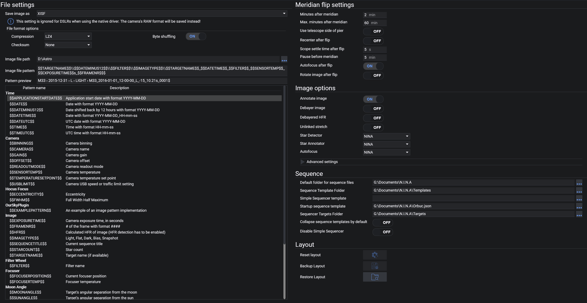

The Imaging options tab contains settings for file formats, save directories, Automatic Meridian flips, sequencing and image options.

## File Settings

### Image Save File Format
* The format for every image to be saved as
    * Available formats: TIFF (zip, lzw compressed), FITS, XISF (lz4, lz4hc, zlib compressed)
* For more information on these file formats see: 
    * [Advanced Topics: File Formats TIFF](../../advanced/file_formats/tiff.md)
    * [Advanced Topics: File Formats FITS](../../advanced/file_formats/fits.md) 
    * [Advanced Topics: File Formats XISF](../../advanced/file_formats/xisf.md)
* All formats are saved as 16bit
* If an OSC camera is used, the raw bayered data is saved
    
### Compression
* Select the compression method (if available)
* Compression will require more time to save the image, but the file size will be reduced
  
### Byte Shuffling
* Enable/disable byte shuffling for XSIF compression

### Checksum
* Select a checksum method for XSIF (optional)
* Checksums can be used to determine if a file was corrupted
   
### Image File Path
* The file path where images will be saved
    
### Image File Pattern and Preview
* The structure of folders and the filename for saved images can be adjusted here.
* Each keyword will be replaced by its current value when the image is saved. 
* A list of all available keywords and their usage are described in the table below the pattern
* Static text is also possible and will be kept
* A preview of the file pattern is also displayed below.

!!! tip
    By using the backslash characters `\\` you can separate your images into various folders and sub folders.
    For example N.I.N.A. will create separate folders on each new session and create sub folders for Lights Darks etc. and then inside these folders putting the actual image files when using a pattern like    
    `$$DATEMINUS12$$\\$$IMAGETYPE$$\\$$EXPOSURENUMBER$$`  
    which will result in    
    `2020-01-01 -> FLAT -> 0001.fits`  
    `2020-01-01 -> LIGHT -> 0001.fits`  
    `2020-01-02 -> LIGHT -> 0001.fits` 

## Auto Meridian Flip
* For usage of the automated meridian flip refer to [Advanced Topics: Automated Meridian Flip](../../advanced/meridianflip.md)
    
### Minutes after Meridian
* This defines the minimum amount of time passed after crossing the meridian where a flip can be performed

### Max. Minutes after Meridian
* With this setting the latest time to flip after crossing the meridian is defined

!!! tip
    When you span a time range with *Mintues after Meridian* and *Max. Minutes after Meridian* it is possible to immediately flip without losing any time to waiting.
    E.g. you set it to 5 Minutes and 10 Max Minutes, and when an exposure finishes in between this time range the application can immediately flip the scope instead of having to wait for the remaining time where an expsoure would not fit in.
    
### Use Telescope Side of Pier
* Almost all mount drivers can tell N.I.N.A which side of the pier/tripod the telescope is on which is either west or east. Having this enabled will make the flip determination logic much more reliable and robust, as no assumptions about the pier state have to be made.  
*Strongly recommended to be turned on*
    
### Recenter after flip
* When enabled, N.I.N.A. will begin a plate solving sequence after flipping to recenter the target  
*Strongly recommended to be turned on. Requires a plate solver to be set up.*
    
### Scope Settle time
* After flipping the scope, waits for the specified number of seconds to settle the scope
> If you observe trailing in your first platesolve attempts after a flip, increase this value

### Pause before meridian
* For some setups the equipment can touch the tripod or pier a while before passing the meridian. This setting enables the mount to disable tracking for the defined minutes prior to reaching meridian. Once this time and the defined minutes after meridian are passed, the flip will occur normally.
* **Only set a pause time, when your equipment cannot pass the meridian safely. If your equipment can safely track until the meridian flip time keep this setting at 0!**

### Auto Focus after Flip
* Turns ON/OFF the AF routine after flipping. 
> Useful for scopes with mirror flop or focus shift after Meridian Flip.

!!! note
    In previous versions of N.I.N.A. a switch to enable meridian flip was located here. However this approach has been changed and the meridian flip needs to be enabled on sequence level. The simple sequencer has a target set option to enable it and the advanced sequencer needs to have a meridian flip trigger added to the sequence    
  
## Image Options

### Autostretch factor and Black Clipping
* These are the parameters for the display autostretch
> These values refer to the midtone transformation function. The standard values should already work for almost all cases
    
### Annotate Images
* When this setting and HFR analysis in imaging is enabled, displayed images will exhibit annotated HFR values on detected stars
> Note that this is only for display in the imaging tab and has no effect on saved data

### Debayer Image
* When a OSC camera is used, enabling this will debayer the images for display purposes only.
    
### Debayered HFR
* If enabled, images will be debayered first before HFR analysis is done. In case you run into star detection problems with OSC camera and autofocus, enable this setting
*This setting is the memory and processing heavy and should not be activated for resource restricted machines*

### Unlinked Stretch
* When a OSC camera is used, debayering the image generates 3 channels R,G and B
* By default the autostretch in imaging is linked and may result in unbalanced colour channels
* Enabling this will enable debayer image, and should result in balanced colour channels when stretching
*This setting is the memory and processing heavy and should not be activated for resource restricted machines*
    
### Star Sensitivity
* This changes the sensitivity of star detection used for HFR analysis
> Only change this when the application doesn't properly recognize stars

### Noise Reduction
* This changes the amount of noise reduction performed on the image for star detection and HFR analysis
> Only change this when the application doesn't properly recognize stars
   

## Sequence

### Default folder for sequence files
* The user can set here the default folder for saving/loading sequences
  
### Sequence Template Folder
* The user can set a default folder where sequence templates should be stored

### Simple Sequencer Template
* The user can set a default user defined simple sequence template here. When a template is defined adding a new target to the simple sequencer will use the template to prepopulate the values like centering, exposures etc.
> Templates can be made with the 'Save template as xml' button in the simple sequence tab

### Startup Sequence Template (Adv. Sequencer)
* A full saved advanced sequence that will pre-populate the advanced sequencer on application start. This is useful for startup and end instructions that you want to do each time in the same manner.

### Sequencer Targets Folder (Adv. Sequencer)
* The user can set a default folder where advanced sequence targets should be stored

### Collapse sequence templates by default (Adv. Sequencer)
* When enabled, templates that will be dragged into the sequencer will be collapsed by default

### Disable Simple Sequencer
* This will remove the simple sequencer from the UI. Useful if you don't use the simple sequencer at all and want to remove the then unnecessary decisions between the two sequencers.

!!! note
    In previous versions of N.I.N.A. some options where available to run end of sequence options. These have been moved into the sequencer.

## Layout
### Reset Layout
* This will reset the layout of docked windows in the imaging tab