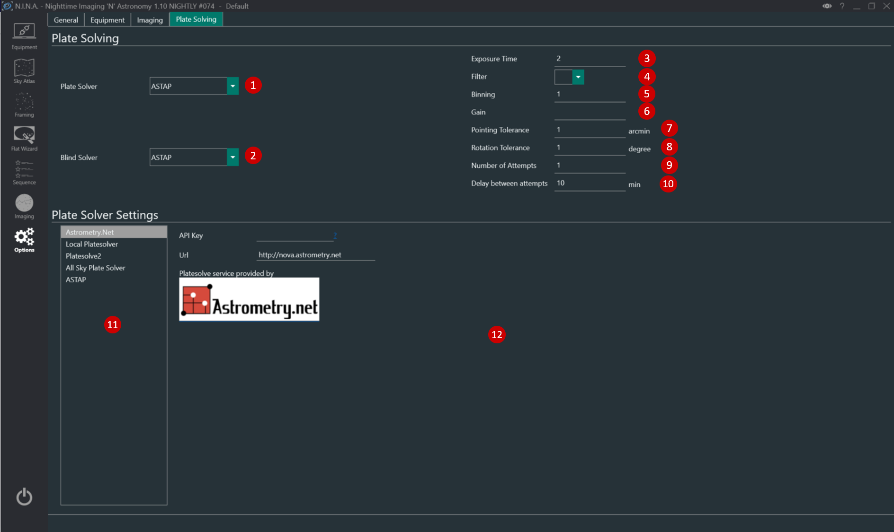

The Plate Solving tab contains configuration options for each supported plate solver. 
N.I.N.A. currently supports Astrometry.Net, a Local version of astrometry, Platesolve2, ASPS and ASTAP.

For usage of the Plate Solver refer to [Advanced Topics: Plate Solving](../../advanced/platesolving.md)

### Plate Solving

1. **Plate Solver**
    * This drop down menu selects the primary platesolver to use
    > ASTAP and PS2 are recommended choices
    
2. **Blind Solver**
    * This drop down menu selects the blind solver that is used for inital solves and or backup solving
    > The blind solver will be used in the framing assistant and normal platesolving should the primary solver fail.
    
3. **Exposure Time**
    * The default exposure time for plate solving frames
    
4. **Filter**
    * The default filter to be used for platesolving
  
5. **Binning**
    * The default binning to be used for platesolving
  
6. **Gain**
    * The default binning to be used for platesolving
    > If empty the current camera Gain will be used

7. **Pointing Tolerance**
    * The threshold of acceptable error for recentering in arcminutes
    
8. **Rotation Tolerance**
    * The threshold of accepetable error in the rotation axis in degrees

9.  **Number of Attempts**
    * Defines the number of attempts for platesolving
    > The default of 1 means if a plate solve fails it will not reattempt
    
10. **Delay between attempts**
    * The delay between plate solving reattempts in minutes

    ## Plate Solver Settings

11. **Plate Solver Settings Selection**
    * This menu displays the currently supported platesolvers in NINA
    * Clicking on each entry will display the corresponding solvers' settings to the right (10)
    
12. **Platesolver Settings** 
    * Each solver except Astrometry.net will require its install directory to be specified here