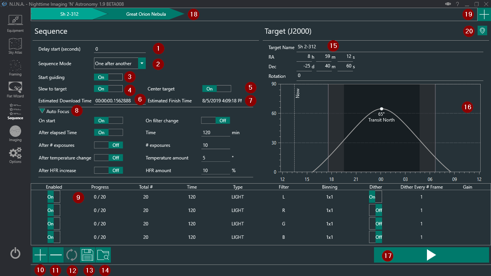

The Sequences menu enables the creation of a sequence of exposures with various options for automation. The main usage is to set exposure times, filters and other settings for a total amount of frames to not have to shoot manually and have it stop after a specific amount of frames.

For further information about sequencing refer to the [Advanced Sequencing topic](../advanced/advancedsequence.md) and [Automated Meridian Flip topic](../advanced/meridianflip.md).

The UI consists of following elements:

1. **Delay start**
    * Specifies a delay (in seconds) before the first operation when the sequence is started
    
2. **Sequence Mode**
    * Specify between one of two modes, “One by another” or “Rotate through”
        * “One by another” would process each sequence entry (9) fully before switching to the next sequence entry
        * “Rotate through” would process one item from a sequence entry and then continue with the next. Allows for example, the rotation of LRGB sequences

3. **Start guiding**
    * When enabled will try to start guiding with PHD2 after the start of the sequence
    > PHD2 needs to be connected in the guider tab in equipment
	> The guider (PHD2 or Direct Guider) has to be connected for dithering to work properly.
	
	!!! Note
		As sequences typically start with a slew and centering process, the guider will be stopped at the beginning of the sequence, and only restarted if this option is set to on.
    
4. **Slew to target**
    * Slews to the target as specified in RA and Dec
    * Does not Plate Solve to verify it is on target
    
5. **Center target**
    * Will center the target given the Ra and Dec coordinates
    * Utilizes the plate solver as specified in the settings
    > Requires a set up primary plate solver
    
6. **Estimated Download Time**
    * User may specify the approximate download time their camera takes to download a single image however it will be automatically populated with the average download times as measured by N.I.N.A. on image download.
    > Will be added to calculations of (7)
    
7. **Estimated Finish Time**
    * Displays the estimated finish time of the sequence
    * Adds the download time (6) to each sequence entry
    
8. **Auto Focus Expander & Settings**
    * Displays enabled auto focus options when not expanded
    > All settings inside require a connected auto focuser
    * Auto Focus can take place on the following conditions if enabled:
        * Auto focus on start of the sequence 
        * Auto focus on filter change
        * Auto focus after elapsed time
            * Starts the auto focus routine after a set amount of time has passed since the last auto focus routine
        * Auto focus after a number of exposures
            * Starts the auto focus routine after a set amount of exposures have been taken since the last auto focus routine
        * Auto focus after a temperature change
            * Starts the auto focus routine after a set amount of temperature change
            * Specify the temperature difference that has to be reached since the last auto focus routine
            > Requires a temperature sensor that reports the temperature for the auto focuser
        * Auto focus after HFR increase
            * If measured HFR from the previous exposure is more than the specified % of the baseline, the auto focus routine will trigger
            * The baseline HFR is determined from the first exposure after autofocus
            
9. **Sequence entry**
    * Each sequence entry consists out of up to 11 columns which determine how the image will be shot   
        * Progress: shows the current progress of the image sequence
        * Total #: the amount of frames for that specific sequence entry
        * Time: the exposure time in seconds
        * Type: the type of the sequence entry: BIAS, DARK, LIGHT, FLAT. Takes into effect only on the naming of the file pattern
        * Filter: the filter that should be used
        * Binning: the binning of your camera that should be used
        * Dither: enable it if this sequence entry should dither while downloading
        > Dithering will only work when PHD2 is connected
        * Dither Every # Frame: will dither only every # frame as set when dithering is enabled
        * Gain: Change the gain of the camera for this entry. Only available when camera can set gain
        * Offset: Change the offset of the camera for this entry. Only available when camera can set offset
    * Sequences cannot be changed while the sequence is running, changes require the sequence to be paused, aborted or completed.

10. **Add new Sequence entry**
    * Adds a new sequence entry line
    
11. **Delete Sequence entry**
    * Deletes the currently selected sequence line

12. **Reset Sequence entry**
    * This resets the progress of the selected sequence line
    
13. **Save Sequence**
    * Saves the sequence as a .xml file

14. **Open Sequence**
    * Loads a previously saved sequence file
    * Will overwrite all current sequence settings

15. **Target information**
    * Displays the target name, RA, and Dec which can be changed from here
    * RA and Dec will affect slew on start (4) and center target (5)
    
16. **Object altitude**
    * Shows the object's altitude, what direction it will transit, and the darkness phase of today, including the current time
    > Altitude depends on Latitude and Longitude set in the Settings

17. **Start Sequence**
    * Starts the sequence
    * Once a sequence is started this button changes into a pause and cancel button
    * Pausing will pause the sequence after the current frame
    * Cancel will abort the frame capture completely and stop the sequence
    
18. **Sequence Target Tab List**
    * List of planned sequence targets for multi target sessions
    * Clicking on a tab will switch to that targets sequence
    > Sequence settings are target specific
    * Hovering the cursor over a tab reveals the reset progress button and delete target button

19. **Add Target Button**
    * Adds an unspecified target to the target list
    > Using the set target buttons in framing and sky atlas will change the target for the currently selected sequence
    
20. **Grab Coordinates button**
    * This grabs coordinates from a preconfigured planetarium software
    > This is configured in the options tab