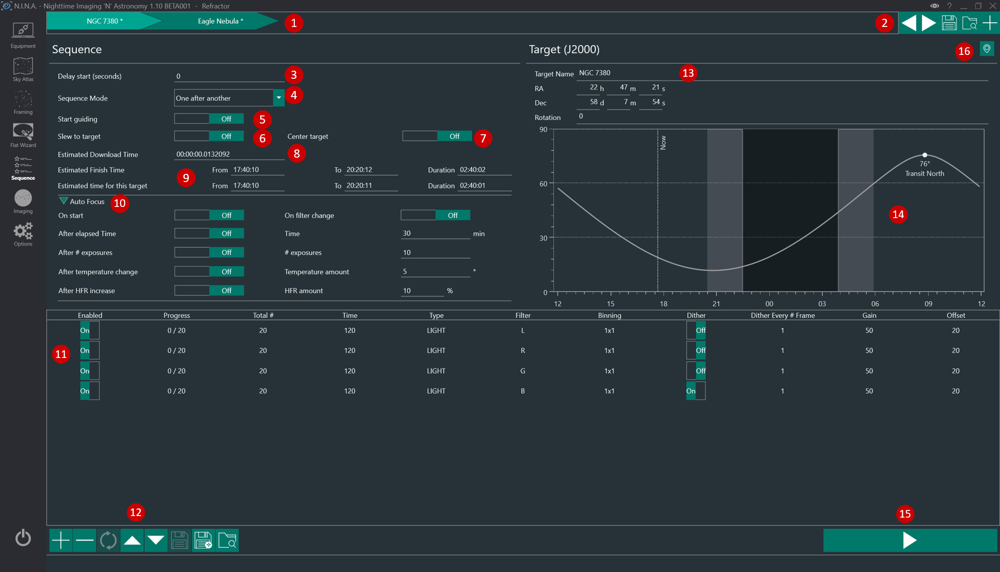

The Sequences menu enables the creation of a sequence of exposures with various options for automation. The main usage is to set exposure times, filters, and other settings for a total amount of frames to not have to shoot manually and have it stop after a specific amount of frames.

For further information about sequencing refer to the [Advanced Sequencing](../advanced/advancedsequence.md) and [Automated Meridian Flip](../advanced/meridianflip.md) topics.

The Sequence interface consists of the following elements:

## Sequence

1. **Sequence Target Tab List**

    Multiple sequences can be loaded into N.I.N.A., with each residing in its own tab at the top of the Sequence window. When multiple sequences are opened, N.I.N.A. will run each sequence in order after the prior sequence is completed. This allows you to specify multiple targets to image over the course of a night, each with their own settings and behaviors.

    * Clicking on a tab will switch to that target's sequence
    * Sequence settings are specific to the target
    * Hovering the cursor over a tab will reveal the Reset Progress and Delete buttons
  
2. **Sequence buttons**
    
     Buttons to edit sequences, from left to right:
     * Moves sequence to the right
     * Moves sequence to the left
     * Saves Sequence set to a specific folder. This will save all sequences that are present in the sequence tab.
     * Loads Sequence set. This will replace all sequences in the Sequence tab.
     * Adds sequence 
  
    > If a **Sequence Template** file is specified under **Options > Imaging > Sequence**, that template will be automatically loaded in the new tab.

3. **Delay start**

    Specifies a delay (in seconds) before the first operation when the sequence starts.

4. **Sequence Mode**

    Specify the preferred mode of sequence entry advancement.

    * **One after another**: N.I.N.A. processes each sequence entry (9) in full before advancing to the next sequence entry.
    * **Loop**: N.I.N.A. processes one item from a sequence entry before advancing to the next entry. The entire sequence will loop until all sequence entries are completed.

5. **Start Guiding**

    When Start Guiding is set to On, N.I.N.A. will command PHD2 to choose a guide star and begin guiding when the sequence starts. N.I.N.A must be connected to PHD2 (See Also: **Equipment > Guider**.)

    !!! Note
        Since sequences typically start with a slew and centering process, the guider will be stopped at the beginning of the sequence and only restarted if this option is set to On.

6. **Slew to target**

    At the beginning of the sequence, N.I.N.A. will command the mount to slew to the coordinates that are specified in RA and Dec fields. This does not plate solve to verify it is on target.

7. **Center target**

    When set to On, N.I.N.A. will use the configured [plate solver](../advanced/platesolving.md) to ensure that the target is centered on the specified RA and Dec coordinates. If a rotation angle is specified and a rotator is configured and connected (See Also: **Equipment > Rotator**), N.I.N.A. will rotate the camera to the desired angle.

    If the Manual Rotator is in use, the sequence will be paused and the user prompted to manually rotate the camera. The prompt will specify the necessary amount of degrees clockwise or anti-clockwise to rotate the camera, and N.I.N.A. will verify the rotation angle again until the angle is within the tolerances configured under **Options > Plate Solving > Rotation Tolerance**.

8. **Estimated Download Time**

    By default, the value here will be automatically populated with the average download time of a single image from the camera, as measured by N.I.N.A. If the user wishes, this value may be changed by editing it. This time specified here will effect the Estimated Finish Time (7).

9.  **Estimated Finish Time and Estimates time for this target**

    Displays the time and duration (in the computer's configured time zone) that N.I.N.A. estimates the entire sequence/active sequence will complete. This estimation takes into account the number and length of the sequence/sequences exposures, as well as the time required to download each exposure from the camera (See Also: Estimated Download Time.)

10. **Auto Focus behavior and settings**

    Due to the large number of auto focus options that can be configured in a sequence, they are grouped under an expandable menu. When the menu is not expanded, a summary of the activated options will be displayed. Expanding the menu by clicking on the arrow will reveal the auto focus settings and make them available for altering.

    Many of the options are self-explanatory, however two in particular may require some clarification:

    * **After temperature change**: Triggers an auto focus operation if the temperature changes the specified amount since the previous auto focus operation. The temperature used is sourced from the focuser, if it provides it. This option does not yet use a Weather source if the focuser does not have a temperature reporting capability.

    * **After HFR increase**: If measured HFR from the previous exposures is more than the specified percent of the baseline, an auto focus operation will be triggered. The baseline HFR is determined from the first exposure after an auto focus operation.

11. **Sequence entries**

    Sequence entry define the image acquisition order and behavior of N.I.N.A. Each sequence entry consists of up to 11 columns which determine how the images will be exposed:

    * **Progress**: Displays the current progress of the sequence entry in terms of exposures completed out of the total number specified
    * **Total #**: Specifies the number of frames to expose
    * **Time**: Specifies the exposure time, in seconds
    * **Type**: Specifies the type of the expsosure and sequence entry. BIAS, DARK, LIGHT, FLAT.
    * **Filter**: Specifies the filter to be used
    * **Binning**: Specifies the camera binning level
    * **Dither**: When enabled, N.I.N.A. will command a dither operation. To save time, dither operations are initiated while the preceding image is being downloaded from the camera

    !!! important
        Dithering will work only when PHD2 or the built-in Direct Guider is connected. See **Equipment > Guider**

    * **Dither Every # Frame**: Initiates a dither operation after the specified number of frames are exposed
    * **Gain**: Specifies the camera gain to use for the entry. This option is available only if camera is capable of setting exposure gain
    * **Offset**: Specifies the camera offset to use for the entry. This option is available only if camera is capable of setting an exposure offset
  
12. **Sequence Buttons**
    
    From left to right:
    * Adds a new row to the sequence (new rows will be defaulted to the previous one)
    * Deletes the acrtive sequence entry
    * Resets the progress of the selected sequence entry to 0
    * Moves the selected entry up
    * Moves the selected entry down
    * Saves Sequence as a XML file in the specifed folder
    * Saves Sequence As
    * Loads a saved Sequence. The opened sequence's settings will overwrite all settings in the current sequence.

    ## Target

13. **Target information**

    Displays the target name, RA, Dec, and desired rotation angle. These may be edited as needed. The RA, Dec, and rotation angle specified will be used to slew on sequence start (4) and for centering the target (5)

14. **Object altitude**

    Displays the target object's altitude, the direction point at which it will transit, the darkness phase of the current day, and includes a veritical marker for the current time.  The accuracy of the altitude curve requires that the latitude and longitude be set under **Options > General > Astrometry**.

15. **Start Sequence**
    
     Pressing the Start button starts the sequence, either from the beginning or from where it was last stopped or paused. Once a sequence is started, this button will change to separate Pause or Cancel buttons.

    * Pausing will pause the sequence after the current frame completes exposing
    * Cancel will abort any active operation (including any in-progress exposures) and stop the sequenc3

16. **Grab Coordinates button**

    Pressing this button grabs coordinates of the selected object in a supported planetarium application. See **Options > Planetarium > Planetarium Preferences** to configure and select a supported planetarium application.

!!! note
    Sequences cannot be changed while the sequence is running. Changing a sequence's settings require the it to be paused, aborted, or completed.
