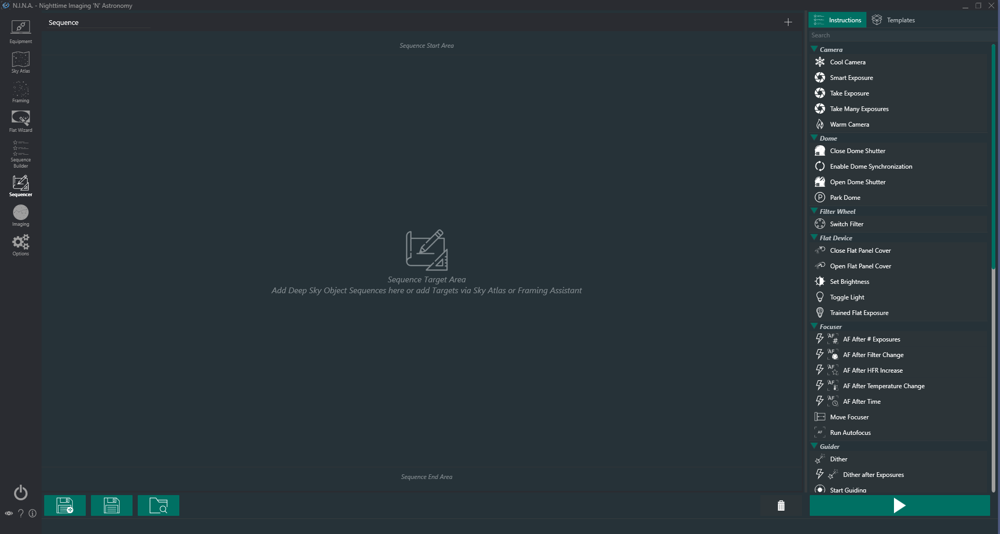
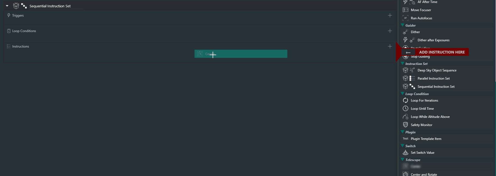

## Instructions
An instruction is a single command that the application will execute. Each instruction has a different purpose and can control various types of equipment, set parameters or are utility functions to automate the imaging process.  
A complete list of available instructions can be found on the right side of the sequencer page and each instruction will have a small description as well as a tooltip of its purpose.
Instructions can be added to the sequencer and the specific parameters can be set there. The sequencer will then go through each instruction and process them.
From the available list, instructions can be dragged over from the right side to the left side and dropped into the sequencer.  
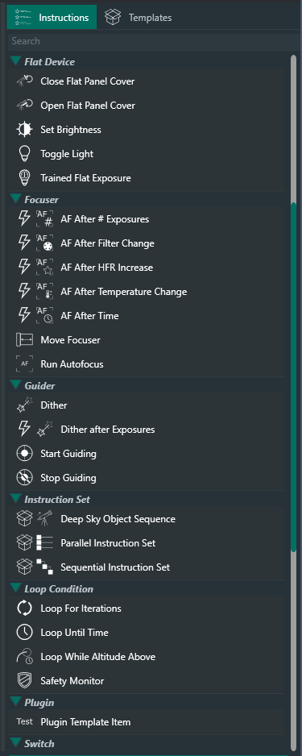

Furthermore instructions can also be directly added into the sequence by clicking on the + button on the top.  
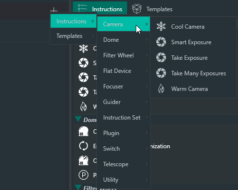

### Details
Once an instruction is part of the sequencer, it will show the specific options for each instruction to customize the behavior. For example an item can be set to cool down the camera to a specific temperature, another item set to switch to a specific filter etc.
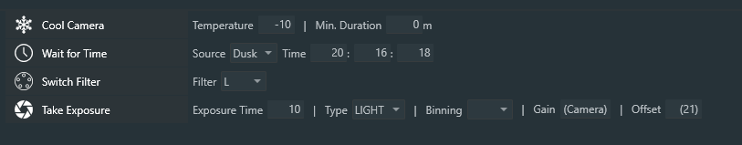

### Validations
Each instruction is capable of doing some degree of validation and will check if the preconditions are met. For example when a camera is connected without a cooling element, and a "Cool Camera" instruction is dragged into the sequence, the instruction will show a visual indicator, as well as a tooltip showing the issues.  
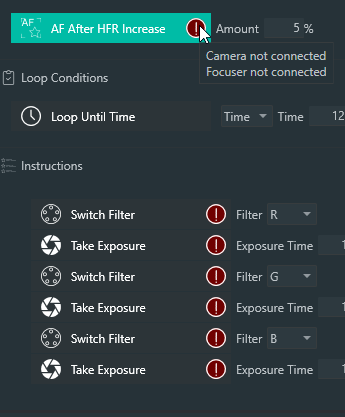

!!! tip
    Instructions that report issues will always be skipped and will not run at all!

## Instruction Sets
Instruction sets are groups of instructions. Each set will process its content, based on the parameters inside the set. Their behavior can be further controlled by loop conditions and triggers, which is described further below.
Instruction sets can be added to the sequencer in the same way as instructions. Furthermore it is possible to nest instruction sets inside of each other.
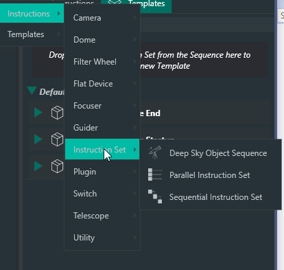
### Sequential Instruction Set
This instruction set will process the instructions one after the other, from top to bottom.
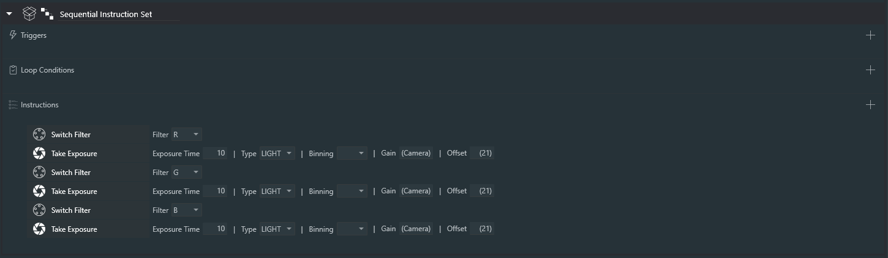
### Parallel Instruction Set
All instructions inside this special instruction set will be processed in parallel. As everything will run in parallel there are no conditions or triggers available for this set.
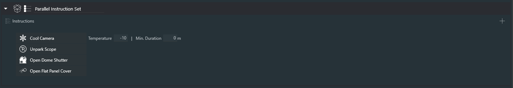
### Deep Sky Object Set
This special set of instructions behaves similar to a sequential instruction set. The main difference here is, that a specific target can be specified with coordinates and rotation and then all instructions that are dependent on coordinates or rotation will pick up these coordinates automatically, so a user does not need to enter these coordinates multiple times.
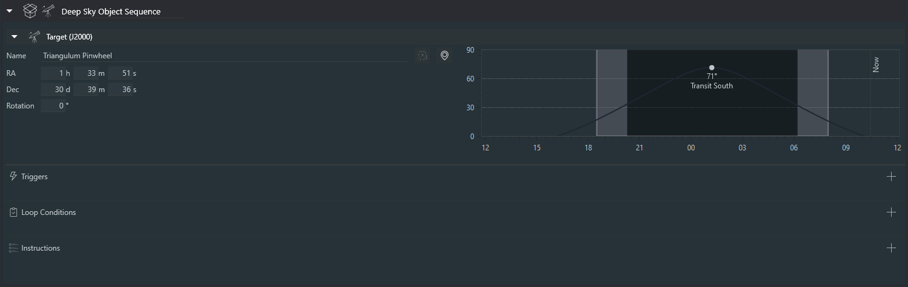

## Loop Conditions
Loop conditions will drive the behavior of an instruction set. Without a condition, an instruction set will just process each sequence item inside once and is finished. This behavior will be changed, when loop conditions are attached. When an instruction set has a loop condition attached, it will process its items and loop itself again as long as the attached loop conditions are fullfilled. Once at least one of these loop conditions is not fullfilled anymore (e.g. a condition to loop until a specific time and the time has passed) the current instruction will be finished and afterwards the rest of the instructions will be skipped and the instruction set will be finished. Conditions will be evaluated after each instruction.
These conditions can be dragged and dropped into the loop condition section inside an instruction set.
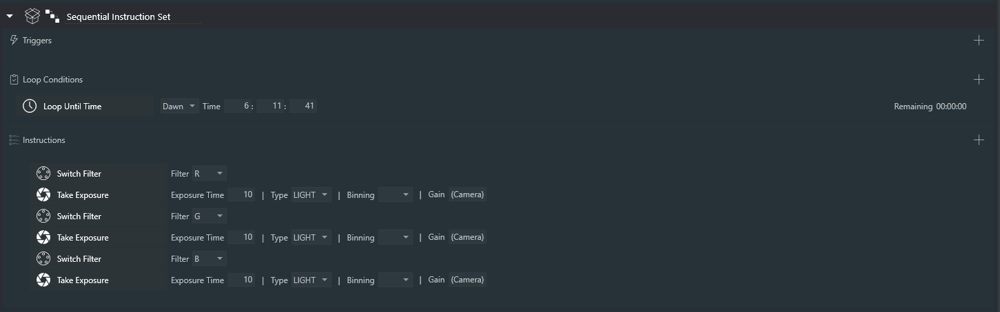
Loop conditions can also be directly attached to an instruction set by clicking the + icon next to the loop conditions section inside an instruction set.  
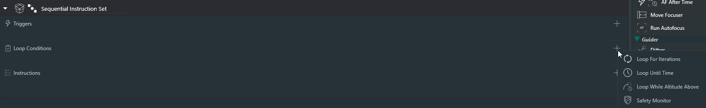

As instruction sets can be nested, the loop conditions are also evaluated for the current instruction set and all loop conditions that are in a parent instruction set.  
Let's take a look at the below example to give an example. The top level instruction set has a condition attached to loop until 12:24:09h. Then there are two further instruction sets inside that should loop 2 times and 3 times respectively.
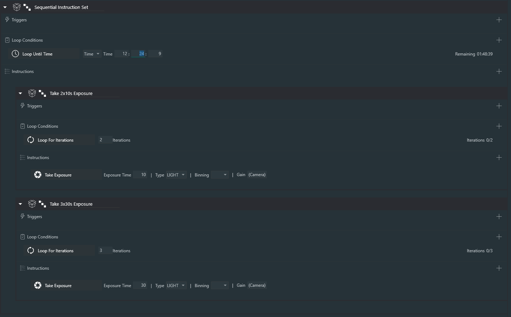
The following will happen in this case:  
- The first instruction set will loop 2 times. After each instruction the parent condition will be checked too, that the remaining time is still sufficient to continue.  
- Afterwards the second instruction set will loop 3 times. After each instruction the parent condition will be checked too, that the remaining time is still sufficient to continue.  
- Once both instruction sets are finished, the whole set will be reset again, as the "Loop Until Time" condition is still valid  
- This behavior will repeat until the Time is up. Once this happens all items inside this whole set will be skipped  

## Triggers
Triggers are instructions that should only happen when certain events occur. These triggers can be attached to an instruction set. When attached, they will get evaluated after each instruction inside the set, similar like loop conditions are evaluated. When the defined event occurred for the trigger to fire, the trigger will execute its instruction. An example is to trigger something after a certain amount of exposures.
The lightning icon next to an instruction on the right side will indicate that the instruction is in fact a trigger. These can only be dragged into the trigger section of an instruction set. Additionally a trigger can directly be added to an instruction set by clicking on the + button.
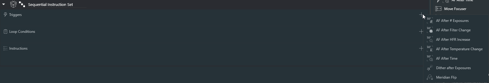

As triggers are evaluated in the same fashion as loop conditions, you can set triggers on a higher level and they get still evaluated when the current instruction that is executed is part of a nested instruction set. In the below example the trigger will fire after every 5 exposures, even though the trigger is defined on a higher level than the actual exposure item.
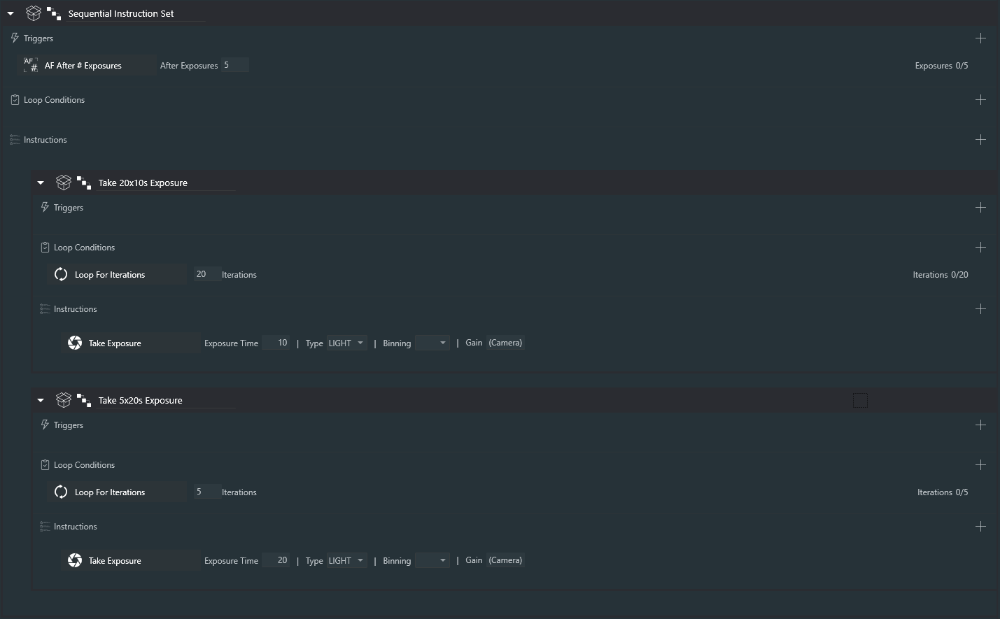

## Templates
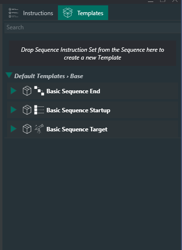
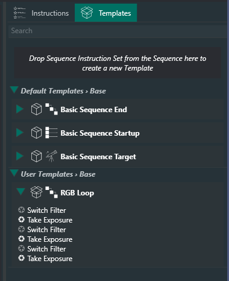
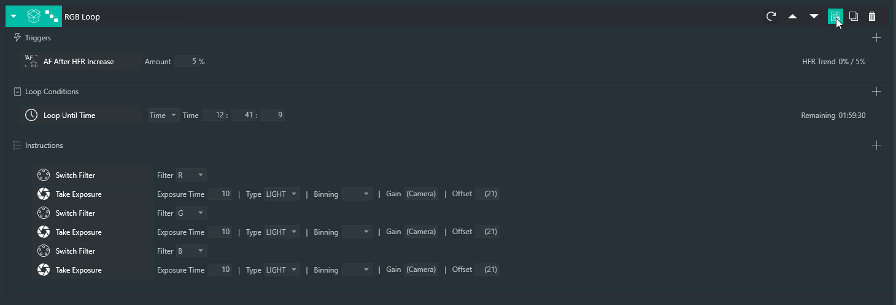
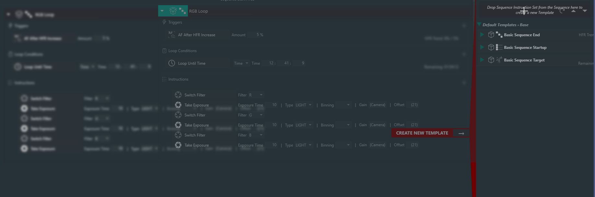

!!! tip
    Templates using a Deep Sky Object Set will be available for selection in the sky atlas and framing assistant to be used to add targets to a sequence

