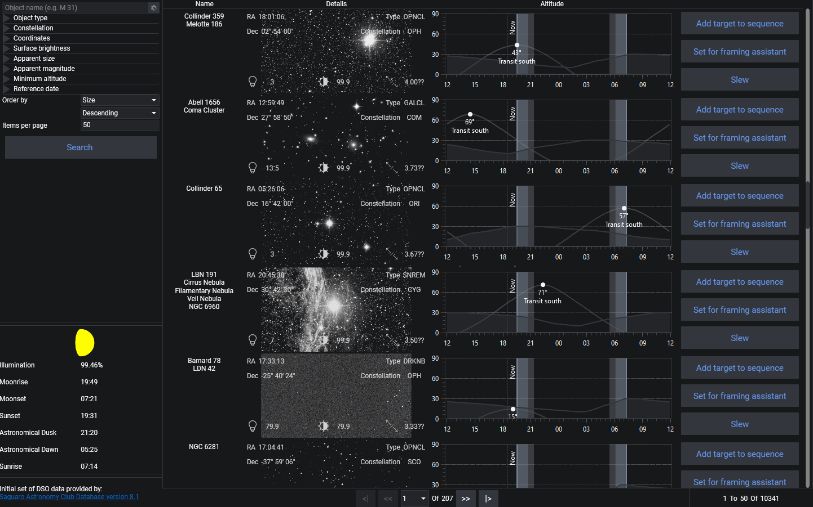

The Sky Atlas allows you to search for various objects in the sky using N.I.N.A.'s own database of deep sky objects. Filters and sorting options can be applied to search results. Additionally, you may set selected objects as a [Sequence](../tabs/sequence.md) target, or to send them to the [Framing Assistant](../tabs/framing.md).

For further information about the Sky Atlas, refer to the [Object Browser](../advanced/objectbrowser.md) advanced topic.

The Sky Atlas interface consists of following elements:

1. **Search Field**

    Search for the object by name or various catalog designations. Some familiar names (e.g., "Andromeda") are not implemented at the moment

2. **Filters**

    Filtering and modifying a search can be done by various object criteria and parameters.

3. **Search result order**

    Search results can be ordered by one of several criteria: Size, Apparent Magnitude, Constellation, RA, Dec, Surface Brightness and Object Type.  Display order can be either Descending or Ascending, and you can specify the number the items displayed per page.

    !!! important
        Be aware that a large number of search results may lead to performance issues

4. **Search**

    Press the Search button to initiate the search

5. **Moon phase and day information**

    Displays the current moon phase and other day information. The accuracy of this information depends upon the correct latitude and longitude being specified under **Options > General > Astrometry**.

6. **Object information**

    Displays various information about objects that are found by a search. The information includes the object name, RA, Dec, Type, Constellation, Apparent magnitude, surface brightness, and size.

    If the optional [Sky Atlas Image Repository](../requirements.md#recommended-and-optional-support-software) has been installed and the path to it specified under **Options > General > General > Sky Atlas Image Directory**, a small image of the object is displayed.

7. **Object altitude**

    Displays the target object's altitude, the direction point at which it will transit, the darkness phase of the current day, and includes a vertical marker for the current time. The accuracy of the altitude curve requires that the latitude and longitude be set under **Options > General > Astrometry**.

8. **Set as Sequence**

    Sets the selected object as a Sequence target for the sequence builder or the sequencer using a specific template based on the selection

9. **Set for Framing Assistant**

    Sets the selected object as the target in the [Framing Assistant](../tabs/framing.md)

10. **Slew**

    Slews the mount to the selected object
