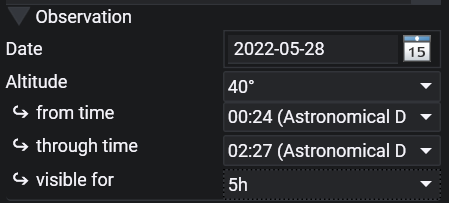
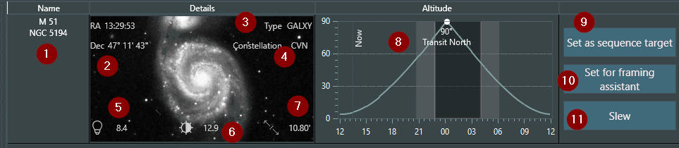

The Sky Atlas allows you to search for various objects in the sky using N.I.N.A.'s own database of deep sky objects. Filters and sorting options can be applied to search results. Additionally, you may set selected objects as a [Sequence](../tabs/sequencer.md) target, or to send them to the [Framing Assistant](../tabs/framing.md).

The Sky Atlas interface consists of following elements:

### Search Field

Search for the object by name or various catalog designations. Some familiar names (e.g., "Andromeda") are not implemented at the moment

### Reset
Next to the search field there is a small button to reset. This will reset all filters that have been set.

### Filters

Filtering and modifying a search can be done by various object criteria and parameters. Only objects matching the filter criteria will be shown on a search.

#### Observation filter
  

To easily find suitable targets for the current night an altitude filter can be used in conjunction with a from and through time and how long the target should be visible.  
Using this filter can give you a great preview of what to expect for the night as you will then only see targets that are visible during the specified time range for at least the specified amount of time.  

### Search result order

Search results can be ordered by one of several criteria: Size, Apparent Magnitude, Constellation, RA, Dec, Surface Brightness and Object Type.  Display order can be either Descending or Ascending, and you can specify the number the items displayed per page.

!!! important
    Be aware that a large number of search results may lead to performance issues

### Search

Press the Search button to initiate the search

!!! important
    Utilizing the Sky Atlas requires your current location information to be set in the Astrometry settings area in the general settings. Not doing so, or inputting inaccurate information will cause Sky Atlas to display inaccurate data!

### Moon phase and day information

Displays the current moon phase and other day information. The accuracy of this information depends upon the correct latitude and longitude being specified under **Options > General > Astrometry**.

## Object List Display

An example of a search result:

1. The name of the object in question with any available alternatives. Spoken names like "Whirlpool Galaxy" are not yet implemented
2. The Coordinates of the object in RA and Dec, should you want to save the coordinates or manually slew to them
3. The object type. Types are abbreviations to conserve visual space. The filter uses the full type name instead of the abbreviation
4. The object's constellation, abbreviated
5. Apparent magnitude of the object, if available. This determines the peak brightness
6. Surface brightness of the object, if available. The actual full brightness of the object. A value of 99.9 indicates an unknown surface brightness
7. Apparent size of the object, if available. Shows you the apparent size in arcminutes or degrees, depending on size.
8. Displays the target object's altitude, the direction point at which it will transit, the darkness phase of the current day, and includes a vertical marker for the current time. The accuracy of the altitude curve requires that the latitude and longitude be set under **Options > General > Astrometry**.
    * The line with a specific peak is the actual altitude of the object at any given time, generally: the higher, the better. Transit north or south tells you whether the object will pass to your south or north.
    * The Now line shows you your current time so you can cross reference the current altitude of the object.
    * The darker lines show you the start of the nautical and astro dark.
    * Furthermore a custom horizon will be displayed if it is set in the Astrometry settings
9. Sets the selected object as a sequence target for the [legacy sequencer](../sequencer/simple/simple.md) or the [advanced sequencer](../sequencer/advanced/advanced.md) using a specific template based on the selection
10. Sets the selected object as the target in the [Framing Assistant](../tabs/framing.md)
11. Slew to the targetSlews the mount to the selected object

!!! tip
    If the optional [Sky Atlas Image Repository](../requirements.md#recommended-and-optional-support-software) has been installed and the path to it specified under **Options > General > General > Sky Atlas Image Directory**, a small image of the object is displayed.
