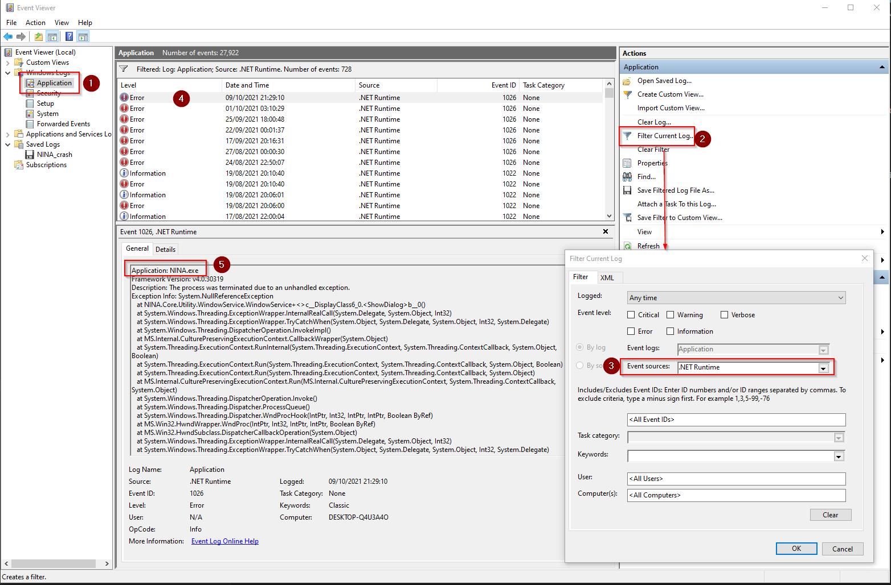

## General Troubleshooting

Should you encounter any bugs during your usage of N.I.N.A., please report them on the project's [Issue Tracker](//github.com/isbeorn/nina/issues) or directly to the team on the [Discord chat](//discord.gg/fwpmHU4). If possible, attach the latest log file. It is also helpful to increase the application's logging verbosity to **Debug** or **Trace** under **Options > Log Level**. The logging level of **Trace** includes the most information and may lead to the accumulation of large log files. Therefore, it is not recommended to leave that level specified under normal conditions.

Log files may be found in the `%LOCALAPPDATA%\NINA\Logs\` folder.

## Installation Issues

### Installation fails in general

Often, Anti-Virus software can interfere with the installation of N.I.N.A. and cause either an aborted installation or an incomplete one.
In these cases, it is advisable to disable any AV software temporarily and retry the installation.
The likelihood of running into installation issues can vary with the number and types of AV software in use, as well as how strict the AV software is set to operate.
No significant problems have been encountered on Windows 10 when using only Microsoft's built-in Windows Defender suite.

### Error: "The feature you are trying to use is on a network resource that is unavailable"

In case you get this error or are unable to uninstall the application, some of the registry keys got corrupted. Follow the advice on the following page to fix the corrupted keys:
[https://support.microsoft.com/en-us/topic/fix-problems-that-block-programs-from-being-installed-or-removed-cca7d1b6-65a9-3d98-426b-e9f927e1eb4d](//support.microsoft.com/en-us/topic/fix-problems-that-block-programs-from-being-installed-or-removed-cca7d1b6-65a9-3d98-426b-e9f927e1eb4d)

## Application Crashes

### Crashdump
In case you encounter a hard crash, Windows will create a crash dump file to investigate the problem in detail. Should you encounter such an issue, please provide this crash dump file.

The crash dump may be found in the `%LOCALAPPDATA%\NINA\CrashDump\` folder.

### Event Viewer  

You can check the Windows Event Viewer for root causes of hard application crashes.  
To open event viewer, go to the windows search bar, enter "Event Viewer" and open the app.  

Once inside the app, go to the "Windows Logs -> Application" (1). Then go to "Filter Current Log..." (2) and narrow down the "Event Sources" (3) to only select ".NET Runtime" in the pop up window and click "OK".  
After the filter is applied, you will find all event sources in the list in the middle (4). Look for the message that contains "Application: NINA.exe" in the Detail section (5). This will show the complete stack trace of why the application crashed. This is useful information that can be posted to the contributors who can analyze this further.

## First-Session Checklist

When several automated operations fail at once, test the dependency chain manually before editing the sequence:

1. select the intended profile and verify the observing site, time zone, focal length and camera pixel size
2. connect each device separately and exercise one safe command
3. take and save a manual exposure
4. plate solve that exposure and verify the returned scale and coordinates
5. start and stop guiding
6. run autofocus manually
7. slew and center a nearby test target

A successful manual path separates driver and configuration problems from sequencer structure problems.

## ASTAP Does Not Solve

Install both the ASTAP application and a compatible star database. In **Options > Plate Solving**, select ASTAP and confirm that N.I.N.A. points to the installed executable. Verify the profile's focal length and camera pixel size because a badly wrong image scale can prevent a local solve. Test with an uncropped, non-saturated star field and use the blind solver when the starting coordinates are not trustworthy. See [Plate Solving](../advanced/platesolving.md) for the supported solver setup.

## Autofocus Has Two Different Best Positions

If focus runs approached from opposite directions do not agree, test mechanical backlash before changing curve fitting settings. Move well past the suspected slack, approach the same position from each direction and compare the resulting focus. Configure **Overshoot** or **Absolute** backlash compensation in the autofocus options, then repeat several runs from both directions. A step size that is too small to leave the critical focus zone can hide backlash and produce an apparently flat curve.

## Meridian Flip Does Not Run

The meridian-flip trigger evaluates only when the mount is connected, unparked, not at home and tracking. Confirm that the driver reports a credible time to meridian and, when enabled, a valid side of pier. Place the trigger on a container that actually encloses the exposure instructions. Compare the mount's physical limits with **Minutes after meridian**, **Max. minutes after meridian** and **Pause before meridian**. Do not use a live target to discover collision limits. See [Meridian Flips](../advanced/meridianflip.md).

## Advanced Sequence Skips or Never Finishes

Red validation markers mean an instruction's prerequisites are not met. Check the marker before starting because an invalid instruction is skipped and considered failed. Every loop should have an exit condition, such as a fixed iteration count, time, altitude or safety state. Put startup and shutdown actions in the dedicated start and end areas, then keep target-specific instructions and triggers inside the Deep Sky Object container so they inherit its coordinates. Use the instruction's **On error** setting deliberately rather than relying on the default for recovery-critical actions.
