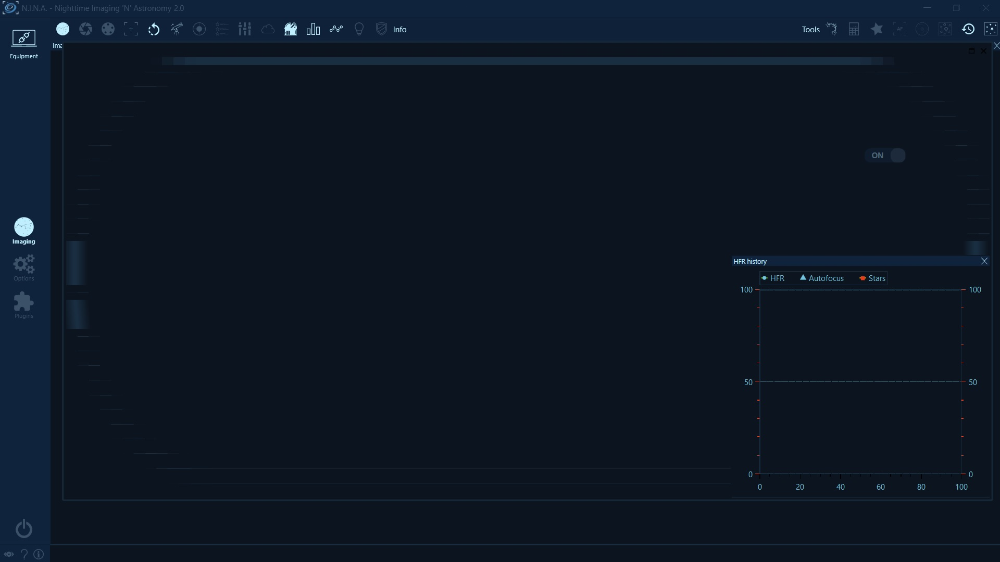
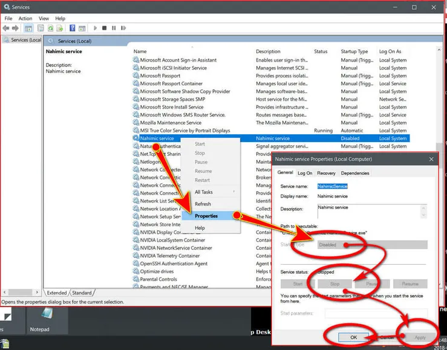

In the past there were reports where the application was not rendering correctly. Follow this guide if your applicaiton looks like the window below, where some icons are disappearing and windows are not rendering:  

 

It has been identified that there is an audio driver service called "Nahimic service" responsible for causing side effects on WPF applications. (WPF is the User Interface framework that N.I.N.A. is built on).
Once this service is stopped, the application will render correctly again.  
  
To disable the service:  
- Open the Windows Run menu by holding the keys `⊞ Win` + `r`   
- Enter "services.msc" into the window and hit "Ok"  
- A new window will open showing all available services.   
- Check for a service called "Nahimic Service" and follow the steps in the screenshot below  

 
